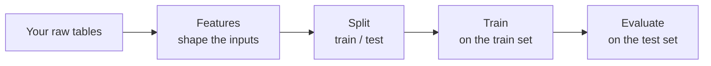

# The Workflow

Here's how a supervised project actually moves from your tables to a working model. There are four beats - **features, split, train, evaluate** - and a data person has a strong hand in three of them. The one piece that's "the algorithm" is, in practice, the smallest part.



## Features: the columns the model learns from

**What they actually are.** **Features** are the input columns you give the model to learn from - the things it's allowed to look at when making a prediction. If the label is "did this customer churn?", the features are everything *about* the customer the model gets to see: tenure, support tickets, plan type, last login date.

📝 **Terminology.** A *feature* is one input column. *Feature engineering* is the craft of turning your raw data into features that actually carry signal - and it's where data people quietly win or lose projects.

**Why this is more than "pick some columns."** Raw data is rarely in the right shape. A `last_login` timestamp isn't directly useful, but `days_since_last_login` is. A pile of support tickets isn't a feature, but `tickets_in_last_90_days` is. You're translating messy reality into clean, comparable numbers the model can reason over.

```text
   Feature engineering: raw → useful

   RAW                              ENGINEERED FEATURE
   last_login = 2026-04-02   ──►    days_since_last_login = 78
   [ticket, ticket, ticket]  ──►    tickets_in_last_90_days = 3
   signup = 2024-01-15       ──►    tenure_months = 29
```

💡 **Key point.** Models don't see your business; they see your features. A mediocre algorithm with thoughtful features usually beats a fancy algorithm with lazy ones. This is the single biggest lever a data person controls.

⚠️ **Don't sneak the answer into the features.** If one of your "features" is actually a stand-in for the outcome - for example, a `cancellation_reason` column that only gets filled in *after* someone churns - the model will look brilliant in testing and fall apart in real life. This is **data leakage**, and it gets full treatment in Phase 3. For now, plant one flag: a feature must be something you'd genuinely know *before* the outcome happens.

## The split: train on some, test on the rest - and why

Here's the idea that separates trustworthy ML from self-deception. Before training, you **split your labeled data into two parts**:

- a **training set** - the examples the model learns from, and
- a **test set** - examples you *hide* from the model during training, and use only at the end to check how it does.

```text
   ALL your labeled data
   ┌───────────────────────────────────────────────┐
   │██████████████████████████████████│░░░░░░░░░░░░░░│
   └───────────────────────────────────────────────┘
    └──────── TRAIN (model learns) ───┘└─ TEST  ────┘
                                         (hidden until
                                          the very end)
```

**Why bother - why not train on everything?** Because the question that matters is *"how will this model do on customers it has never seen?"* Those are the only customers you'll ever use it on. Test it on the same examples it learned from and you're asking it to recite answers it already memorized - it'll look great and tell you nothing.

🪖 **War story.** The classic rookie result: a model scores beautifully in development, ships, then flops in production. Nine times out of ten, somebody evaluated on data the model had already seen, or the test data was contaminated by the training data. The split exists to catch this *before* it embarrasses you.

**A real example.** Doing the split is usually a couple of lines, but the *intent* is the whole game:

```console
$ python train.py
Loaded 50,000 labeled customers
Splitting: 40,000 train / 10,000 test  (test set held out)
Training on 40,000 examples...  done
Evaluating on the 10,000 held-out customers the model never saw...
```
*What just happened:* The model learned only from the 40,000 training customers. The 10,000 test customers stayed locked away until training finished, then got used to ask the real question: "on people you've never met, how do you do?" That number is the one you can trust.

⚠️ **The test set is sacred - look at it once.** If you peek at the test results, tweak the model to do better on them, peek again, tweak again, you've quietly turned your test set into a training set. Its validity leaks away with every peek. (A third "validation" slice handles tuning properly - detail for later; the principle stands regardless.)

## Training: the part that's mostly not your job

This is the step everyone pictures when they hear "machine learning," and it's genuinely the *least* hands-on for a data person. You hand the training set to a learning algorithm, and it adjusts itself to fit the patterns between features and label.

You don't need to know the internals to be useful here. What matters is the framing: **training is the algorithm's job; preparing what it trains on is yours.** Picking which algorithm is often a few lines of code and some experimentation. Getting clean, leak-free, well-featured data into it is the work that takes real judgment.

## Evaluating: accuracy is not the whole story

The model's trained. Now the crucial question: *is it any good?* The tempting answer is **accuracy** - what fraction of predictions were correct. It's fine to glance at, but on its own it can be dangerously misleading. Here's the trap:

**The rare-event problem.** Imagine fraud detection: genuine fraud is rare, most transactions are legitimate. Picture a lazy "model" that *always* predicts "not fraud":

```text
   Suppose fraud is rare and most transactions are legit.

   A model that ALWAYS says "not fraud":
     ✓ correct on every legitimate transaction
     ✗ wrong on every actual fraud

   Result: very high accuracy...
   ...and it catches ZERO fraud. Completely useless.
```

That model can post impressive-sounding accuracy and still be worthless, because it never catches the thing you actually care about. (Exactly how high depends on how rare fraud is in *your* data - the point is that high accuracy can coexist with catching nothing.)

Use two sharper questions instead. Don't memorize formulas - hold the meaning:

📝 **Terminology.**
- **Precision** - *of the cases the model flagged, how many were real?* High precision means few false alarms. "When it cries fraud, it's usually right."
- **Recall** - *of all the real cases out there, how many did the model catch?* High recall means few misses. "It rarely lets real fraud slip through."

```text
                       the truth
                   fraud      not fraud
   model      ┌──────────┬────────────┐
   says       │  caught  │ false      │  PRECISION = of all the
   "fraud" →  │  (good)  │ alarm      │  "fraud" calls, how many
              ├──────────┼────────────┤  were truly fraud?
   model      │  MISSED  │  correctly │
   "not    →  │  (bad)   │  ignored   │  RECALL = of all the real
    fraud"    └──────────┴────────────┘  fraud, how much did we catch?
```

**The tension you can't escape.** Precision and recall pull against each other. Flag aggressively and you catch more fraud (high recall) but raise more false alarms (lower precision). Flag cautiously and your alarms are usually right (high precision) but you miss more real cases (lower recall). There's no universal "correct" balance - it depends on the cost of each mistake.

💡 **Key point.** "Is the model good?" is a *business* question disguised as a technical one. For fraud, a missed case (low recall) might cost far more than a false alarm, so you'd lean toward recall. For flagging customers with a retention offer, too many false alarms annoy good customers, so you might lean toward precision. The right metric comes from "what does a mistake cost us?" - a conversation a data person should be *in*, not handed the answer to.

## Recap

1. **Features** are the input columns the model learns from; shaping raw data into good features (**feature engineering**) is high-leverage data work.
2. A feature must be something you'd know *before* the outcome - or you've got leakage (Phase 3).
3. **Split** into a **training set** and a hidden **test set** so you can measure on unseen data - the only reliable measure of real-world performance.
4. The **test set is sacred**: judge yourself on it once; don't tune against it.
5. **Training** is mostly the algorithm's job; preparing its data is yours.
6. **Accuracy alone misleads on rare events.** Use **precision** (few false alarms) and **recall** (few misses), and choose the balance from what a mistake actually costs.

Next: why ML projects actually succeed or fail on the data - and why that puts you closer to the center than the people writing the models.

---

[← Guide overview](_guide.md) · [Phase 3: Where Data People Fit →](03-where-data-people-fit.md)
