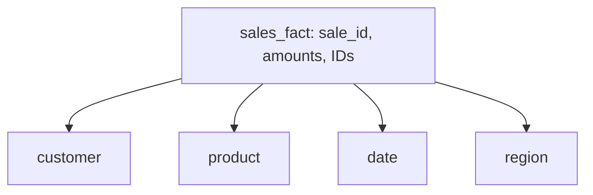

# Facts vs. dimensions

A star schema is built from exactly two kinds of tables, and once you can tell them apart, the rest of this guide is filling in the detail. Let's ground it in something concrete: a business selling products, tracking every sale.

## The fact table: what happened

The **fact table** holds the events you're measuring — one row per thing that occurred. For a sales business, that's `sales_fact`, and each row is one sale:

```text
sales_fact
-----------------------------------------------------------
sale_id | customer_id | product_id | date_id | region_id | amount | quantity
1001    | 42          | 501        | 20260701| 3         | 89.99  | 1
1002    | 17          | 233        | 20260701| 1         | 45.50  | 2
1003    | 42          | 501        | 20260702| 3         | 89.99  | 1
```

*What just happened:* each row is one measurable event — a sale — with a handful of numbers you care about summing or averaging (`amount`, `quantity`), plus a set of IDs pointing out to the "who, what, when, where" of that sale. Those numeric, summable columns are called **measures**. The fact table is deliberately narrow on descriptive detail — it doesn't store the customer's name or the product's category inline. It records "sale 1001 involved customer 42, product 501, on this date, in this region, for this amount," and nothing more. Everything else lives one hop away.

## The dimension tables: the who, what, when, where

Each ID in the fact table points to a **dimension table** — a table that describes one axis you might want to slice the facts by. For this example, there are four:

```text
customer                        product                         date                            region
------------------------        ------------------------        ------------------------        ------------------------
customer_id | name | tier       product_id | name | category     date_id | date | month | year    region_id | name | country
42          | Amara| gold       501        | Mug  | Kitchen       20260701| Jul 1| Jul  | 2026     3         | West | USA
17          | Devon| standard   233        | Pen  | Office        20260702| Jul 2| Jul  | 2026     1         | East | USA
```

*What just happened:* each dimension answers one question about a sale. `customer` answers "who bought it." `product` answers "what did they buy." `date` answers "when." `region` answers "where." None of these tables are large compared to the fact table — you might have millions of sales but only a few thousand customers, a few hundred products, a handful of regions, and one row per calendar date.

## Why the split matters

This split creates a shape: one big table full of numbers and ID references, surrounded by several small tables full of descriptive attributes. That's the whole idea. The fact table is where the *measurements* live; the dimension tables are where the *context* for interpreting those measurements lives.



*What just happened:* this is the star taking shape — one fact table in the middle, dimensions arranged around it, each connected by a foreign key. It's a plain-language division of labor: facts are *what happened, and how much*; dimensions are *everything you'd use to describe or filter what happened*.

> If a column is a number you'd sum or average, it belongs in the fact table. If it's something you'd filter or group by — a name, a category, a date, a region — it belongs in a dimension.

Phase 2 gets into why the dimension tables themselves look different from what you'd expect if you've worked with a normalized application database — and why that difference is deliberate, not sloppy design.

[← Overview](_guide.md) | [Phase 2: Why it's shaped like a star →](02-why-a-star.md)
