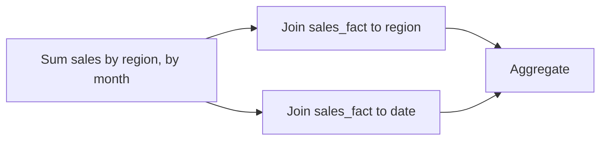

# Why it's shaped like a star

If you've worked with an application database, you were probably taught to **normalize**: split data into small tables so each fact is stored exactly once, avoiding duplication. A star schema's dimension tables break that habit on purpose, and understanding why is the core of this phase.

## What a normalized schema is trying to prevent

In a normalized, transactional (OLTP) schema, you'd typically split `product` further - categories in their own table, referenced by ID, so that renaming a category means updating one row instead of thousands. That avoids what's called an **update anomaly**: the same fact stored in many places, some of which get updated and some of which don't, leaving the data inconsistent with itself.

That design is optimized for a system that's constantly writing - orders coming in, inventory changing, customer details being edited. Keeping each fact in exactly one place keeps those writes cheap and safe.

## Dimensions are denormalized on purpose

A dimension table in a star schema does the opposite: it flattens everything about one entity into a single row, categories and all, even if that means the word "Kitchen" is repeated across a thousand rows of the `product` table.

```text
-- flattened (star schema style)
product_id | name | category | subcategory
501        | Mug  | Kitchen  | Drinkware

-- normalized (OLTP style) would instead split this into:
product (product_id, name, subcategory_id)
subcategory (subcategory_id, name, category_id)
category (category_id, name)
```

*What just happened:* the star schema version repeats "Kitchen" and "Drinkware" on every product row that belongs to them, instead of pointing to a separate category table. That's duplication a normalized schema is designed to avoid - and here, it's intentional.

## Why duplication is the right trade here

A data warehouse isn't being hammered with constant small writes the way an application database is. It's typically loaded in batches (nightly, hourly, or streaming in append-only fashion) and then read over and over by people running reports and dashboards. The workload it needs to be fast at is **aggregation**: "sum sales by region by month," "average order value by customer tier," "total revenue by product category last quarter."

Denormalizing the dimensions means a query like that touches far fewer tables. Instead of joining `sales_fact` to `product`, then `product` to `subcategory`, then `subcategory` to `category`, you join `sales_fact` to `product` once and every attribute you need - category included - is already sitting right there in that one row.



*What just happened:* a typical warehouse query joins the fact table directly to one or two flat dimension tables and aggregates, instead of chaining through sub-tables to reassemble a product's category. Fewer joins - especially on a table with millions of fact rows - means a faster, simpler query.

> A star schema isn't "worse" normalization - it's a different design goal. Normalized OLTP schemas optimize for correctness under frequent writes; a star schema optimizes for speed under heavy aggregation reads. Neither one is right for the other's job.

This is also why you rarely see anyone running `UPDATE` against a warehouse's dimension tables the way you would against an OLTP database - dimensions are typically reloaded wholesale from the source system. That way, the "what if the category name changes and it's duplicated everywhere" problem is handled by the load process, not the schema.

Watch it animated: [a star schema](/explainers/StarSchema.dc.html)

```quiz
[
  {
    "q": "Why are dimension tables in a star schema typically denormalized, unlike tables in an OLTP application database?",
    "choices": [
      "Denormalization is a mistake that warehouse designers haven't fixed yet",
      "Warehouses optimize for fast aggregation reads, and flat dimensions mean fewer joins per query",
      "Denormalized tables use less disk space",
      "SQL doesn't support joins in a data warehouse"
    ],
    "answer": 1,
    "explain": "Flattening a dimension avoids joining through several sub-tables just to get one attribute, which speeds up the aggregation queries a warehouse is built for."
  },
  {
    "q": "What problem does normalization in an OLTP schema primarily prevent?",
    "choices": [
      "Slow aggregation queries",
      "Update anomalies - the same fact stored in multiple places getting out of sync",
      "Running out of table names",
      "Foreign keys pointing to the wrong table"
    ],
    "answer": 1,
    "explain": "Normalization keeps each fact in one place so an update only has to happen once, which matters most under frequent writes."
  },
  {
    "q": "In the sales_fact example, which of these belongs in the fact table rather than a dimension table?",
    "choices": [
      "The customer's loyalty tier",
      "The product's category name",
      "The sale amount",
      "The region's country"
    ],
    "answer": 2,
    "explain": "The sale amount is a measure - a number you'd sum or average - which is what fact tables hold. The others are descriptive attributes that belong in dimensions."
  }
]
```

[← Phase 1: Facts vs. dimensions](01-facts-vs-dimensions.md) | [Overview](_guide.md) | [Phase 3: Star vs. snowflake, and when to use it →](03-star-vs-snowflake.md)
