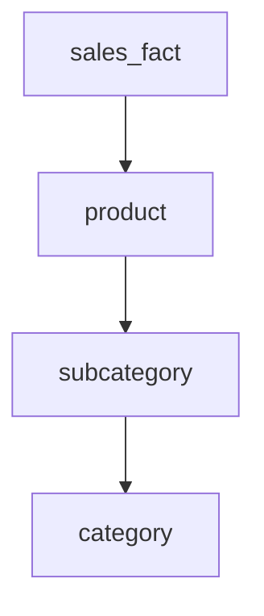

# Star vs. snowflake, and when to use it

Now that you've seen why dimensions are deliberately flattened, here's a variant that partially undoes that — and when each one earns its place.

## The snowflake schema

A **snowflake schema** takes a dimension and normalizes part of it back out into sub-tables — the same splitting you'd do in an OLTP schema. Instead of one flat `product` table carrying `category` and `subcategory` inline, you get:

```text
snowflake version:
product (product_id, name, subcategory_id)
subcategory (subcategory_id, name, category_id)
category (category_id, name)

star version:
product (product_id, name, category, subcategory)
```

*What just happened:* the snowflake version breaks `product` into three linked tables so "Kitchen" is stored exactly once instead of once per product. Drawn out, the fact table's points now branch further into sub-dimensions, which is where the name comes from — it looks like a snowflake's branching arms instead of a plain star's straight points.



*What just happened:* this is one arm of the star growing an extra hop. Where the star schema had `sales_fact → product` with everything already attached, the snowflake has `sales_fact → product → subcategory → category`, each step normalized.

## The trade-off

A snowflake schema reduces duplication — genuinely useful if a dimension is large and its attributes change often, since there's only one row to update. The cost is exactly what Phase 2 showed a star schema avoiding: more joins per query. Summing sales by category now means traversing three tables deep instead of reading one flat row.

```text
star schema      -> more storage duplication, fewer joins, simpler & faster queries
snowflake schema -> less duplication, more joins, more query complexity
```

In practice, most data warehouses lean toward star schemas, or something close to it, precisely because query speed and simplicity matter more than storage savings when dimension tables are small relative to the fact table anyway. A `product` dimension with ten thousand rows duplicating a category name costs you almost nothing in storage — but it can save real time on every report that groups by category.

> Neither shape is universally "correct." A star schema optimizes for the queries; a snowflake schema optimizes for the storage and update story. Pick based on which one you're actually trading against.

## Where this fits in the bigger picture

Everything in this guide has been about how a warehouse organizes tables once data is already there — the OLAP side of things, built for analysis and reporting. That's a different world from the OLTP database your application writes to on every request, and the two get confused constantly. If the distinction between those two systems — and how data gets from one to the other — isn't already solid for you, that's covered in [Data Warehouses vs Lakes, Honestly](/guides/warehouses-vs-lakes), which lays out the OLTP/OLAP split this guide has been assuming throughout.

[← Phase 2: Why it's shaped like a star](02-why-a-star.md) | [Overview](_guide.md)
