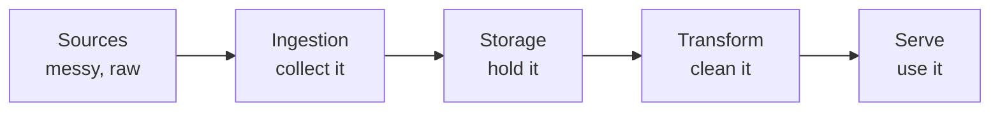
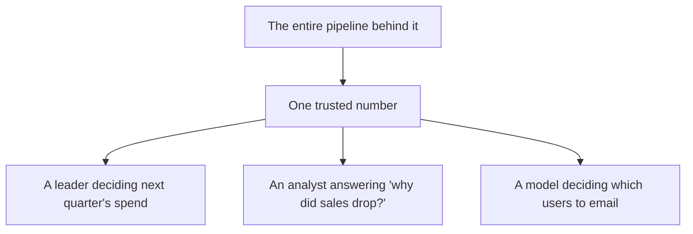

# From Raw Data to a Trusted Answer

Before any tools, here's the one idea the whole field rests on. Once you have it, every job title, tool
name, and "best practice" you'll meet later slots neatly into place instead of floating as disconnected
jargon.

## What data engineering actually is

**What it actually is.** Data engineering is the work of building the **plumbing that moves data from
where it's created to where it's useful** — and cleans it up along the way. Somewhere in your company,
data is born messy: an app records a sign-up, a payment system logs a charge, a sensor spits out a
reading. None of that raw data is ready for a human to make a decision on. A data engineer builds the
system that carries it, cleans it, organizes it, and delivers it as something people can actually trust
and use.

The word people reach for is **pipeline**, and it's a good one. Picture a river:

Water starts muddy upstream (raw data from your apps and systems), flows through stages, and comes out
clean at the tap (a dashboard, a report, a model). Data engineering is the work of **building and
maintaining that river** so the water keeps flowing and stays clean.

**Why people get this wrong.** The common wrong picture is "data engineering = working with databases."
Databases are part of it, but that's like saying plumbing is "working with pipes." The real job is the
*flow*: getting data out of a dozen messy sources, reconciling them, fixing the inevitable garbage, and
delivering something dependable on a schedule, over and over, without it breaking. The database is one
stage in a much longer journey.

💡 **Key point.** Data engineering isn't about storing data. It's about **reliably turning raw, messy
data into clean, trustworthy data** that someone downstream can build a decision on.

## Why raw data isn't usable

It's tempting to think raw data is basically fine and just needs to be "loaded somewhere." It isn't.
Real raw data is a mess, and naming the kinds of mess tells you exactly what the pipeline is *for*:

- **Different shapes.** Your web app records dates as `2026-06-19`; your payment provider sends
  `06/19/2026`; an old system uses `19-Jun-26`. Same fact, three formats. Something has to make them
  agree.
- **Missing and duplicated rows.** A network blip means a sign-up got logged twice. A bug means another
  one didn't get logged at all. Count "new users" naively and you'll be wrong.
- **Scattered across systems.** "How many customers do we have?" lives partly in the app database, partly
  in the billing system, partly in a spreadsheet someone maintains by hand. No single place holds the
  answer.
- **Sheer volume.** A busy app can generate millions of events a day. You can't open that in a
  spreadsheet and eyeball it.

A data engineer's pipeline is the thing that absorbs all of this — reconciles the formats, removes the
duplicates, fills or flags the gaps, joins the scattered pieces — so the people downstream never have to.

## Why "trusted" is the word that matters

Here's the part that separates data engineering from "moving files around": the output has to be
**trusted**. Not just present, not just clean-looking — trusted enough that someone will bet a decision
on it.

Think about who's standing at the tap:

If the number at the tap is wrong, the decision is wrong — and nobody downstream can tell, because the
number *looks* fine. That's the quiet danger. A broken dashboard that shows an error is annoying. A
dashboard that confidently shows the *wrong* number is dangerous, because people act on it.

So "trusted" means the pipeline can promise things like: *every sign-up is counted exactly once*; *the
revenue number matches the bank*; *yesterday's data is complete and arrived on time*. Building a system
that can keep those promises, every day, without a human checking by hand — that's the real
engineering, and it's why this is a discipline and not a one-off script.

🪖 **War story.** A team once shipped a "weekly active users" chart that slowly drifted up and to the
right — everyone celebrated. Months later someone noticed a retry bug was logging some events twice.
Growth was real but smaller than the chart said. The fix took an hour; the erosion of trust in *every*
dashboard took far longer. That's the cost of untrusted data: it's not the one wrong number, it's the
doubt it casts on all the right ones.

**Why this saves you later.** Once you see that the whole job aims at *one trusted number at the tap*,
every tool and practice you meet later has an obvious purpose. Testing data? That's protecting trust.
Monitoring a pipeline? Protecting trust. Documenting where a number comes from? Trust again. You won't
have to memorize why these things matter — you'll already know.

## Recap

1. Data engineering builds the **plumbing** that moves data from where it's born (messy) to where it's
   useful (clean) — picture a **river flowing through stages**.
2. Raw data is genuinely unusable on arrival: different shapes, missing and duplicate rows, scattered
   across systems, and far too big to eyeball.
3. The goal isn't storage — it's a **trusted answer at the tap**, dependable enough to bet a decision on.
4. Almost every data-engineering tool and practice exists to **protect that trust**.

Next: the river, stage by stage — what each piece of the pipeline actually does.

---

[← Guide overview](_guide.md) · [Phase 2: The Pieces of the Pipeline →](02-the-pieces-of-the-pipeline.md)
