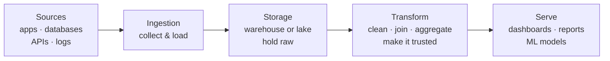
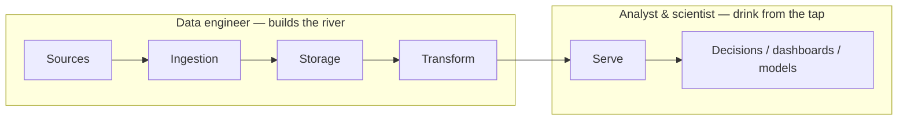

# The Pieces of the Pipeline

In Phase 1 we saw the river from a distance: muddy upstream, clear at the tap. Now let's walk it stage by
stage. Each stage has a job, and once you can name them, you can place almost any data tool or buzzword
you'll ever hear into the right spot in the flow.

Here's the whole river, labeled:



Let's take them one at a time.

## Sources — where data is born

**What it actually is.** The sources are every system that *creates* data in the first place. You don't
build these as a data engineer — they already exist because the business runs on them. Your job is to tap
into them. The usual suspects:

- **Applications** — your product itself, emitting events like "user signed up" or "added to cart."
- **Databases** — the operational database behind the app, holding the current state (users, orders).
- **APIs** — outside services you pull from: a payment provider, an ad platform, a CRM.
- **Logs** — the raw, firehose-style records that servers and systems spit out constantly.

**The gotcha.** Sources are owned by other teams and they change without telling you. A column gets
renamed, an API adds a field, a log format shifts. The river starts here, and so do most of its
surprises — we'll come back to this in Phase 3 under its real name, *schema drift*.

## Ingestion — getting the data out

**What it actually is.** Ingestion is the act of **collecting data from the sources and loading it into
your own storage**. It's the intake valve of the river.

There are two broad styles, and the difference is just *how often*:

- **Batch** — grab a chunk on a schedule (say, "every night, pull yesterday's orders"). Simpler, and
  fine for most reporting.
- **Streaming** — pull each event as it happens, continuously. More complex, used when minutes or seconds
  matter (fraud alerts, live dashboards).

📝 **Terminology.** *Ingestion* (sometimes called *extraction* or *loading*) = the stage that moves data
from a source into your storage. If you hear "we ingest from the payments API nightly," that's a batch
ingestion job.

**Why this matters.** Ingestion is where reliability lives or dies. If last night's pull silently failed,
everything downstream is stale or missing — and remember, stale data often *looks* fine. A big part of
the job is making ingestion dependable and noisy-when-broken.

## Storage — a stable home for the data

**What it actually is.** Once data is ingested, it needs somewhere to live that's built to hold a lot of
it and let you query it later. Two common homes, and the distinction is worth knowing:

- **Data warehouse** — a storage system optimized for *analytics queries* over structured, table-shaped
  data. You put cleaned, organized data here so people can ask questions fast. Think: neatly labeled
  shelves.
- **Data lake** — a cheaper, more flexible store that holds *raw* data of any shape (including messy,
  half-structured, or huge files) before it's been cleaned. Think: a big warehouse floor where everything
  lands first.

📝 **Terminology.** *Data warehouse* = structured, query-optimized storage for analytics. *Data lake* =
cheap, flexible storage for raw data in any format. Many teams use both: land everything raw in the lake,
then move the cleaned-up, useful parts into the warehouse.

**The gotcha.** "Storage" sounds passive, like a hard drive. It isn't — the choice of storage shapes what
questions you can answer and how fast. Picking the wrong home (or dumping raw mess straight into the
warehouse with no cleaning) is a classic early mistake.

## Transform — where raw becomes trusted

**What it actually is.** This is the heart of the work. **Transform** is where the muddy water gets
filtered clean. You take the raw, ingested data and reshape it into something trustworthy and useful:

- **Clean** — fix the formats, drop or flag the duplicates, handle the missing values.
- **Join** — stitch together pieces from different sources ("match each order to the customer who made
  it").
- **Aggregate** — roll detail up into the summaries people actually want ("daily revenue per region").

**A real example.** Most of this work is expressed in SQL. Here's a tiny, realistic transform that turns
raw order rows into a clean daily revenue summary:

```sql
SELECT
  order_date,
  COUNT(*)        AS orders,
  SUM(amount_usd) AS revenue_usd
FROM raw_orders
WHERE status = 'completed'      -- drop refunds and abandoned carts
GROUP BY order_date
ORDER BY order_date;
```
*What just happened:* We took the raw `raw_orders` table — one messy row per order — kept only the
*completed* ones, and rolled them up into one clean row per day with a count and a revenue total. The raw
data was unusable for a report; this output is something a leader can read directly. That move, raw → 
trusted summary, is the transform stage in one query.

**Try the same shape of move.** This runs the same kind of aggregate over a tiny library dataset — rows
rolled up into a per-group summary. Run it, then change `GROUP BY` to see the transform stage in action:

```sql runnable
SELECT a.country, COUNT(b.id) AS books, MIN(b.year) AS earliest
FROM authors a
JOIN books b ON b.author_id = a.id
GROUP BY a.country
ORDER BY books DESC;
```

📝 **Terminology — ETL vs ELT.** You'll hear both. **ETL** = *Extract, Transform, Load* (clean the data
*before* storing it). **ELT** = *Extract, Load, Transform* (store the raw data first, then clean it
*inside* the warehouse). Modern cloud warehouses are powerful enough that ELT is now common — but it's the
same three jobs in a different order.

**Why this saves you later.** When you see a dashboard number you don't trust, the transform stage is
almost always where you look first: a wrong join, a forgotten filter (like counting refunds as revenue),
a bad assumption about the raw data. Knowing this stage exists tells you *where the bug usually is*.

## Serve — where people actually use it

**What it actually is.** The last stage delivers the cleaned, trusted data to whoever (or whatever) needs
it:

- **BI dashboards** — the charts and tables business teams watch (revenue, sign-ups, churn).
- **Reports** — scheduled or one-off answers to specific questions.
- **ML models** — machine-learning systems that consume the clean data as fuel.

This is the tap. Everything upstream existed to make this water clean. If the serve layer is the only
part most people ever see, that's a sign the pipeline is doing its job — the plumbing is supposed to be
invisible.

## Who works where: engineer vs analyst vs scientist

These three titles get blurred constantly. The pipeline makes the difference easy to see — it's mostly
about *which part of the river you live in*:



- **Data engineer** — builds and maintains the river itself: ingestion, storage, and the transform
  machinery. Their deliverable is *trusted data, reliably*. They care most about plumbing that doesn't
  break.
- **Data analyst** — stands at the tap. Uses the trusted data to answer business questions ("why did
  sales drop in March?") and build the dashboards. Their deliverable is *insight from existing data*.
- **Data scientist** — also drinks from the tap, but builds *predictive* things on top: models that
  forecast or classify ("which customers are likely to churn?"). Their deliverable is usually a *model*.

⚠️ **Gotcha.** These lines are fuzzy in real life — at a small company one person may do all three, and
titles vary wildly between companies. Don't treat them as rigid castes. The useful takeaway is the *kind
of work*: building the pipeline (engineer) vs. analyzing what's in it (analyst) vs. modeling on top of it
(scientist).

## Recap

1. The pipeline has five stages: **sources → ingestion → storage → transform → serve**.
2. **Sources** create data; **ingestion** collects it; **storage** (warehouse or lake) holds it;
   **transform** cleans and reshapes it into something trusted; **serve** delivers it to dashboards,
   reports, and models.
3. **Transform** is the heart — raw becomes trusted there, usually in SQL — and it's where most
   bad-number bugs hide.
4. **Engineer** builds the river, **analyst** reads from the tap, **scientist** models on top — but the
   lines blur in real life.

Next, we'll ask why this is hard enough to be its own discipline — what makes building a reliable river
genuinely difficult.

Watch it animated: [batch vs. stream processing](/explainers/BatchVsStream.dc.html)

---

[← Phase 1: From Raw Data to a Trusted Answer](01-from-raw-data-to-a-trusted-answer.md) · [Phase 3: Why It's Its Own Discipline →](03-why-its-its-own-discipline.md)
