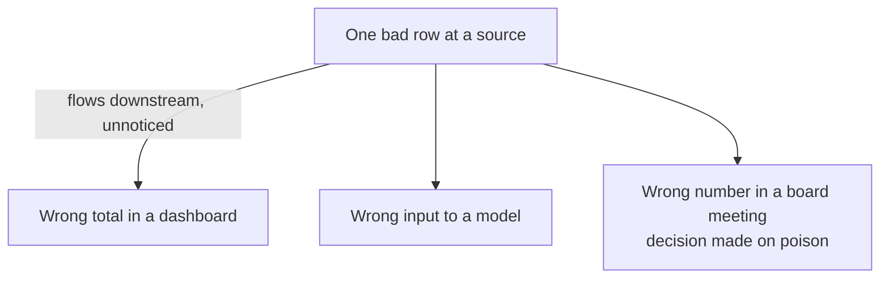

# Why It's Its Own Discipline

By now you can picture the river and name its stages. A fair question: if it's "just" moving and cleaning
data, why is it a whole job with its own title? Couldn't a regular software engineer or a smart analyst
do it on the side?

The straight answer is no, and the reasons are specific. Four things make data engineering genuinely hard
and genuinely distinct. Seeing them is the best way to respect the discipline - and to understand the rest
of the data-analytics track, because almost every tool you'll meet later exists to fight one of these.

## 1. Scale: it's too big to eyeball

**What makes it hard.** The amounts of data are large enough that ordinary instincts stop working. You
can't open it in a spreadsheet, you can't fix a problem by hand-editing a few rows, and a query that runs
instantly on a thousand rows can grind for a long time on a billion.

That changes how you have to think. A regular program runs once and you watch it. A data pipeline chews
through enormous volumes on a schedule, where a small inefficiency multiplied across billions of rows
becomes a real cost in time and money. Designing for that - choosing storage and transforms that stay
fast and affordable at scale - is its own skill.

💡 **Key point.** Scale isn't just "more data." It's the point where you can no longer fix things by
looking - you have to build systems that stay correct *without* a human checking each row.

## 2. Reliability and reproducibility: same input, same answer

**What makes it hard.** A pipeline isn't a one-time script - it's a machine that has to run *correctly,
every single time*, often unattended at 3am. Two demands fall out of that:

- **Reliability** - it has to keep working when things go wrong around it: a source is down, the network
  hiccups, a job gets run twice by accident. A good pipeline survives these without producing wrong or
  duplicated data.
- **Reproducibility** - the same input must always produce the same output. If you re-run yesterday's
  pipeline, you must get yesterday's numbers back - exactly. If you can't, you can never trust a number,
  because you can't even confirm it.

📝 **Terminology.** *Reproducibility* = running the pipeline again on the same data gives the same result,
every time. It sounds obvious, but it's surprisingly easy to break - a transform that depends on "now" or
on the order rows happened to arrive in will quietly give different answers on different runs.

**Why this saves you later.** When someone says "the dashboard shows a different number than last week and
the underlying data didn't change," you now know the word for what's broken: reproducibility. The pipeline
isn't deterministic, and that's the first thing to hunt down.

## 3. Schema drift: the ground keeps moving

**What makes it hard.** Remember from Phase 2 that sources are owned by *other* teams. They change their
data without warning you. A column gets renamed, a field changes type, a new value appears that your code
never expected, a date format shifts. This constant, unannounced change is common enough to have a name:
**schema drift**.

📝 **Terminology.** *Schema* = the shape of the data: which fields exist, what type each one is, what
they're named. *Schema drift* = that shape changing over time, usually upstream and usually without
warning.

Here's why it's so nasty:

```text
   Monday:   amount = 19.99        (a number)
   Tuesday:  amount = "19.99 USD"  (now a string, upstream "improved" it)

   Your nightly SUM(amount) ...
     - errors out          → at least you find out
     - OR silently returns 0 → you DON'T find out, and the report is quietly wrong
```
*What just happened:* An upstream team added a currency label to a field, turning a number into text. The
best case is your pipeline crashes and pages you. The genuinely dangerous case is it keeps running and
produces a clean-looking, completely wrong total. Schema drift is hard precisely because the failure can
be silent.

**The gotcha.** You can't prevent schema drift - it's other people's systems. The job is to *detect* it
fast and fail loudly when it happens, rather than letting bad data slip through with a confident face.

## 4. Trust: bad data poisons quietly

**What makes it hard.** This is the one that ties the other three together, and it's the deepest. We met
it in Phase 1; now you can see why it's so unforgiving.

When normal software breaks, it usually breaks *loudly* - an error, a crash, a blank screen. You know
something's wrong. When data breaks, it often breaks *silently*. The number is still there. It's still a
plausible-looking number. People still act on it. And one bad value upstream flows through every join and
aggregation below it, contaminating everything downstream - without ever raising an alarm.



That's why a data engineer's real product isn't pipelines - it's *trust*. Anyone can write a script that
moves data on a good day. The discipline is in building something that stays correct on the bad days, and
tells you the moment it can't.

🪖 **War story.** Plenty of teams have learned this the hard way: a single mis-mapped field or a duplicate
load makes its way into a metric that leadership steers by, and the wrong number gets discovered only
*after* a decision was made on it. The lesson sticks every time - the expensive part was never the bug, it
was that nobody knew to distrust the number.

## How this sets up the rest of the track

Hold onto these four - scale, reliability and reproducibility, schema drift, and trust - because they're
the *why* behind everything that comes next in the data-analytics track. When you learn SQL, you're
learning the language of the transform stage. When you learn about warehouses, you're solving storage and
scale. When you learn data testing and monitoring, you're defending reproducibility and trust against
schema drift. None of it will feel like arbitrary tooling - each piece answers a problem you can now name.

## Recap

1. **Scale** - too big to fix by hand; you must build systems that stay correct without per-row human
   checking.
2. **Reliability and reproducibility** - the pipeline must run correctly every time, and the same input
   must always give the same output.
3. **Schema drift** - upstream sources change shape without warning, and the failure can be silent; the
   job is to detect it and fail loudly.
4. **Trust** - bad data breaks quietly and flows downstream into real decisions, so the data engineer's
   true product is trustworthy data, not just data.

That's the whole picture: data engineering builds the trusted plumbing under every dashboard, report, and
model. From here, the rest of the data-analytics track gives you the tools to actually build it.

---

[← Phase 2: The Pieces of the Pipeline](02-the-pieces-of-the-pipeline.md) · [← Guide overview](_guide.md)

---

## Related guides

- [Spreadsheets to SQL to Pipelines](/guides/spreadsheets-to-sql-to-pipelines) - the hands-on path from a spreadsheet mindset to real pipelines.
- [ETL & ELT Pipelines](/guides/etl-elt-pipelines) - a closer look at the transform stage and the two orderings of the work.
- [What a Database Is](/guides/what-a-database-is) - the foundation under the storage stage.
