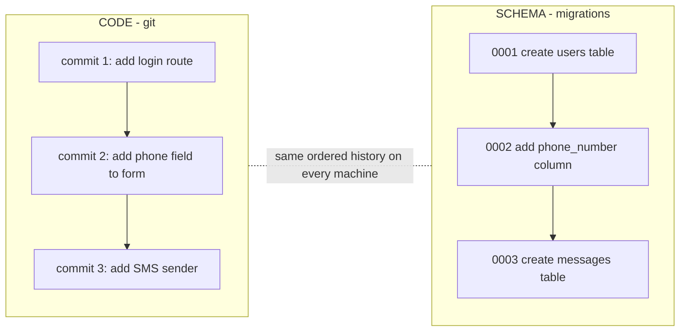

# What a Migration Is

If you've ever pulled a teammate's branch, run the app, and gotten a `column "phone_number" does not
exist` error, you've felt the problem migrations solve. Your *code* changed when you pulled — Git made
sure of that. But your local database didn't. The schema and the code drifted apart, and the app fell
into the gap.

A migration is the fix for that drift. Before we run anything, let's install the one idea the whole
topic rests on.

## The mental model: git for your schema

**What a migration actually is.** A migration is a small, versioned, *ordered* change to your database
structure, written down as a file and checked into source control next to your code. Not a click in a
GUI, not a one-off `ALTER TABLE` you typed into production and forgot — a recorded step that any
environment can replay.

The reason this matters is the same reason Git matters for code. Think about what Git gives you:
a history of ordered changes, the same history on every machine, and the ability to move forward
(apply commits) or backward (revert them). Migrations give your *schema* exactly those properties.



So a migration file is to your database what a commit is to your code: one ordered, replayable step.
Run them all in order, and any empty database becomes the exact structure your app expects — on your
laptop, on a teammate's, in CI, in staging, in production. Same steps, same result, every time.

💡 **Key point.** The value isn't any single migration — it's that the *ordered set* of them is the
single source of truth for what your schema looks like. Nobody has to remember "oh, and you also need
to add this index by hand." It's in the list. You replay the list.

## Up and down: apply and roll back

**What it actually is.** Most migration tools split each migration into two halves:

- An **up** (or *apply*) step: the change you want — "add the `phone_number` column."
- A **down** (or *rollback* / *revert*) step: the exact reverse — "drop the `phone_number` column."

📝 **Terminology.** *DDL* (Data Definition Language) is the subset of SQL that changes structure:
`CREATE TABLE`, `ALTER TABLE`, `DROP TABLE`, `CREATE INDEX`. Migrations are mostly DDL. *DML* (Data
Manipulation Language) — `INSERT`, `UPDATE`, `DELETE` — changes the *rows*. Some migrations do both
(create a column, then fill it in), which becomes important in [Phase 2](02-doing-it-safely-on-live-data.md).

**What it does in real life.** When you deploy, the tool looks at which migrations the database has
already run, finds the new ones, and runs their *up* steps in order. If a deploy goes wrong, the
*down* step is your scripted way back — instead of improvising a fix under pressure, you run the
reverse you already wrote.

⚠️ **Gotcha — down is a comforting story, not a guarantee.** A `down` cleanly reverses *structure*. It
does **not** bring back *data*. If your `up` dropped a column, the `down` that re-adds the column gives
you an empty column — the old values are gone. Rollback is real for "add a table, oops, remove it"; it
is a trap for anything that destroyed data. That asymmetry is the entire reason Phase 2 and Phase 3
exist. (And this is why we lean on a real backup, not just `down`, in Phase 3.)

## How migration tools work, at a concept level

Every framework has one — Rails has Active Record migrations, Django has its migrations, Laravel has
its own, and standalone tools like Flyway and Liquibase do the same job for any stack. They differ in
syntax, but underneath they all do the same three things:

1. **Keep migrations as ordered files** — usually named with a number or timestamp so the order is
   unambiguous (`0001_…`, `0002_…`, or `20260619_…`).
2. **Track what's been applied** — in a little bookkeeping table inside your database (often called
   `schema_migrations` or similar). That table is how the tool knows migration `0007` ran but `0008`
   hasn't.
3. **Apply the pending ones in order** — on command, or as part of your deploy.

Let's see that bookkeeping table, because it demystifies the whole thing:

```console
$ psql -c "SELECT version FROM schema_migrations ORDER BY version;"
   version
--------------
 0001
 0002
 0003
(3 rows)
```
*What just happened:* You asked the database which migrations it has recorded as run. It says `0001`
through `0003`. When you deploy a branch that adds `0004_add_phone_number`, the tool will see `0004`
is *not* in this table, run its `up` step, and then insert `0004` here. Next deploy, it sees `0004` is
present and skips it. That's the entire trick — a checklist the database keeps about itself.

## An annotated example migration

Here's a complete, ordinary migration in plain SQL — the kind a tool would run as one step. We'll
annotate every line so nothing is mysterious:

```sql
-- 0004_add_phone_number.sql

-- == UP (apply) ==
ALTER TABLE users
    ADD COLUMN phone_number text;        -- new, nullable column. Existing rows get NULL here.

CREATE INDEX idx_users_phone_number      -- so lookups by phone don't scan the whole table
    ON users (phone_number);

-- == DOWN (rollback) ==
DROP INDEX idx_users_phone_number;       -- reverse the index first…
ALTER TABLE users
    DROP COLUMN phone_number;            -- …then the column. Reverse order of the up.
```
*What just happened:* The **up** adds a nullable `phone_number` column to `users` and an index to make
lookups on it fast. Because the column is nullable, every existing row gets `NULL` — nothing
breaks, no value is required. The **down** undoes both, in reverse order (drop the index before the
column it sits on). Notice this is a *safe* migration: it's purely additive, it asks nothing of
existing rows, and its rollback genuinely restores the prior structure with no data loss — because
there was no data in the new column to lose yet.

That "purely additive, asks nothing of existing rows" quality is not an accident. It's the property
we'll deliberately engineer for in Phase 2, because it's what makes a change safe to run while real
users are hitting the table.

## Recap

1. A **migration** is a versioned, ordered, source-controlled change to your schema — *git for your
   database structure*. The ordered set is the source of truth.
2. Migrations have an **up** (apply) and usually a **down** (rollback). Down reverses *structure*, not
   *data* — it can't resurrect dropped values.
3. **Migration tools** keep migrations as ordered files, track which have run in a bookkeeping table,
   and apply the pending ones in order — the same way in every environment.
4. Most migrations are **DDL**; the safe ones are **additive** and ask nothing of existing rows.

---

[← Guide overview](_guide.md) · [Phase 2: Doing It Safely on Live Data →](02-doing-it-safely-on-live-data.md)
