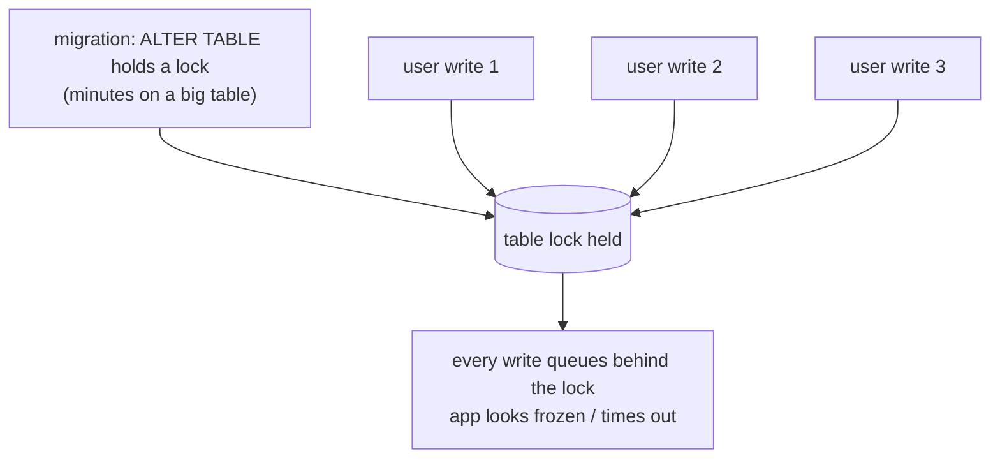

# The Dangerous Migrations

Read this *before* you run the thing that's making you nervous. Most migration disasters aren't exotic —
they're a handful of the same mistakes, made by people who didn't know the migration was dangerous until
it was. Here they are, named, so they can't surprise you.

## The danger cheat-card

> **About to run a migration? Check it against this first. If it matches a row, read that section
> before you ship.**

| What you're about to do | The danger | The calm move |
|---|---|---|
| `ALTER TABLE` / add index on a **big** table | Can lock the table; writes freeze for minutes (§1) | Add columns nullable; build indexes concurrently; check your engine (§1) |
| **Drop or rename** a column | Old app code still using it → errors (§2) | Use expand/contract from [Phase 2](02-doing-it-safely-on-live-data.md); drop last (§2) |
| Add a `NOT NULL` column **without a default** | Fails outright, or locks while it backfills (§3) | Add nullable → backfill → add the constraint (§3) |
| One giant `UPDATE` to backfill | Long lock + huge transaction → bloat, replication lag (§4) | Batch it (§4) |
| Anything **destructive** at all | If it goes wrong, data is gone | Rollback plan + a tested backup, first (§5) |

---

## 1. Long locks on a big table

**What actually happens.** Many schema changes need a lock on the table to do their work. On a tiny table
that lock is held for a blink and nobody notices. On a table with millions of rows, the same operation
can hold it for *minutes* — and while it's held, queries queue up behind it. To your users, the feature
(or the whole app) is frozen.



The classic trap is building an index. A plain `CREATE INDEX` on a large, busy table blocks writes for
the entire build:

```sql
CREATE INDEX idx_orders_customer_id ON orders (customer_id);   -- blocks writes while it builds
```

Postgres offers a non-blocking variant that builds the index without holding that write lock:

```sql
CREATE INDEX CONCURRENTLY idx_orders_customer_id ON orders (customer_id);
```
*What just happened:* `CONCURRENTLY` tells Postgres to build the index while still allowing reads and
writes — it takes longer overall and can't run inside a transaction, but it doesn't freeze your users.
(source: PostgreSQL docs, "Building Indexes Concurrently" —
https://www.postgresql.org/docs/current/sql-createindex.html#SQL-CREATEINDEX-CONCURRENTLY)

⚠️ **Gotcha — locking behavior is engine- and version-specific.** Which operations lock, and for how
long, differs between Postgres and MySQL and changes across versions. Don't assume an `ALTER` is cheap
because it was cheap on your 50-row dev table — check your engine's docs for that specific operation, and
test against a realistically-sized copy first.

💡 **Key point.** "It ran instantly in dev" tells you nothing about production — cost scales with row
count and live traffic, neither of which your laptop has.

## 2. Dropping or renaming a column the app still uses

This is the deploy-gap from [Phase 2](02-doing-it-safely-on-live-data.md), worth stating on its own
because it's the most common self-inflicted outage. The moment you drop or rename a column, any
still-running app instance that references the old name starts erroring:

```console
$ # app log, seconds after a "rename" migration deployed:
ERROR: column "name" does not exist
LINE 1: SELECT id, name, email FROM users WHERE id = $1
                   ^
```
*What just happened:* The migration removed `name`, but old app instances mid-deploy were still running
`SELECT … name …`. Every such query fails until the new code fully rolls out. A "quick rename" became a
wave of errors.

The fix is the entire reason Phase 2 exists: **never drop or rename in place under live traffic.** Use
expand/contract — add the new column, dual-write, backfill, switch reads, and drop the old column as a
separate, *later* migration once you've confirmed nothing references it.

## 3. A non-nullable column without a default

Say you need a required column — every user must have a `status`:

```sql
ALTER TABLE users ADD COLUMN status text NOT NULL;
```
```console
ERROR: column "status" of relation "users" contains null values
```
*What just happened:* The table already has rows. The instant you declare the column `NOT NULL`, every
existing row violates it — they have no `status` yet — so the database refuses the change.

Even when you *do* supply a default, on some engines and versions adding a `NOT NULL` column with a
default has to write that value into every existing row, which on a big table means a long lock (§1).

The safe path is the golden pattern from Phase 2, applied to a constraint:

```sql
-- 1. add it nullable — instant, breaks nothing
ALTER TABLE users ADD COLUMN status text;

-- 2. backfill in batches (see §4) until no NULLs remain
UPDATE users SET status = 'active' WHERE status IS NULL AND id BETWEEN 1 AND 10000;
-- …repeat over id ranges…

-- 3. now that every row has a value, add the constraint
ALTER TABLE users ALTER COLUMN status SET NOT NULL;
```
*What just happened:* You added the column nullable (safe), filled in every existing row in batches
(safe), and only *then* told the database "from now on this can't be null." By the time the constraint
goes on, there are no nulls to object to, so it succeeds — you never asked the database to do an
impossible or table-locking thing in one shot.

## 4. The one giant UPDATE

Backfilling with a single `UPDATE users SET …` across millions of rows is its own hazard, for two
reasons. First, it can lock a lot of rows for a long time, blocking other writes (§1). Second, it's one
enormous transaction — on databases like Postgres that generates a large amount of row churn to clean up
afterward, and on replicated setups it can make replicas fall behind while they apply that one massive
change.

Batching, as in Phase 2 and §3, sidesteps both: each batch is a small, short transaction.

```sql
UPDATE users SET status = 'active'
 WHERE status IS NULL
   AND id BETWEEN 1 AND 10000;     -- bounded; commits; then do the next range
```
*What just happened:* You updated a bounded slice and committed it, keeping locks brief and each
transaction small. Looping over ranges processes the whole table without any single step being heavy.

## 5. Always: a rollback plan and a backup

Two habits turn "we have a problem" into "we have a plan":

**A rollback plan.** Before you run a migration, know your way back. For additive changes, your `down`
migration is genuinely enough. For anything destructive, remember the hard truth from
[Phase 1](01-what-a-migration-is.md): **a `down` restores structure, not data.** A `down` that re-creates
a dropped column gives you an empty one. So "we'll just roll back" is a real plan for expand-style
changes and a *false comfort* for destructive ones — exactly why expand/contract keeps the old column
around as your true fallback, and why destructive steps come last.

**A real backup — and the DDL-transaction caveat.** Before any destructive migration, take a backup (or
confirm a recent one exists *and* that you've actually restored from one before — an untested backup is
a guess). A transaction helps on some engines: Postgres can run most DDL inside a transaction, so a
failed migration rolls back as a unit. But MySQL implicitly **commits** before and after many DDL
statements, so it can't wrap them in a transaction the way you'd expect — a multi-statement migration can
fail half-done with no automatic undo.

> ⏭️ If "commit", "rollback", and "atomic" are fuzzy — or you want to know exactly what your engine
> wraps in a transaction and what it doesn't — read [Transactions and ACID](/guides/transactions-and-acid).
> It's the foundation under every "can I undo this?" question in this phase.

⚠️ **Gotcha — never test a destructive migration for the first time on production.** Run it against a
recent restore of production data (a staging copy sized like the real thing) and watch the lock time,
the run time, and the result. Surprises are free there and expensive in prod.

## Recap

The five dangers map straight onto the cheat-card at the top: big-table locks, drop/rename under live
traffic, `NOT NULL` without a default, one giant `UPDATE`, and anything destructive without a rollback
plan and a tested backup. Each has the same shape — add nullable, backfill in batches, switch, drop
last — and `down` restores structure, never data. When in doubt about what your engine wraps in a
transaction, see [Transactions and ACID](/guides/transactions-and-acid).

---

[← Guide overview](_guide.md) · [Phase 1: What a Migration Is →](01-what-a-migration-is.md)
