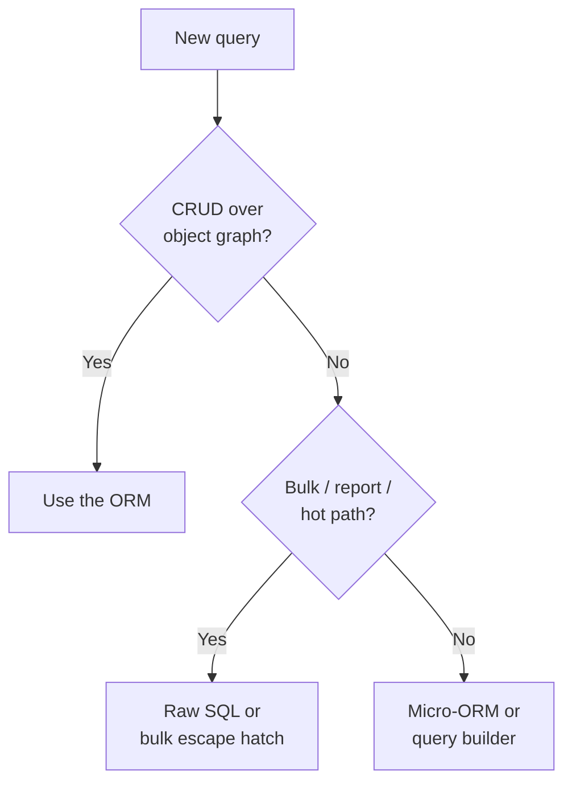

# When Not to Use an ORM

Six phases ago an ORM was a black box that sometimes did surprising things. Now you know the four jobs
every one of them is doing: **mapping** objects to tables, keeping an **identity map + unit of work** to
track them, **loading** related data on some strategy, and **translating** your queries into SQL. That's
the whole machine - and the real payoff isn't that you can use an ORM, it's that you can *predict* one.
Every ORM, and every ORM surprise, now decomposes into those four jobs.

> 📝 The mental model for this finale: an ORM is **a tool, not a cage.** It's brilliant at one shape of work
> and awkward at others, and knowing the difference is what separates people who fight their ORM from people
> who reach past it at exactly the right moment. Every ORM lets you drop to raw SQL when you need to - that
> escape hatch is a feature, not an admission of defeat.

## Where ORMs shine: CRUD over object graphs

The thing an ORM is *built* for - and genuinely great at - is the everyday work of an application: load a
record and its related records, change a few fields, save them back. Create, read, update, delete, over a
graph of connected objects. This is most of your app code, and for it the ORM is a joy: you think in
objects, the four jobs run quietly underneath, and you skip the boilerplate INSERT/UPDATE statements.

```text
order = session.find(Order, 42)     # load the order and (eagerly) its lines
order.status = "shipped"            # mutate an object
order.add_line(Item("sticker", 3)) # touch the graph
session.commit()                    # ORM works out the UPDATE + INSERT
```

That's the 80% case, and reaching for raw SQL there would be busywork. The ORM earns its keep.

## Where to reach past it

The trouble starts when the work stops looking like "fetch some objects, poke them, save them." A few shapes
where the object-graph model fights you:

- **Complex reporting and analytics.** Heavy joins, aggregations, window functions, CTEs, ranking. The
  object query language gets awkward fast and the generated SQL is often suboptimal - write the SQL
  yourself for clearer code *and* a faster query.
- **Bulk operations.** Updating or deleting millions of rows. A naive ORM loop loads every row into an
  object, mutates it, and writes it back - slow and memory-hungry. A single set-based `UPDATE ... WHERE`
  does it in one statement. (Most ORMs offer a bulk/execute escape hatch - use it instead of the loop.)
- **Performance-critical hot paths.** The one query that runs ten thousand times a second, where you need
  to hand-tune the exact SQL and indexes. The abstraction that helps everywhere else gets in your way
  here.
- **Database-specific features the ORM doesn't model.** Vendor extensions, exotic types, fancy locking
  hints. If the ORM has no vocabulary for it, don't contort the ORM - write the SQL.

💡 The decision is rarely "ORM or not" for the *whole app*. It's per-query: which shape is this piece of work?



## The alternatives spectrum

Past the full ORM, there's a whole range of tools, trading "magic" for "control":

- **Raw SQL.** You write the query, the driver runs it, you read rows out by hand. Maximum control, zero
  mapping help. Perfect for the gnarly report.
- **Query builders** (jOOQ in Java, Knex in JavaScript). Build SQL *programmatically* - type-safe,
  composable - but don't map rows into domain objects or track changes. SQL-shaped power with nicer
  ergonomics than string concatenation.
- **Micro-ORMs** (Dapper in .NET, sqlx and sqlc in Go). The sweet spot for many: **you write the SQL**,
  and the library maps result rows onto objects for you. Fast, predictable, none of the magic from
  Phases 3–5, and none of its costs.

💡 Many strong teams **mix**: a full ORM for writes and ordinary CRUD, and raw SQL or a micro-ORM for
heavy reads and reports. That's not hedging - it's using each tool for the shape it fits.

## A clear recap of the costs

This guide has been candid about where ORMs bite, and it's worth gathering those in one place. None of
them is a reason to *avoid* ORMs - they're reasons to *understand* them, which you now do:

- **Hidden queries / N+1** ([Phase 5](05-lazy-loading-and-n-plus-1.md)) - lazy loading can fire a flood of
  small SELECTs without a single line in your code looking suspicious.
- **The detached-object trap** ([Phase 4](04-change-tracking.md)) - mutate an object the session isn't
  tracking and the change silently vanishes at commit.
- **The leaky abstraction** ([Phase 6](06-building-the-query.md)) - the ORM promises to hide SQL, but to use
  it well you still have to know what SQL it generates.
- **A real learning curve** - sessions, flushing, fetch strategies, lifecycle states. It's genuinely a lot.

Here's the reframe: every one of those is a *job you now recognize*. N+1 is the loading job
misconfigured. The detached trap is the tracking job's boundary. The leak is the translating job showing
through. You're not memorizing landmines anymore - you're reading a machine you understand.

## Where to go next

The four concrete ORM guides will now read completely differently - where they once looked like four
unrelated APIs to memorize, you'll see **the same four jobs, only configured**:
[Hibernate & JPA from Zero](/guides/hibernate-and-jpa-from-zero) (Java's ORM and the JPA spec),
[SQLAlchemy from Zero](/guides/sqlalchemy-from-zero) (Python's, with its explicit session),
[GORM from Zero](/guides/gorm-from-zero) (Go's, lighter on magic), and
[EF Core from Zero](/guides/efcore-from-zero) (.NET's, with change-tracking front and center).

Whichever you use, keep one habit: **watch the SQL.** Turn on query logging, read what your ORM emits,
and when a query is slow, go diagnose it - [Why Is My Query Slow?](/guides/why-is-my-query-slow) is your
next stop the first time a page drags. An ORM maps objects to rows, tracks them, loads their relations,
and translates your queries - four jobs, recognized everywhere, in every ORM you'll ever touch.

## Recap

- ORMs are **excellent at CRUD over object graphs** - the 80% of app code that loads, mutates, and saves
  records and their relations. Don't write raw SQL for that; the ORM earns its keep.
- **Reach past the ORM** for complex reporting/analytics, bulk operations, performance-critical hot paths,
  and DB-specific features the ORM can't model. The choice is usually per-query, not whole-app.
- The **alternatives spectrum** runs from raw SQL (full control) through query builders (jOOQ, Knex - SQL
  programmatically, no mapping) to micro-ORMs (Dapper, sqlx, sqlc - you write SQL, they map rows).
- 💡 Mixing is normal and smart: **full ORM for writes/CRUD, raw SQL or a micro-ORM for heavy reads.**
- The real costs - N+1, the detached trap, the leaky abstraction, the learning curve - are reasons to
  *understand* ORMs, not avoid them. Each one maps to one of the four jobs you now know.
- An ORM is a tool, not a cage: every one lets you drop to raw SQL when you need to.

## Quick check

```quiz
[
  {
    "q": "Which kind of work is an ORM genuinely the best tool for?",
    "choices": ["A report with heavy joins, aggregations, and window functions", "CRUD over an object graph - load records and their relations, mutate, save", "Updating ten million rows in one go", "A query that runs thousands of times a second and must be hand-tuned"],
    "answer": 1,
    "explain": "ORMs shine at create/read/update/delete over connected objects - the bulk of app code. Reporting, bulk updates, and hot paths are exactly where you reach past the ORM."
  },
  {
    "q": "What best describes a micro-ORM like Dapper, sqlx, or sqlc?",
    "choices": ["A full ORM with identity map, lazy loading, and dirty checking", "You write the SQL; it maps result rows onto objects - no tracking or lazy-loading magic", "A tool that generates SQL programmatically but never maps rows to objects", "A database driver with no mapping at all"],
    "answer": 1,
    "explain": "Micro-ORMs sit between raw SQL and a full ORM: you author the SQL yourself, and they handle mapping rows to objects - fast and predictable, with none of the identity-map/tracking machinery."
  },
  {
    "q": "You need to update millions of rows. Why is a naive ORM loop the wrong approach?",
    "choices": ["ORMs can't run UPDATE statements", "It loads every row into an object to mutate it - slow and memory-heavy; a set-based UPDATE ... WHERE is one statement", "The identity map forbids bulk writes", "Lazy loading would re-fetch each row twice"],
    "answer": 1,
    "explain": "A naive loop materializes each row as an object, mutates it, and writes it back. A single set-based UPDATE ... WHERE does the whole thing in one statement - use the ORM's bulk/execute escape hatch instead."
  }
]
```

---

[← Phase 6: Building the Query (to SQL)](06-building-the-query.md) · [Guide overview](_guide.md)
