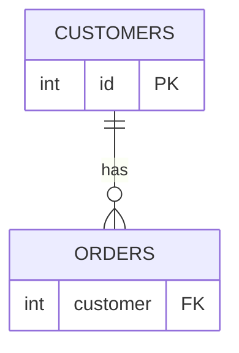

# Why Split Data Into Tables

Picture a brand-new project. You have customers, and customers place orders. The obvious move — the one
almost everyone makes first — is to put everything in one big table: one row per order, each row also
carrying the customer's details right there beside it. It works. It's readable. And it quietly sets a
trap that springs months later.

Let's walk into the trap on purpose so you can see exactly where it bites. Then we'll fix it, and the fix
*is* the whole reason databases use relationships.

## The one-big-table trap

Here's that single table after a few orders come in:

```text
  orders
  ┌────────┬───────────────┬──────────────────────┬─────────────┬───────────┐
  │ order  │ customer_name │ customer_email       │ product     │ amount    │
  ├────────┼───────────────┼──────────────────────┼─────────────┼───────────┤
  │ 1001   │ Ada Lovelace  │ ada@example.com      │ Keyboard    │  49.00    │
  │ 1002   │ Ada Lovelace  │ ada@example.com      │ Mouse       │  25.00    │
  │ 1003   │ Grace Hopper  │ grace@example.com    │ Monitor     │ 210.00    │
  │ 1004   │ Ada Lovelace  │ ada@example.com      │ Webcam      │  80.00    │
  └────────┴───────────────┴──────────────────────┴─────────────┴───────────┘
```

Look at Ada. Her name and email are written out three times — once per order. Nothing is technically
wrong yet. The data is *correct*. But it's *repeated*, and repeated data is data waiting to disagree with
itself.

📝 **Terminology.** This repetition is **data duplication**: the same fact stored in more than one place.
The danger isn't the wasted space — it's that the copies can drift apart.

## Where it actually hurts: the three anomalies

The trap isn't the duplication itself. It's what happens when you try to *change*, *add*, or *remove*
things. These three pains have names, and you'll feel all of them.

**The update anomaly.** Ada emails to say her address is now `ada.lovelace@example.com`. You update her
row... but *which* row? She has three. If you update order 1001 and miss 1004, the database now holds two
different emails for one person, and both look equally official. There's no longer a single source of
truth about Ada — there are three, and they disagree.

```text
  After a careless update:
  ┌────────┬───────────────┬─────────────────────────────┐
  │ 1001   │ Ada Lovelace  │ ada.lovelace@example.com     │ ← updated
  │ 1002   │ Ada Lovelace  │ ada@example.com              │ ← MISSED
  │ 1004   │ Ada Lovelace  │ ada.lovelace@example.com     │ ← updated
  └────────┴───────────────┴─────────────────────────────┘
            which email is real now? the database can't tell you.
```

**The insertion anomaly.** A new customer signs up but hasn't ordered anything yet. Where do you put
them? This table is *orders* — every row needs an order. You literally cannot record a customer without
inventing a fake order for them. The structure won't let you store a fact you clearly need.

**The deletion anomaly.** Grace has exactly one order, number 1003. You delete it (maybe it was
cancelled). Grace vanishes entirely — her name, her email, gone. You meant to delete an *order* and you
accidentally erased a *person*, because the only place that person existed was inside that one order row.

⚠️ **The pattern behind all three.** Every one of these is the same root cause wearing a different
costume: *two different kinds of thing (a customer and an order) are crammed into one table.* When facts
about a customer and facts about an order share a row, you can't touch one without risking the other.

## The fix: one thing, one table, one place

The cure is to give each kind of thing its own table, where each fact is written exactly **once**.
Customers go in a `customers` table. Orders go in an `orders` table. Then — and this is the crucial part —
each order *references* the customer it belongs to instead of copying the customer's details.



Each order's `customer` column holds the customer's `id` — a pointer — not a copy of their name and
email. Ada (id `1`) is written once; her three orders just carry the number `1`.

Ada's name and email now live in **exactly one row** — `customers` id `1`. Her three orders don't copy
her details; they just hold the number `1`, a pointer that says "this order belongs to customer 1."

Watch the three anomalies disappear:

- **Update:** Ada changes her email? You edit *one* cell, in *one* row. Every order that points at
  customer 1 instantly reflects the new email, because they were never storing a copy in the first place.
- **Insert:** A customer with no orders? Add a row to `customers`. Done. The `orders` table isn't
  involved.
- **Delete:** Cancel order 1003? Delete that one order row. Grace, sitting safely in `customers`,
  is untouched.

*What just happened:* by storing each kind of thing once and linking with a number instead of copying
details, you removed the *possibility* of the data contradicting itself. There's no longer more than one
copy to keep in sync — so nothing can fall out of sync.

📝 **Terminology — normalization.** Organizing data this way (each fact in one place, tables referencing
each other instead of duplicating) is called **normalization**. There's a formal theory with numbered
"normal forms," but you don't need the jargon to get the benefit. The instinct is enough: *if you're
copying the same fact into many rows, pull it out into its own table and point at it instead.*

## The trade you're making

Splitting isn't free, and an honest friend tells you the cost. The data is now in pieces, so when you
want "Ada's name *and* her order total" in one result, you have to stitch the tables back together at
query time. That stitching is the JOIN — the subject of [SQL JOINs Explained](/guides/sql-joins-explained).

So the real deal is: a little reassembly effort *every time you read*, in exchange for never fighting
contradictory data *every time you write*. For data that lives a long time and changes often, that's a
trade worth making almost always — why nearly every real application is built this way.

But notice what the whole scheme silently depends on. Order 1001 points at customer "1." For that pointer
to mean anything, customer 1 has to be a **stable, unique name** for exactly one row in `customers` — a
name that won't suddenly belong to someone else tomorrow. That anchor has a name. It's the
**primary key**, and it's next.

## Recap

1. **One big table duplicates facts** — a customer's details get copied into every one of their orders.
2. **Duplication breeds three anomalies** — *update* (copies drift apart), *insertion* (can't store a
   customer without an order), *deletion* (deleting an order erases the person).
3. **All three share one cause** — two kinds of thing forced into one table.
4. **The fix is separate tables that reference each other** — store each fact once; have other tables
   hold a pointer to it instead of a copy. This is **normalization**.
5. **The trade** — you reassemble tables at read time (a JOIN) in exchange for data that can't
   contradict itself at write time.
6. **The pointer only works if the target row has a stable, unique name** — the **primary key**, coming
   up next.

---

[← Guide overview](_guide.md) · [Phase 2: Primary Keys →](02-primary-keys.md)
