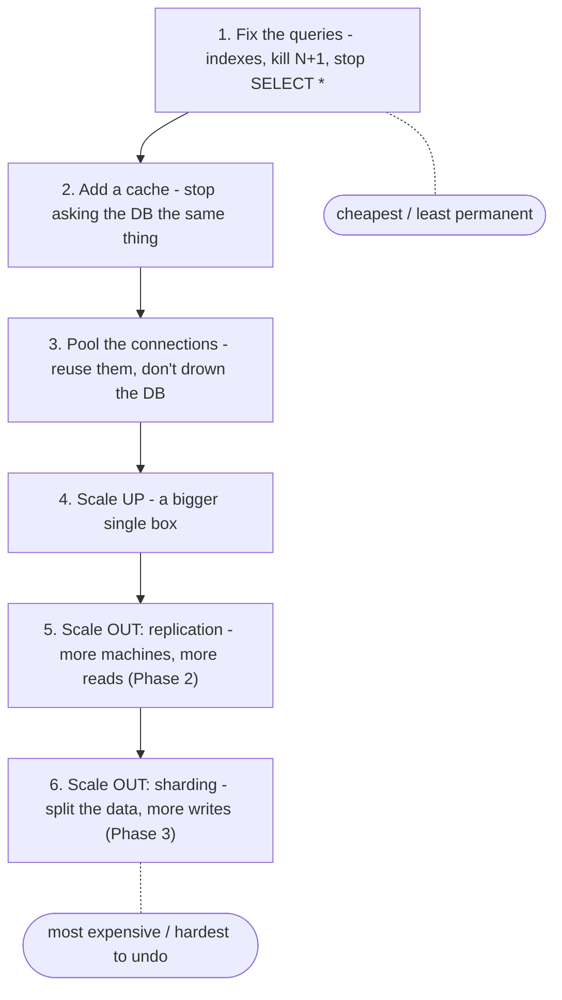
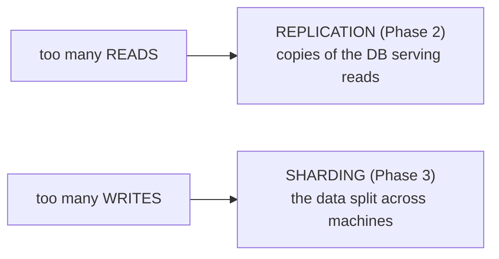

# The Bottleneck

A database under load *feels* like it needs more hardware. It almost never does, at first - and machines you add for scaling are hard to remove later. So before you provision anything: find the actual bottleneck, fix it cheaply, and only then ask whether you've outgrown one box.

Two ideas drive this phase. **Scale the query before you scale the hardware.** And **a read-heavy problem and a write-heavy problem are different illnesses** - almost everything in the next two phases hinges on which one you have.

## Scale up before you scale out

📝 **Terminology.** *Scaling up* (*vertical scaling*) means giving your one database machine more CPU, RAM, or disk. *Scaling out* (*horizontal scaling*) means adding more machines and spreading the work. Replication and sharding are both scaling out.

These aren't two points on the same line - they're different worlds. A bigger single box is still one database: same queries, same transactions, same mental model, just more room. The moment you go to multiple machines, you inherit a permanent tax of coordination and operational complexity that never goes away.

"Scaling out" sounds like the grown-up answer, but a single modern server is enormous - hundreds of gigabytes of RAM, dozens of cores. Most applications never outgrow one well-tuned box. Everything is easier to reason about on one machine: bugs, backups, transactions, "where is this row" - trivial on a single box, genuinely hard across many. So: optimize what you have, scale up if you must, and treat scaling out as the move you make when a single machine truly can't keep up - not the default.

⚠️ **Gotcha - scale the query before you scale the hardware.** The slow-database feeling is far more often a *missing index* or a *bad query* - a full table scan, an N+1 loop firing a thousand small queries per page, a `SELECT *` dragging back columns nobody reads. Hardware buys a little headroom and hides the real problem until it comes back bigger. Fix the expensive queries first - that's the entire subject of [Why Is My Query Slow?](/guides/why-is-my-query-slow). A well-placed index can turn a query from seconds to milliseconds, which beats any amount of new hardware, and it's free.

## The cheap wins, in order

Before "we need to scale" becomes a project, walk this list. Each step is cheaper and less permanent than the one after it.

### Add a cache

A cache is a fast, temporary store (Redis, Memcached, often just in-memory) that holds answers to expensive or frequently-repeated questions, so your app skips the database entirely. The classic pattern is *cache-aside*: check the cache first; on a miss, query the database and store the result for next time.

If your homepage runs the same "top 10 articles" query for every visitor, you're asking the database the identical question thousands of times a minute for an answer that changes maybe once an hour. A cache turns thousands of database hits into one, plus thousands of fast cache reads. For read-heavy workloads, a good cache is often the single highest-leverage change you can make - and it's reversible, unlike adding machines.

⚠️ **Gotcha.** Caching introduces *staleness*: the cached answer can be out of date until it expires or you invalidate it. You're trading perfect freshness for speed, on purpose. (Hold onto that - replication in Phase 2 makes the same trade in different clothes.) The hard part of caching isn't the cache; it's deciding when to throw entries away. Phil Karlton's line - "there are only two hard things in computer science: cache invalidation and naming things" - stops being funny the first time stale data ships to a user.

### Pool your connections

A connection pool is a fixed set of already-open database connections that your application borrows and returns, instead of opening a brand-new connection per request. Every new connection costs real work - authentication, a new backend process or thread - and databases have a hard ceiling on how many they can hold open. A flood of connections can bring a database to its knees while CPU and disk sit nearly idle.

With a pool, a hundred concurrent web requests share, say, twenty long-lived connections, taking turns. Most web frameworks and ORMs have pooling built in or one config flag away; in front of databases like PostgreSQL, a dedicated pooler (PgBouncer is the common one) manages this at scale.

A team once "scaled" their database to a bigger instance because it kept hitting connection limits under load. The bigger box hit the same wall a week later - the limit was self-inflicted: every request opened its own connection. A connection pool fixed in an afternoon what a hardware upgrade couldn't fix at all.

## Read-heavy or write-heavy? This decides everything

**Is your bottleneck reads or writes?** This is the most important question in the guide.

📝 **Terminology.** A *read* is any query that fetches data without changing it (`SELECT`). A *write* is anything that modifies data (`INSERT`, `UPDATE`, `DELETE`). A *read-heavy* workload does far more reads than writes; a *write-heavy* workload is dominated by writes.

The two scaling tools ahead solve different problems:

Most applications are overwhelmingly read-heavy - a social feed, a news site, a store catalog: read constantly, written rarely. That's good news, because **reads are the easy thing to scale.** Make as many copies of the data as you like and spread reads across them - that's replication, the well-trodden path.

Writes are the hard thing. Every copy of the database has to agree on the new value, so more copies can't absorb more writes - a write has to land everywhere. When *writes* are your wall, copies don't help; you have to split the data itself so different machines own different writes. That's sharding, and it's hard precisely because writes are hard.

If you misdiagnose this, you'll reach for the wrong tool and the pain won't go away. Teams add read replicas (Phase 2) to a database that's actually drowning in writes and are baffled when nothing improves - replicas don't take writes off the leader; they add to its load. Measure your read/write ratio before you pick a strategy (PostgreSQL's `pg_stat_statements` breaks down where time goes). Diagnose first. The cure depends entirely on the disease.

## Recap

1. **Scale up before you scale out.** One bigger box keeps the simple mental model; multiple machines impose a permanent coordination tax. Most apps never truly outgrow one well-tuned server.
2. **Scale the query before you scale the hardware.** Missing indexes, N+1 queries, and `SELECT *` masquerade as capacity problems. Fix them first - it's free and it's the biggest win. (See [Why Is My Query Slow?](/guides/why-is-my-query-slow).)
3. **Add a cache** for repeated reads, and **pool your connections** so you don't drown the database - both cheap, both reversible.
4. **Diagnose read-heavy vs. write-heavy.** Reads are scaled with replication (Phase 2); writes, much harder, with sharding (Phase 3). Measure before you choose.

Next: the most common real scaling move there is - making copies of your database so they can share the read load.

---

[← Guide overview](_guide.md) · [Phase 2: Replication →](02-replication.md)
