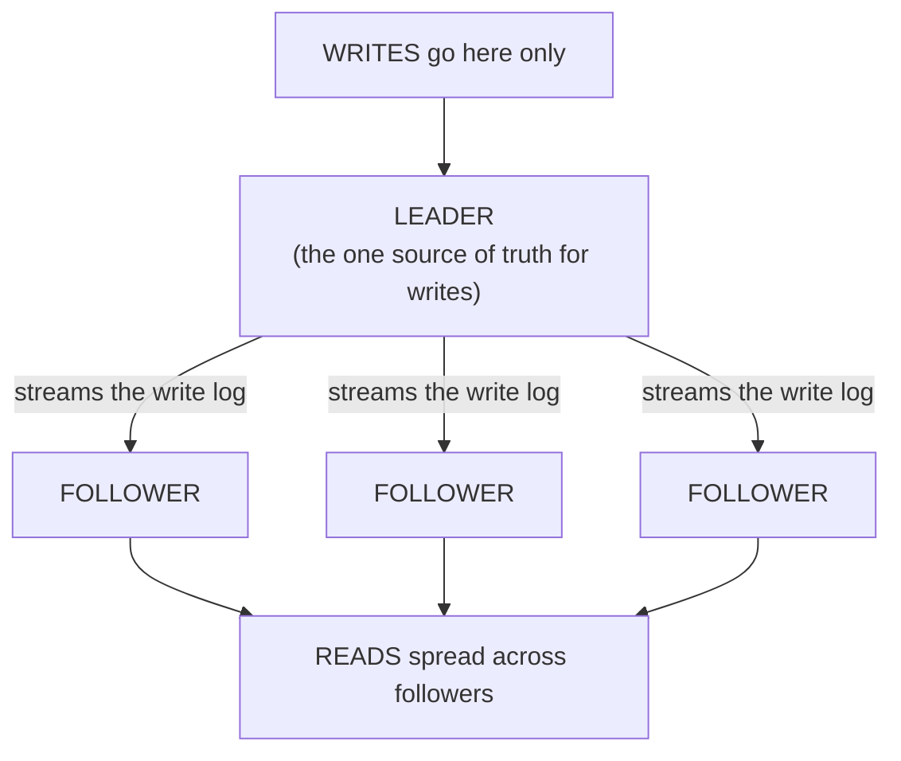
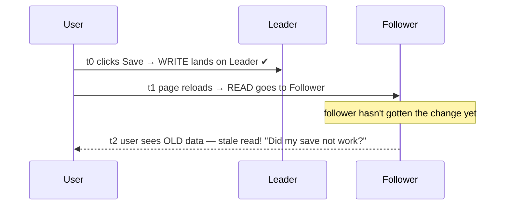

# Replication

You've done the cheap work from [Phase 1](01-the-bottleneck.md) — the queries are tuned, there's a cache, connections are pooled — and the database is *still* pinned, drowning in reads. Good. That means you've earned the right to scale out, and for a read-heavy workload, replication is the move. It's the most common database-scaling technique in the world, it's well understood, and it does two valuable things at once: it multiplies your read capacity, and it gives you a spare copy ready to take over if the main one dies.

Let's build the mental model first, because the whole thing rests on one simple picture.

## The mental model: one leader, many followers

**What it actually is.** Replication means running **multiple live copies of the same database** on separate machines, kept in sync. In the standard arrangement, one machine is the **leader** — it's the only one that accepts writes. Every change it makes, it streams to one or more **followers**, which apply those same changes to their own copies. The followers are read-only mirrors that trail just behind the leader.

📝 **Terminology.** The leader is also called the *primary*, *master*, or *source*; followers are called *replicas*, *secondaries*, *standbys*, or *read replicas*. The names vary by database, but the roles are identical: one place writes go, several places reads can come from. We'll say *leader* and *follower* throughout.

**How the syncing actually works.** The leader already keeps an ordered log of every change it makes — it needs this for crash recovery anyway (PostgreSQL calls it the *write-ahead log* / WAL; MySQL calls it the *binlog*). Replication is, at heart, the leader shipping that change-log to each follower, and each follower replaying it to stay current. The follower isn't re-running your `UPDATE` query from scratch; it's applying the leader's recorded result. That's it — that's the engine.

## How replication scales reads

**What it does in real life.** Your application sends every write — `INSERT`, `UPDATE`, `DELETE` — to the leader, and spreads its reads (`SELECT`) across the followers. If one box could handle all your reads before it tipped over, three followers give you roughly three boxes' worth of read capacity. Add another follower, get more read headroom. Reads, as we said in Phase 1, are the easy thing to scale — and this is exactly why: a read can be answered by *any* copy, so more copies means more reads.

**How your app routes the traffic.** Something has to decide "this query goes to the leader, that one goes to a follower." There are a few common shapes:

- The application code is read/write aware and picks the right connection (many ORMs support a primary/replica split).
- A *proxy* sits in front of the cluster and routes by inspecting the query (writes to leader, reads to followers).
- Managed cloud databases hand you a single "reader endpoint" that load-balances across followers for you.

**Why this saves you later.** The day a marketing campaign triples your read traffic, you don't rewrite anything — you add a follower or two and the load spreads. Read capacity becomes a dial you can turn, which is a very different life from watching one box redline with no options.

## The other gift: failover and redundancy

Scaling reads is the headline, but replication quietly hands you something else you'll be grateful for: a **hot spare**.

**What it actually is.** Because a follower already holds a complete, current copy of your data, it can be *promoted* to become the new leader if the original leader dies. This is **failover** — and it's the difference between "a disk failed, we're down until we restore last night's backup" and "a disk failed, we promoted a follower, we were down for thirty seconds."

📝 **Terminology.** *High availability* (HA) means the system keeps serving even when a component fails. *Failover* is the act of switching to a standby when the active one dies. *Promotion* is turning a follower into the leader.

**The honest catch.** Failover sounds automatic and clean. In practice it's one of the genuinely tricky parts of running databases, because of **split-brain**: if the old leader isn't truly dead (just unreachable for a moment) and a follower gets promoted, you can briefly end up with *two* machines that both think they're the leader, both accepting writes — and now your data has diverged in two directions. Production systems use careful coordination (consensus, fencing, a witness node) to prevent this, and managed databases handle most of it for you. Know that "promote a follower" is not the one-liner it sounds like, and it's a strong argument for using a managed offering if you can.

## The gotcha that defines replication: lag

Everything above is the good news. Here is the thing you *must* internalize before you build on replicas, because it will shape your application's behavior in ways that surprise people.

⚠️ **Gotcha — replication lag, and the stale read.** A follower is always *slightly behind* the leader. The leader commits a write, then streams it, then the follower applies it — and during that gap, however small, the follower is serving data from a moment ago. This delay is **replication lag**. Usually it's milliseconds. Under load, or across a slow network, or during a big batch write, it can stretch to seconds or worse. The consequence has a name: the **stale read** — a read replica handing back data that's already out of date.

**Why this happens (and why it's not a bug).** This is the same trade-off the cache made in Phase 1, wearing different clothes. To make a copy that can serve reads, you accept that the copy isn't instantaneously identical to the original. The technical name for this property is *eventual consistency*: given no new writes, the followers will *eventually* catch up to the leader — but at any given instant, they might not match. You are trading strict freshness for read scalability, deliberately.

**What it actually does to your app — the classic bug.** A user updates their profile, the app writes it to the leader, then immediately re-renders their profile page with a read — which gets routed to a follower that hasn't received the change yet. The user sees their *old* profile and concludes the save failed, so they save again. This is the single most common replication footgun, and it's called **"read your own writes."**

**How to handle it (you have options, none free).** You don't eliminate lag — you decide where you can tolerate it:

- **Route reads-after-writes to the leader.** For the brief window after a user writes, send *that user's* reads to the leader so they always see their own change. Costs a little leader load for correctness where it matters most.
- **Accept staleness where it's harmless.** A view count, a "trending" list, an analytics dashboard — nobody is harmed if it's a few seconds behind. Send these to followers freely. This is most of your traffic.
- **Read from the leader when freshness is non-negotiable.** Account balances, inventory at checkout, anything where a stale read causes a real-world mistake — read from the leader, accept the cost.

**Why this saves you later.** The teams that get burned by replicas are the ones who flipped reads over to followers globally and assumed the data would always be current. The ones who sail through are the ones who asked, query by query, "what happens if this read is two seconds stale?" — and routed accordingly. Make that question a habit and replication becomes a tool you trust instead of a source of mystery bugs.

## What replication does NOT solve

Replication scales reads. It does **not** scale writes. Re-read the leader diagram: *every write still goes through the single leader.* Adding followers gives you more places to read from, but not one extra ounce of write capacity — in fact each follower adds a little work, since the leader must stream its log to all of them. If your bottleneck is writes (Phase 1 told you how to tell), more replicas won't help, and you've arrived at the wall that the final phase is about.

That wall — when the writes themselves are too much for one machine — is where sharding comes in. It's powerful, and it's the most expensive move in this guide.

## Recap

1. **Replication = one leader (takes all writes) + followers (serve reads),** kept in sync by streaming the leader's change-log.
2. It **scales reads** (any copy can answer a read) and provides **failover/redundancy** (a follower can be promoted if the leader dies — though promotion is genuinely tricky; beware split-brain).
3. **Replication lag is unavoidable:** followers trail the leader, so reads from a follower can be **stale**. This is eventual consistency — the same freshness-for-speed trade as caching.
4. **Design around the stale read** — especially "read your own writes." Route by tolerance: leader for must-be-fresh, followers for harmless-if-slightly-old.
5. **Replication does not scale writes.** Every write still funnels through the one leader. When writes are the wall → Phase 3.

Next: the hard one. Splitting the data itself so different machines own different writes — and the real price you pay for it.

Watch it animated: [database replication](/explainers/Replication.dc.html)

---

[← Phase 1: The Bottleneck](01-the-bottleneck.md) · [Phase 3: Sharding →](03-sharding.md)
