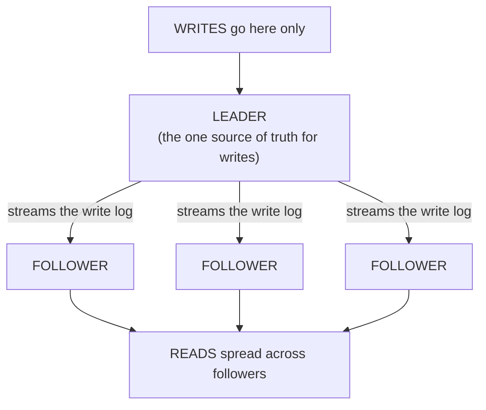

# Replication

You've done the cheap work from [Phase 1](01-the-bottleneck.md) - queries tuned, a cache in place, connections pooled - and the database is *still* pinned, drowning in reads. Good: you've earned the right to scale out. For a read-heavy workload, replication is the move: the most common database-scaling technique there is, and it does two things at once - multiplies your read capacity, and gives you a spare copy ready to take over if the main one dies.

## The mental model: one leader, many followers

Replication means running **multiple live copies of the same database** on separate machines, kept in sync. One machine is the **leader** - the only one that accepts writes. Every change it makes, it streams to one or more **followers**, which apply those same changes to their own copies. Followers are read-only mirrors that trail just behind the leader.

📝 **Terminology.** The leader is also called the *primary*, *master*, or *source*; followers are called *replicas*, *secondaries*, *standbys*, or *read replicas*. Names vary by database, but the roles are identical: one place writes go, several places reads can come from. We'll say *leader* and *follower*.

The leader already keeps an ordered log of every change it makes, for crash recovery (PostgreSQL calls it the *write-ahead log* / WAL; MySQL calls it the *binlog*). Replication is, at heart, the leader shipping that change-log to each follower, which replays it to stay current - not re-running your `UPDATE` from scratch, just applying the leader's recorded result. That's the whole engine.

## How replication scales reads

Your app sends every write (`INSERT`, `UPDATE`, `DELETE`) to the leader, and spreads its reads (`SELECT`) across the followers. If one box could handle all your reads before tipping over, three followers give you roughly three boxes' worth of read capacity - add another follower, get more headroom, because a read can be answered by *any* copy.

Something has to route "this query goes to the leader, that one goes to a follower": read/write-aware application code (many ORMs support a primary/replica split), a *proxy* in front of the cluster that routes by inspecting the query, or a managed cloud database's single "reader endpoint" that load-balances across followers for you.

The day a marketing campaign triples your read traffic, you don't rewrite anything - you add a follower or two and the load spreads. Read capacity becomes a dial you can turn, a very different life from watching one box redline with no options.

## The other gift: failover and redundancy

Scaling reads is the headline, but replication quietly hands you a **hot spare**: a follower already holds a complete, current copy of your data, so it can be *promoted* to become the new leader if the original dies. This is **failover** - the difference between "a disk failed, we're down until we restore last night's backup" and "a disk failed, we promoted a follower, we were down for thirty seconds."

📝 **Terminology.** *High availability* (HA) means the system keeps serving even when a component fails. *Failover* is switching to a standby when the active one dies. *Promotion* is turning a follower into the leader.

The real catch: failover sounds automatic and clean, but it's genuinely tricky, because of **split-brain** - if the old leader isn't truly dead (just unreachable for a moment) and a follower gets promoted, you can briefly end up with *two* machines that both think they're the leader, both accepting writes, and now your data has diverged in two directions. Production systems use careful coordination (consensus, fencing, a witness node) to prevent this, and managed databases handle most of it for you - a strong argument for a managed offering if you can.

## The gotcha that defines replication: lag

⚠️ **Gotcha - replication lag, and the stale read.** A follower is always *slightly behind* the leader. The leader commits a write, then streams it, then the follower applies it - and during that gap, however small, the follower serves data from a moment ago. This delay is **replication lag**. Usually milliseconds; under load, a slow network, or a big batch write, it can stretch to seconds or worse. The consequence has a name: the **stale read** - a read replica handing back data that's already out of date.

This is the cache's trade-off from Phase 1, wearing different clothes: to make a copy that can serve reads, you accept it isn't instantaneously identical to the original. The technical name is *eventual consistency* - given no new writes, followers will *eventually* catch up, but at any given instant they might not match. You're trading strict freshness for read scalability, deliberately.

The classic bug: a user updates their profile, the app writes to the leader, then re-renders the page with a read routed to a follower that hasn't received the change yet. The user sees their *old* profile, concludes the save failed, and saves again. This is the most common replication footgun, called **"read your own writes."**

You don't eliminate lag - you decide where you can tolerate it:

- **Route reads-after-writes to the leader.** For the brief window after a user writes, send *that user's* reads to the leader so they always see their own change. Costs a little leader load for correctness where it matters most.
- **Accept staleness where it's harmless.** A view count, a "trending" list, an analytics dashboard - nobody is harmed if it's a few seconds behind. Send these to followers freely; this is most of your traffic.
- **Read from the leader when freshness is non-negotiable.** Account balances, inventory at checkout - read from the leader, accept the cost.

Teams that get burned by replicas flip reads to followers globally and assume the data is always current. The ones who sail through ask, query by query, "what happens if this read is two seconds stale?" and route accordingly. Make that a habit and replication becomes a tool you trust, not a source of mystery bugs.

## What replication does NOT solve

Replication scales reads. It does **not** scale writes. Re-read the leader diagram: *every write still goes through the single leader.* Adding followers gives you more places to read from, but not one extra ounce of write capacity - each follower even adds a little work, since the leader must stream its log to all of them. If your bottleneck is writes, more replicas won't help.

## Recap

1. **Replication = one leader (takes all writes) + followers (serve reads),** kept in sync by streaming the leader's change-log.
2. It **scales reads** (any copy can answer a read) and provides **failover/redundancy** (a follower can be promoted if the leader dies - though promotion is genuinely tricky; beware split-brain).
3. **Replication lag is unavoidable:** followers trail the leader, so reads from a follower can be **stale**. This is eventual consistency - the same freshness-for-speed trade as caching.
4. **Design around the stale read** - especially "read your own writes." Route by tolerance: leader for must-be-fresh, followers for harmless-if-slightly-old.
5. **Replication does not scale writes.** Every write still funnels through the one leader. When writes are the wall → Phase 3.

Next: the hard one. Splitting the data itself so different machines own different writes - and the real price you pay for it.

Watch it animated: [database replication](/explainers/Replication.dc.html)

---

[← Phase 1: The Bottleneck](01-the-bottleneck.md) · [Phase 3: Sharding →](03-sharding.md)
