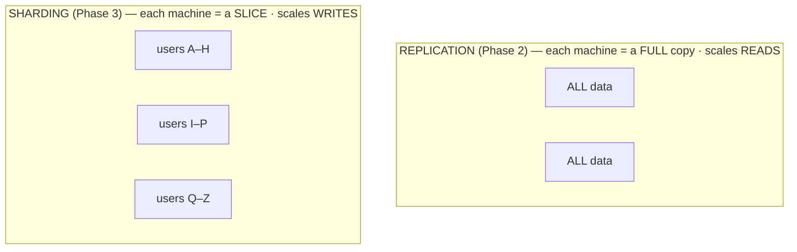

# Sharding

You've optimized the queries, you've cached the hot reads, you've pooled the connections, and you've spread reads across followers. And the database is *still* the wall — but now it's the **writes**. The leader alone can't keep up with the volume of `INSERT`s and `UPDATE`s, and replication (Phase 2) is no help, because every write still funnels through that one leader. You've reached the place where copies don't cut it and you have to split the data itself.

This is sharding. It's the most powerful tool in this guide and the most expensive, and the right way to feel about it is *reluctant*. Everything below is written to give you the real picture — including the parts vendors gloss over — so that you reach for it with eyes open, or recognize that you can avoid it a while longer.

## The mental model: split the data, not copy it

**What it actually is.** Sharding splits your data into pieces called **shards**, and puts each shard on a *different* machine. Every row lives on exactly one shard. Unlike replication — where every machine holds *all* the data — in sharding each machine holds only *part* of it. You decide which row goes where using a **shard key**: a column (or a few columns) whose value determines the shard.

📝 **Terminology.** *Sharding* is also called *horizontal partitioning* — "horizontal" because you're splitting the table by *rows* (this user's rows here, that user's rows there), not by columns. A *shard key* (or *partition key*) is the field used to decide which shard a row belongs to.

Hold the contrast clearly, because it's the whole point:

**Why this scales writes.** With three shards, writes for users A–H land on shard 1, I–P on shard 2, Q–Z on shard 3 — three machines absorbing writes *in parallel*, each responsible for a third of the load. That parallelism is the thing replication could never give you, because no single machine has to see every write anymore. Add shards, add write capacity.

**How rows get routed.** Two common schemes for mapping a key to a shard:

- **Range-based:** split by ranges of the key (users A–H, I–P, Q–Z; or orders by date range). Simple, and great for range queries — but prone to *hot shards* if one range gets disproportionate traffic (everyone whose name starts with S, or this month's orders).
- **Hash-based:** run the key through a hash function and use that to pick the shard. Spreads load evenly and avoids hotspots — but destroys natural ordering, so "all orders from last week" now means asking every shard.

That trade — even distribution vs. the ability to query a range cheaply — is your first taste of how every sharding decision costs you something elsewhere.

Now the honest part. Sharding works. It's also where a database stops being one clean thing and becomes a distributed system, and distributed systems are *hard*. Here are the costs, plainly.

## Hard part #1: choosing the shard key

This is the most consequential decision in the entire project, and the one you can least afford to get wrong.

**Why it's hard.** The shard key decides three things at once: how evenly load spreads, which queries stay fast, and how painful future changes will be. A good key spreads writes evenly *and* matches how you actually query the data, so most queries touch a single shard. A bad key creates a **hot shard** (one machine swamped while others idle) or forces nearly every query to fan out across all shards.

⚠️ **Gotcha — the shard key is nearly impossible to change later.** Changing your mind about the shard key means re-deciding where every row lives and physically moving most of your data across machines while the system is live. Teams put this off for months because it's so disruptive. Choose as if you can't change it, because in practice you almost can't.

**A concrete example of getting it right and wrong.** Say you shard a multi-tenant app. If you shard by `tenant_id`, then any one customer's data lives together on one shard — so "show me everything for tenant 42" hits a single machine, fast. If instead you shard by, say, `created_at`, that same tenant's rows are scattered across every shard by date, and every per-customer query has to ask all of them. Same data, same machines — one key makes your common query cheap, the other makes it expensive forever.

## Hard part #2: cross-shard queries and joins

This is where sharding's cost shows up in everyday work, on queries that were trivial yesterday.

**What it actually is.** A query that needs data from *more than one shard* can no longer be answered by one machine. The system has to ask several shards, then combine the results. This is a **cross-shard query** (or *scatter-gather*: scatter the question to every shard, gather the answers back).

**Why it hurts.** On a single database, `SELECT COUNT(*) FROM orders` is one query to one machine. Sharded, it becomes: ask every shard for its count, wait for the slowest one, sum the results. The query is now as slow as your slowest shard, and it loads *all* of them at once. `ORDER BY ... LIMIT 10` across shards is worse — each shard returns its own top 10, and a coordinator has to merge and re-sort to find the true top 10.

⚠️ **Gotcha — cross-shard joins.** The one that surprises people most: a `JOIN` between two tables that live on different shards is, in general, something a sharded database cannot do for you efficiently — or at all. If `users` is sharded one way and `orders` another, joining them means pulling data across machines and stitching it together yourself. The usual answer is to *co-locate* related data by sharding it on the same key (shard both `users` and `orders` by `tenant_id` so a tenant's users and orders sit on the same shard, and the join stays local). But that only works if a single key makes sense for everything — and it rarely does for *every* query. Some joins you give up, denormalize away, or compute in the application.

**Why this saves you later.** If you go in believing every query will stay as easy as it is today, sharding will feel like betrayal. If you go in knowing that *queries spanning the shard key are the expensive ones*, you'll design your schema and your shard key around your most important queries — and accept that a few reports get slow or move to a separate analytics system. That mindset is the difference between sharding working and sharding hurting.

## Hard part #3: rebalancing

**What it actually is.** Over time, shards drift out of balance — one fills up or gets hammered while others sit idle — or you need to add machines. **Rebalancing** is moving data between shards to even things out or make room. And moving data, while the system is live and serving traffic, without losing writes or breaking queries mid-move, is genuinely hard.

**The naive trap.** The simplest scheme — `shard = hash(key) % number_of_shards` — has a brutal flaw: change the number of shards and the modulo changes for *almost every key*, so adding one machine means relocating nearly all your data. Systems that rebalance gracefully use cleverer schemes (*consistent hashing*, or a layer of many small logical shards mapped onto fewer physical machines) specifically so that adding capacity moves only a small fraction of the data. This is exactly the kind of machinery that managed and distributed databases build for you — and a strong reason not to hand-roll sharding if you can avoid it.

## Hard part #4: the transactions you lose

This is the cost that's easiest to miss and most dangerous to discover late.

**What it actually is.** On a single database, a transaction lets you change several rows *atomically* — all of them commit, or none do — even across different tables. That guarantee is the bedrock a lot of correct code quietly stands on. (If transactions and the word *atomic* are fuzzy, the foundations are in [Transactions and ACID](/guides/transactions-and-acid).)

⚠️ **Gotcha — you largely lose cross-shard transactions.** The moment two rows in one logical operation live on *different shards*, a normal single-database transaction can't span them. The classic example is moving money: debit account A, credit account B. On one database that's one atomic transaction — both happen or neither does. If A and B are on different shards, you no longer have a simple way to make both-or-neither hold. There are answers — *distributed transactions* via two-phase commit (slow, complex, and a source of locking trouble), or application-level *sagas* that do each step and compensate on failure — but they're far harder to get right than the single-line transaction you're used to, and the failure modes are subtle. **A lot of sharding pain is really the pain of losing easy transactions.**

**Why this saves you later.** Plenty of teams shard, then *much* later realize an operation that must be atomic now spans shards — and there's no clean fix without re-sharding or rewriting the operation. Before you commit to a shard key, walk through your operations that must be all-or-nothing and check whether they stay inside one shard. If a critical one doesn't, that's a sign to rethink the key — or to not shard yet.

## When to actually reach for this

Pull the threads together. Sharding is the right tool when:

1. You have a genuine **write** bottleneck (Phase 1's diagnosis), not a read one.
2. You've already exhausted the cheaper options: optimized queries, caching, a bigger box, and read replicas for the read side.
3. You can identify a shard key that keeps your **most important queries on a single shard** and your write-load **evenly spread**.

If you can't tick all three, you're probably not ready — and that's good news, because you get to keep the simple life a while longer.

💡 **Key point — let someone else carry the weight if you can.** Most teams should not hand-build sharding. Managed and distributed databases (Vitess for MySQL, Citus for PostgreSQL, and "distributed SQL" systems like CockroachDB and Spanner, plus many NoSQL stores) handle routing, rebalancing, and a degree of cross-shard querying *for you*. They don't make the costs vanish — cross-shard joins are still expensive, the shard-key choice still matters, distributed transactions are still slower — but they handle the brutal operational machinery so you don't write it under pressure at 2am. The hard parts above don't disappear with a managed system; they stop being *your* code. (Whether to move to such a system at all overlaps with the [SQL vs NoSQL](/guides/sql-vs-nosql) decision, since many NoSQL systems shard by default.)

**The honest bottom line.** Sharding is powerful and it is costly, and the cost is permanent in a way the earlier moves aren't. Exhaust replication and caching first. Reach for sharding only when the writes genuinely won't fit on one machine — and when you do, strongly prefer a battle-tested managed or distributed database over rolling it yourself. The goal was never to shard. The goal was to keep the product up, and sharding is the heaviest, last tool you take down off the shelf to do it.

## Recap

1. **Sharding splits the data across machines by a shard key** (each row on one shard) — unlike replication, which copies all data everywhere. This is what **scales writes**, because shards absorb writes in parallel.
2. **Choosing the shard key is the make-or-break decision** — it sets load balance and which queries stay fast, and it's nearly impossible to change later.
3. **Cross-shard queries and joins are slow or impossible.** Scatter-gather is as slow as your slowest shard; cross-shard joins usually require co-locating data on the same key or giving up the join.
4. **Rebalancing data live is hard;** naive `hash % N` relocates almost everything when you add a machine — good systems move only a fraction.
5. **You largely lose cross-shard transactions** — the atomic, all-or-nothing operation you relied on no longer spans shards cheaply. Much of sharding's pain is this.
6. **It's the last resort.** Exhaust optimization, caching, and replication first; prefer a managed/distributed database to hand-rolling it.

---

[← Phase 2: Replication](02-replication.md) · [Guide overview →](_guide.md)
