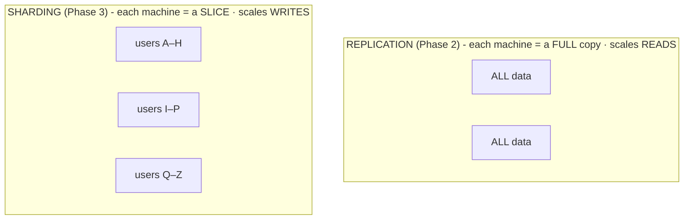

# Sharding

You've optimized the queries, cached the hot reads, pooled the connections, and spread reads across followers. The database is *still* the wall - but now it's the **writes**. The leader alone can't keep up with the volume of `INSERT`s and `UPDATE`s, and replication (Phase 2) is no help, because every write still funnels through that one leader. Copies don't cut it anymore; you have to split the data itself.

This is sharding: the most powerful tool in this guide, and the most expensive - reach for it *reluctantly*, and with eyes open to the parts vendors gloss over.

## The mental model: split the data, not copy it

Sharding splits your data into pieces called **shards** and puts each on a *different* machine. Every row lives on exactly one shard. Unlike replication - where every machine holds *all* the data - each machine here holds only *part* of it. A **shard key** (a column, or a few - also called a *partition key*) decides which shard a row goes to.

📝 **Terminology.** *Sharding* is also called *horizontal partitioning* - "horizontal" because you're splitting the table by *rows* (this user's rows here, that user's rows there), not columns.

With three shards, writes for users A–H land on shard 1, I–P on shard 2, Q–Z on shard 3 - three machines absorbing writes *in parallel*, each responsible for a third of the load. That's the parallelism replication could never give you, because no single machine has to see every write anymore. Add shards, add write capacity.

Two common schemes for mapping a key to a shard:

- **Range-based:** split by ranges of the key (A–H, I–P, Q–Z; or orders by date). Great for range queries - but prone to *hot shards* if one range gets disproportionate traffic (everyone whose name starts with S, this month's orders).
- **Hash-based:** hash the key to pick the shard. Spreads load evenly and avoids hotspots - but destroys natural ordering, so "all orders from last week" means asking every shard.

Even distribution vs. cheap range queries - your first taste of how every sharding decision costs you something elsewhere.

Now the plain part: sharding works, and it's also where a database stops being one clean thing and becomes a distributed system. Distributed systems are *hard*. Here are the costs, plainly.

## Hard part #1: choosing the shard key

This is the most consequential decision in the project. The shard key decides how evenly load spreads, which queries stay fast, and how painful future changes will be. A good key spreads writes evenly *and* matches how you actually query the data, so most queries touch a single shard. A bad key creates a **hot shard** (one machine swamped while others idle) or forces nearly every query to fan out across all shards.

⚠️ **Gotcha - the shard key is nearly impossible to change later.** Changing your mind means re-deciding where every row lives and physically moving most of your data across machines while the system is live. Teams put this off for months because it's so disruptive. Choose as if you can't change it, because in practice you almost can't.

**A concrete example.** Shard a multi-tenant app by `tenant_id`, and any one customer's data lives together on one shard - "show me everything for tenant 42" hits a single machine, fast. Shard by `created_at` instead, and that tenant's rows scatter across every shard by date, so every per-customer query has to ask all of them. Same data, same machines - one key makes your common query cheap, the other makes it expensive forever.

## Hard part #2: cross-shard queries and joins

This is where sharding's cost shows up on queries that were trivial yesterday. A query needing data from *more than one shard* can't be answered by one machine - the system has to ask several, then combine the results. This is a **cross-shard query** (or *scatter-gather*: scatter the question to every shard, gather the answers back).

`SELECT COUNT(*) FROM orders`, one query on a single database, becomes: ask every shard for its count, wait for the slowest one, sum the results - now as slow as your slowest shard, and it loads all of them at once. `ORDER BY ... LIMIT 10` is worse: each shard returns its own top 10, and a coordinator must merge and re-sort to find the true top 10.

⚠️ **Gotcha - cross-shard joins.** The one that surprises people most: a `JOIN` between two tables on different shards is, in general, something a sharded database cannot do efficiently - or at all. If `users` is sharded one way and `orders` another, joining them means pulling data across machines and stitching it together yourself. The usual answer is to *co-locate* related data by sharding both on the same key (shard `users` and `orders` both by `tenant_id`, so the join stays local) - but that only works if one key makes sense for everything, and it rarely does for *every* query. Some joins you give up, denormalize away, or compute in the application.

Design your schema and shard key around your most important queries, and expect that *queries spanning the shard key are the expensive ones* - a few reports will get slow or need to move to a separate analytics system.

## Hard part #3: rebalancing

Over time, shards drift out of balance - one fills up or gets hammered while others idle - or you need to add machines. **Rebalancing** is moving data between shards to even things out, and doing that live, without losing writes or breaking queries mid-move, is genuinely hard.

The naive scheme - `shard = hash(key) % number_of_shards` - has a brutal flaw: change the number of shards and the modulo changes for *almost every key*, so adding one machine means relocating nearly all your data. Systems that rebalance gracefully use cleverer schemes (*consistent hashing*, or many small logical shards mapped onto fewer physical machines) so adding capacity moves only a small fraction of the data - exactly the kind of machinery managed and distributed databases build for you, and a strong reason not to hand-roll sharding if you can avoid it.

## Hard part #4: the transactions you lose

This is the cost that's easiest to miss and most dangerous to discover late. On a single database, a transaction lets you change several rows *atomically* - all commit, or none do - even across different tables. That guarantee is the bedrock a lot of correct code quietly stands on. (If "atomic" is fuzzy, the foundations are in [Transactions and ACID](/guides/transactions-and-acid).)

⚠️ **Gotcha - you largely lose cross-shard transactions.** The moment two rows in one logical operation live on *different shards*, a normal transaction can't span them. Classic example: moving money - debit account A, credit account B. On one database that's one atomic transaction; on different shards, there's no simple way to make both-or-neither hold. There are answers - *distributed transactions* via two-phase commit (slow, complex, prone to locking trouble), or application-level *sagas* that do each step and compensate on failure - but they're far harder to get right than the single-line transaction you're used to. **A lot of sharding pain is really the pain of losing easy transactions.**

Plenty of teams shard, then *much* later realize an operation that must be atomic now spans shards, with no clean fix short of re-sharding or rewriting it. Before you commit to a shard key, walk through your must-be-atomic operations and check they stay inside one shard. If a critical one doesn't, rethink the key - or don't shard yet.

## When to actually reach for this

Sharding is the right tool when:

1. You have a genuine **write** bottleneck (Phase 1's diagnosis), not a read one.
2. You've exhausted the cheaper options: optimized queries, caching, a bigger box, and read replicas for the read side.
3. You can identify a shard key that keeps your **most important queries on a single shard** and your write-load **evenly spread**.

If you can't tick all three, you're probably not ready - good news, since you get to keep the simple life a while longer.

💡 **Key point - let someone else carry the weight if you can.** Most teams should not hand-build sharding. Managed and distributed databases (Vitess for MySQL, Citus for PostgreSQL, "distributed SQL" systems like CockroachDB and Spanner, plus many NoSQL stores) handle routing, rebalancing, and some cross-shard querying *for you*. They don't make the costs vanish - cross-shard joins are still expensive, the shard-key choice still matters, distributed transactions are still slower - but the hard parts above stop being *your* code to maintain at 2am. (This overlaps with the [SQL vs NoSQL](/guides/sql-vs-nosql) decision, since many NoSQL systems shard by default.) The cost here is permanent in a way the earlier moves aren't - the goal was never to shard, it was to keep the product up, and sharding is the heaviest, last tool you take off the shelf to do that.

## Recap

1. **Sharding splits the data across machines by a shard key** (each row on one shard) - unlike replication, which copies all data everywhere. This is what **scales writes**, because shards absorb writes in parallel.
2. **Choosing the shard key is the make-or-break decision** - it sets load balance and which queries stay fast, and it's nearly impossible to change later.
3. **Cross-shard queries and joins are slow or impossible.** Scatter-gather is as slow as your slowest shard; cross-shard joins usually require co-locating data on the same key or giving up the join.
4. **Rebalancing data live is hard;** naive `hash % N` relocates almost everything when you add a machine - good systems move only a fraction.
5. **You largely lose cross-shard transactions** - the atomic, all-or-nothing operation you relied on no longer spans shards cheaply. Much of sharding's pain is this.
6. **It's the last resort.** Exhaust optimization, caching, and replication first; prefer a managed/distributed database to hand-rolling it.

Watch it animated: [database sharding](/explainers/Sharding.dc.html)

---

[← Phase 2: Replication](02-replication.md) · [Guide overview →](_guide.md)
