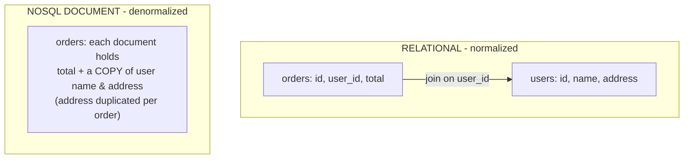

# The Honest Trade-offs

This is the phase where most comparisons cheat: they list the strengths of the side they like
and the weaknesses of the side they don't. We're doing it honestly — each trade-off gets both
sides, because every one of these is a *trade*: you gain something and give something up.
There's no free lunch, only lunches you're choosing to pay for differently.

The whole phase in one table. Read it, then read the sections below for the *why*.

| The trade-off | Relational gives you | NoSQL (the relevant family) gives you | What you give up either way |
|---|---|---|---|
| **Schema** | Enforced structure — bad data is rejected at the door | Flexible records — change shape without a migration | Relational: friction to change shape. NoSQL: the DB won't catch malformed data for you |
| **Related data** | Joins recombine normalized tables on demand | Denormalization — store related data together for one-read access | Relational: joins do work at query time. NoSQL: duplicated data you must keep in sync |
| **Scaling & consistency** | Strong consistency, easy on one big server | Horizontal scale across many machines | Relational: scaling *out* is harder. NoSQL: often weaker/eventual consistency |
| **Queries vs speed** | Ask any question later, even unforeseen ones | Blazing speed for the *one* access pattern it's tuned to | Relational: general queries aren't always the fastest. NoSQL: off-pattern queries are awkward or slow |

## 1. Schema flexibility vs enforced integrity

**The relational side.** You declare the structure up front, and the database *enforces* it —
a column typed as a date can't hold "banana," a required field can't be missing, a foreign key
can't point at a user who doesn't exist. This is a guardrail that works while you sleep: every
write is checked.

```console
shop=# INSERT INTO orders (user_id, total) VALUES (999, 'banana');
ERROR:  invalid input syntax for type numeric: "banana"
```

*What just happened:* The database refused a bad write before it could rot your data. You didn't
write that check in your app — the schema *is* the check, across every write from every part of
your system.

**The NoSQL side.** A schema-flexible store (document stores especially) lets each record have
its own shape. Adding a field is just writing it; you don't run a migration across millions of
rows or coordinate a deploy. Early in a project, or when records genuinely *are* irregular,
that's real velocity.

```console
> db.products.insertOne({ name: "Mug", price: 9, color: "blue" })
> db.products.insertOne({ name: "Poster", price: 12, dimensions: "24x36" })
```

*What just happened:* Two products with different fields landed in the same collection with no
complaint — no migration, no schema change. That's the flexibility, and also the catch: nothing
*stopped* the second one from being malformed, because there's no enforced shape. The validation
didn't disappear; it moved into your application code (more in Phase 3).

> 💡 **The honest framing.** This isn't "rigid vs flexible" with flexible winning. It's "the
> database guarantees your structure" vs "you guarantee your structure." Both are valid. One
> trusts the database; the other trusts your code and discipline.

## 2. Joins vs denormalization

**The relational side.** Because each fact lives in one place, you avoid duplication — a
customer's address is stored once, and every order that needs it *joins* to it. Change the
address once and every order sees the new value. Joins are how relational databases stay
**normalized** (no duplicated data) while answering "show me X with its related Y."

> 📝 **Normalized.** Data organized so each fact is stored exactly once, with relationships
> expressed by keys rather than copies. The opposite is **denormalized** — deliberately
> duplicating data so it's pre-combined and fast to read.

**The NoSQL side.** Many NoSQL designs **denormalize** on purpose: they store related data
together (an order document that includes a copy of the shipping address) so a common read is
*one* lookup with no join. For read-heavy paths where you always need the data together, that's
genuinely faster and simpler to fetch.

The cost is the mirror image of the benefit: duplicated data must be kept in sync. If that
address is copied into a thousand order documents and the customer moves, you either update a
thousand copies or accept that old orders show the old address. Sometimes the old address is
*correct* (an order shipped where it shipped), sometimes it's a bug waiting to happen. The trade
is **read simplicity now** vs **update complexity later**.



Relational keeps one address, joined when needed; the document store does one read, but the address is
copied into every order.

The relational "stored once, joined when needed" move on a built-in pair of tables — each book stores
only its `author_id`, and the author's name is recombined at query time:

```sql runnable
SELECT books.title, authors.name AS author
FROM books
JOIN authors ON books.author_id = authors.id;
```
*What just happened:* The author's name lives once in `authors`; the books just point at it by
`author_id`. The JOIN stitched them back together for this question — no name duplicated on disk.

## 3. Consistency vs horizontal scale (a gentle look at CAP)

This is the trade-off with the most folklore around it, so let's keep it grounded.

**The relational side.** A traditional relational database runs on one primary server and offers
**strong consistency**: once a write succeeds, every following read sees it. There's one
authoritative copy, so there's no ambiguity about "the current value" — wonderful for anything
where being wrong for even a moment matters (money, inventory, bookings). The limit is that a
single machine can only get so big; scaling *up* has a ceiling, and scaling *out* (spreading one
logical database across many machines) is genuinely hard while keeping that strong consistency.

**The NoSQL side.** Several NoSQL stores (wide-column especially) are built from day one to
spread across many machines — **horizontal scale**. Add servers, absorb more data and writes.
But spreading data across machines forces a hard question: when a network hiccup splits your
servers apart for a moment, do you refuse writes (stay consistent) or keep accepting them and
reconcile later (stay available)?

> 📝 **CAP, without the jargon.** When your database is spread across machines and the network
> between them fails for a moment, you can't have both perfect consistency *and* full
> availability — you have to favor one. Many distributed NoSQL stores favor availability and
> offer **eventual consistency**: a write shows up everywhere *soon*, but a read right after a
> write might briefly see the old value.

**The honest framing.** Strong consistency on one machine is easy and is the relational default.
Massive horizontal scale is easy for distributed NoSQL stores and is their default. Getting
*both at once* is the genuinely hard engineering problem — which is why "guaranteed-correct-
right-now, or scale-past-one-machine?" is one of the most useful questions you can ask about an app.

⚠️ **Don't over-rotate on scale.** A single modern relational server, properly indexed, handles
far more load than most apps will ever see. "I might need to scale to billions of rows someday"
is rarely a reason to give up strong consistency *today*.

## 4. Query power vs raw speed for a known pattern

**The relational side.** SQL lets you ask questions you didn't anticipate when you designed the
schema. New report next quarter? Write a new query — the data model doesn't have to change,
because you can always recombine tables a new way. That open-ended query power is the relational
model's quiet superpower: you're not locked into the questions you thought of on day one.

**The NoSQL side.** When you know your access pattern in advance and tune the store for it,
NoSQL can serve that *specific* pattern extremely fast — a key-value `GET`, a single-document
read, a wide-column lookup by its partition key. The store is shaped exactly like the question,
so there's almost no work to do at read time. The catch is the flip side: ask a question the
store *wasn't* shaped for, and it's awkward or slow. "Find all sessions belonging to users in
Canada" is trivial SQL and nearly impossible to ask a plain key-value cache, which only knows
how to look up by key.

> 💡 **The honest framing.** Relational optimizes for *which questions you can ask*; tuned
> NoSQL optimizes for *how fast one known question runs*. Faster-at-the-thing-it's-built-for is
> real, but narrow — "is it faster?" only means anything once you name the query. "NoSQL is
> faster than SQL" with no access pattern attached is a bumper sticker, not a true sentence.

## Recap

1. **Schema:** the database guarantees your structure (relational) vs you guarantee it
   (flexible NoSQL). Validation moves, it doesn't vanish.
2. **Related data:** joins on normalized tables (no duplication, work at read time) vs
   denormalization (one-read speed, duplication to keep in sync).
3. **Consistency vs scale:** strong consistency on one machine vs horizontal scale with often
   eventual consistency. Having both at once is the hard problem (that's CAP).
4. **Queries vs speed:** ask anything later (SQL) vs blazing speed for the one pattern you
   tuned for (NoSQL), at the cost of off-pattern queries.

Every row of that opening table is a real trade. The next phase turns these into an actual
decision.

---

[← Phase 1: The Models](01-the-models.md) · [Guide overview](_guide.md) · [Phase 3: How to Actually Choose →](03-how-to-choose.md)
