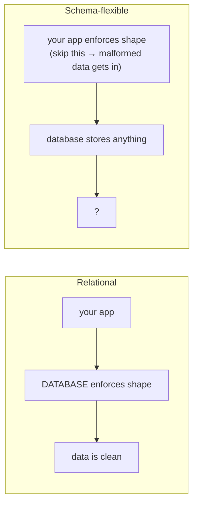
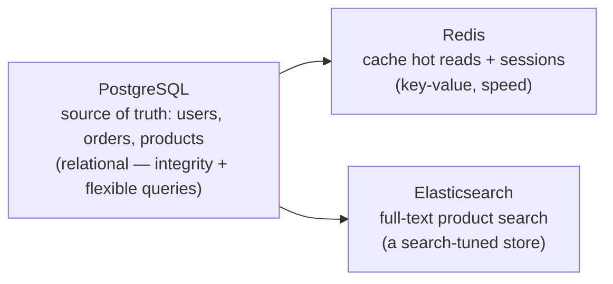

# How to Actually Choose

You've got the mental models and the honest trade-offs. Now the part that actually feels hard
under deadline pressure: picking one. This phase is mostly **judgment**, flagged as judgment
where it is — weigh it against your own situation, don't take it as law. But there's a default
that's right far more often than the internet's energy around this topic would suggest, and
two traps that catch people who pick NoSQL for the wrong reason.

## The picker

> **Find the row that matches your situation, then read the section below it.**

| Your situation | The honest move | Why |
|---|---|---|
| "It's a normal app — users, things they own, relationships between them." | **Relational** (Postgres, MySQL, SQLite). | The boring-correct default. Integrity + flexible queries cover most apps for years. (§1) |
| "I need to make repeated reads blazing fast / store sessions / counters." | Add a **key-value cache** (Redis) *alongside* your main DB. | A cache is a *complement*, not a replacement. (§2) |
| "I'm absorbing a firehose of writes across many machines." | Consider **wide-column** (Cassandra) for that workload. | Built for write scale past one machine. (§2) |
| "My core problem is deep relationships — friends-of-friends, recommendations." | Consider a **graph** store (Neo4j) for that part. | Deep traversal is its native strength. (§2) |
| "My records are genuinely irregular / document-shaped and read as a unit." | Consider a **document** store (MongoDB). | Flexible, read-it-as-one-unit records. (§2) |
| "I picked NoSQL because 'no schema' sounds easier." | Stop — read §3 first. | The schema didn't vanish; it moved into your code. |
| "I think I need more than one of these." | You probably do, and that's fine — §4. | Polyglot persistence is normal. |

## 1. The boring-correct default: a relational database

**The judgment, stated plainly:** *for most applications, a relational database is the right
default, and you should need a specific reason to choose otherwise.* That's an opinion, but a
well-worn one, and here's the reasoning so you can decide if it applies to you.

Most apps are, underneath, a set of *things* with *relationships* between them: users have
orders, orders have line items, line items reference products. That's the relational model's
home turf. You get integrity for free (Phase 2, §1), you can ask questions you haven't thought
of yet (Phase 2, §4), and a single well-indexed relational server handles more load than the
vast majority of apps will ever reach.

The reason "boring" is a compliment here: a relational database is mature, deeply understood,
documented everywhere, and unlikely to surprise you at 2am. Choosing it is rarely the decision
you regret; choosing something exotic *without a reason* is.

⚠️ **"We might need web-scale someday" is not a reason today.** Picking a distributed NoSQL
store to handle traffic you don't have yet means paying its costs — weaker consistency, harder
queries, more operational complexity — *now*, for a problem that may never arrive. If it does
arrive, you'll have real numbers to design against. Optimize for the app you have.

## 2. Reach for a NoSQL store for a *specific* access pattern

The right way to bring in NoSQL is **a specific store for a specific job**, not "let's be a
NoSQL shop." Each family from Phase 1 earns its place when its access pattern is *your*
problem:

- **Cache / sessions / counters → key-value (Redis).** When the same expensive read happens
  over and over, put a fast key-value store in front of it. This is the most common and most
  clearly-justified NoSQL adoption — and it sits *alongside* your relational database, not
  instead of it.
- **Huge write volume across machines → wide-column (Cassandra).** Time-series, event logs,
  sensor data, activity feeds at enormous scale — workloads where writes-per-second outgrow a
  single server and your queries are known in advance.
- **Deep relationship traversal → graph (Neo4j).** When the *queries themselves* are about
  walking connections many hops deep (social graphs, fraud rings, recommendation paths), a
  graph store does natively what would be punishing joins in SQL.
- **Genuinely document-shaped, irregular records → document (MongoDB).** When your records
  really are self-contained objects of varying shape that you read and write as a whole, a
  document store fits the grain of the data.

The test for all four: **can you name the access pattern out loud?** "I need sub-millisecond
lookups by session ID" is a reason. "It's more modern" is not.

🪖 **A common arc.** Plenty of teams start on a relational database, run fine for years, then
add Redis the day a hot query starts hurting — relational core, a specialized store bolted on
for one measured problem. The unhealthy pattern is the reverse: choosing an exotic store first
and discovering later you've made the *normal* parts of the app harder.

## 3. ⚠️ Trap one: "NoSQL ≠ no schema"

This is the most expensive misconception in the whole topic, so it gets its own section.

A schema-flexible store doesn't mean your data has no schema. Your data **always** has a
structure — your code reads `user.email` and `order.total` and expects them to exist and be the
right type. The only question is **who enforces that structure.**

- In a relational database, the *database* enforces it. A bad write is rejected at the door
  (you saw `ERROR: invalid input syntax` in Phase 2).
- In a schema-flexible store, *your application code* enforces it — or nobody does, and then
  malformed records pile up silently until something downstream chokes on them.

The honest version: "schemaless" really means "the schema moved out of the database and into
your code and your discipline." That can be the right trade, but it's a *relocation* of the
work, never a *deletion* of it. Teams that picked NoSQL expecting to skip data modeling
entirely tend to rediscover, painfully, that the modeling was load-bearing.

> 💡 **Key point.** You never get to *not* have a schema. You only get to choose whether the
> database guards it or you do.

## 4. ⚠️ Trap two: it's not either/or — you can mix

The framing "SQL *vs* NoSQL" quietly implies you must pick one for your whole app. You don't —
real systems routinely use several stores, each for what it's best at. There's even a name for
it: **polyglot persistence.**

> 📝 **Polyglot persistence.** Using more than one type of data store in a single system,
> matching each store to the job it fits, instead of forcing everything into one.

A very ordinary, healthy architecture:

Nothing about this is exotic or contradictory. Postgres is the authoritative record; Redis
makes the hot path fast; a search engine handles fuzzy text queries that SQL is clumsy at. Each
store does the one thing it's shaped for, and the relational database stays the single source
of truth the others derive from.

The cost of mixing is real and worth naming: more moving parts to operate, more places data can
drift out of sync, more for a new teammate to learn. Mix *deliberately* — add a store when a
measured problem justifies it, not because variety feels sophisticated.

## Recap

1. **Default to relational.** For most apps it's the boring-correct choice — integrity,
   flexible queries, maturity. You should need a *reason* to deviate.
2. **Reach for a specific NoSQL store for a specific, nameable access pattern** — cache
   (key-value), write-firehose (wide-column), deep traversal (graph), irregular documents
   (document).
3. **"NoSQL ≠ no schema."** The schema moves into your code; it never disappears. Decide who
   guards it on purpose.
4. **You can mix.** Polyglot persistence — a relational core plus specialized stores — is
   normal and often right. Mix deliberately, because each store adds operational cost.

That's the whole honest picture: not a winner, but a set of shapes and trades you can now reason
about. Pick the shape that fits the problem in front of you, name your reason, and you'll defend
a real decision instead of taking a side in a holy war.

## Where to go next

- [What a Database Is](/guides/what-a-database-is) — the groundwork beneath this whole comparison.
- [Relationships and Keys](/guides/relationships-and-keys) — how the relational model actually
  links tables, in depth.
- [Scaling a Database](/guides/scaling-a-database) — the "scale up vs scale out" and consistency
  story from Phase 2, taken further.

---

[← Phase 2: The Honest Trade-offs](02-the-trade-offs.md) · [Guide overview](_guide.md)
