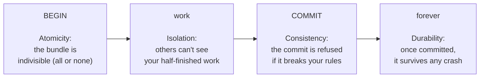

# ACID, Explained

"ACID-compliant" gets thrown around like a marketing checkbox, and most people can recite that it stands for Atomicity, Consistency, Isolation, and Durability without being able to say what any of them actually buy you. That's a shame — each one is a specific promise that defuses a specific way your data could get wrecked.

You already met the most important one in Phase 1 without naming it. Here's the whole set, one plain sentence and one concrete example each. Keep the bundle from Phase 1 in mind throughout: ACID is really four guarantees *about that bundle*.

## A — Atomicity: all of it, or none of it

**In one sentence:** every change in a transaction happens, or none of them do — there is no halfway.

This is the all-or-nothing promise you already felt in the money transfer. "Atomic" means *indivisible* — you can't cut the bundle in half.

**Concrete example.** You debit Alice and credit Bob inside one transaction. The server loses power right after the debit. When it comes back up, atomicity guarantees the database will *not* have applied just the debit. The unsealed bundle is discarded; Alice keeps her money. The only two legal outcomes are "both updates" or "neither update" — never "just one."

💡 **Key point.** Atomicity is what makes `ROLLBACK` trustworthy. Because the bundle is indivisible, undoing it can't leave debris behind.

## C — Consistency: the rules always hold

**In one sentence:** a transaction can only move the database from one valid state to another — it can never commit a state that breaks your defined rules.

The "rules" here are the constraints *you* declared: a balance can't be negative, an email must be unique, every order line must point at a real order. Consistency means the database refuses to commit a transaction that would violate them.

**Concrete example.** Suppose you declared a rule that account balances can't go below zero (`CHECK (balance >= 0)`). You try to overdraw Alice inside a transaction:

```sql
BEGIN;
UPDATE accounts SET balance = balance - 1000 WHERE name = 'Alice';  -- Alice only has $400
```

```text
ERROR:  new row for relation "accounts" violates check constraint "accounts_balance_check"
DETAIL:  Failing row contains (Alice, -600).
```

*What just happened:* The database checked your rule, saw that the update would leave Alice at -$600, and refused — the statement errored instead of being applied. The transaction can't commit a balance that breaks the constraint. To finish at all, you'd have to issue a `ROLLBACK` (or fix the statement). The invalid state never becomes real.

📝 **Terminology.** "Consistency" here means *your* declared rules stay true. It is a different thing from the "C" people argue about in distributed systems (the CAP theorem), which is about whether all servers agree on the latest value. Same word, different conversation — don't let anyone conflate them.

## I — Isolation: concurrent transactions don't trip over each other

**In one sentence:** when many transactions run at the same time, each one behaves as if it had the database to itself — their intermediate, uncommitted changes stay hidden from each other.

This is the promise that lets a database serve thousands of users at once without their half-finished work bleeding together.

**Concrete example.** Alice's transfer is mid-flight: she's been debited but the bundle isn't committed yet. At that exact moment, a reporting job runs `SELECT SUM(balance) FROM accounts`. Isolation guarantees the report does *not* see Alice's temporary, uncommitted -$100 dip. It sees a consistent picture — either the whole transfer or none of it — never the torn-in-half middle.

⚠️ **Gotcha.** Isolation is the one ACID property that comes with a dial, not a fixed setting. "As if it had the database to itself" is the *strongest* guarantee, and it's expensive. Most databases default to a weaker, faster level, which lets certain anomalies sneak through. Phase 3 is entirely about that dial and what slips past at each setting — it's where the real-world trouble lives.

## D — Durability: committed means committed

**In one sentence:** once a transaction has committed, its changes survive anything — crash, power loss, reboot — they will be there when the database comes back.

The promise is about that one instant: the moment `COMMIT` returns success. Before it returns, all bets are off (atomicity handles that). After it returns, the data is safe.

**Concrete example.** Your transfer commits, the database returns `COMMIT` successfully, and you tell the user "Done." One second later the data center loses power. When the server reboots, Bob's $100 is still there. Durability is why you can trust a success message: the database wrote the committed change somewhere permanent (typically a write-ahead log on disk) *before* telling you it succeeded.

💡 **Key point.** Durability is a promise about *committed* transactions only. If `COMMIT` never returned — the connection dropped while you were waiting — you don't actually know whether it landed. That uncertain case is its own headache; the safe move is to check the data rather than assume.

## How the four fit together

It's tempting to memorize ACID as four trivia points. Don't. See them as four ways the database has your back across one transaction's life:



Atomicity and Consistency are about *one* transaction being whole and legal. Isolation is about *many* transactions coexisting. Durability is about surviving *time and failure* after the fact.

## Recap

1. **Atomicity** — all changes in a transaction happen or none do; what makes `ROLLBACK` trustworthy.
2. **Consistency** — a transaction can't commit a state that breaks your declared rules (constraints).
3. **Isolation** — concurrent transactions don't see each other's uncommitted, in-progress changes.
4. **Durability** — once `COMMIT` succeeds, the change survives crashes and reboots.
5. Isolation is the one with a tunable dial — and the source of the real-world surprises in Phase 3.

Watch it animated: [ACID transactions](/explainers/ACIDTransactions.dc.html)

---

[← Phase 1: What a Transaction Is](01-what-a-transaction-is.md) · [Phase 3: Isolation & Concurrency in Real Life →](03-isolation-and-concurrency.md)
