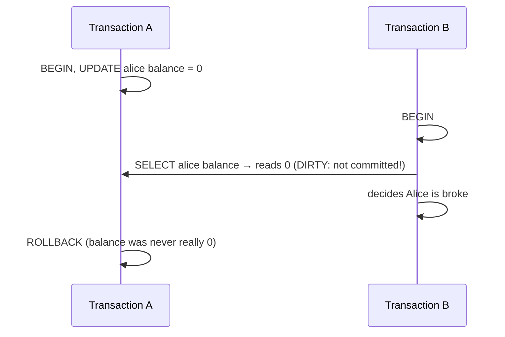
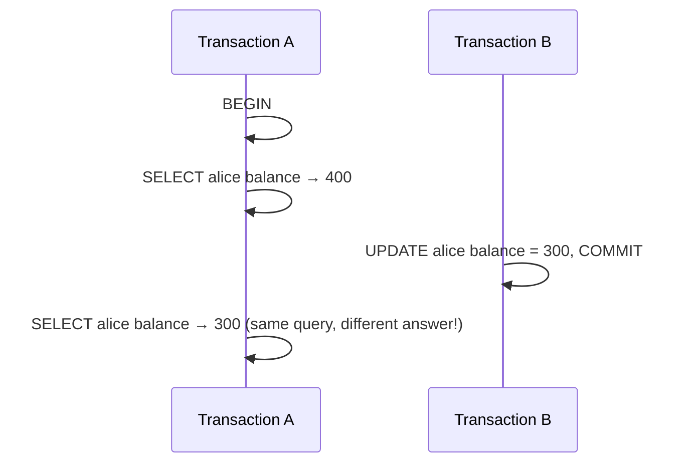
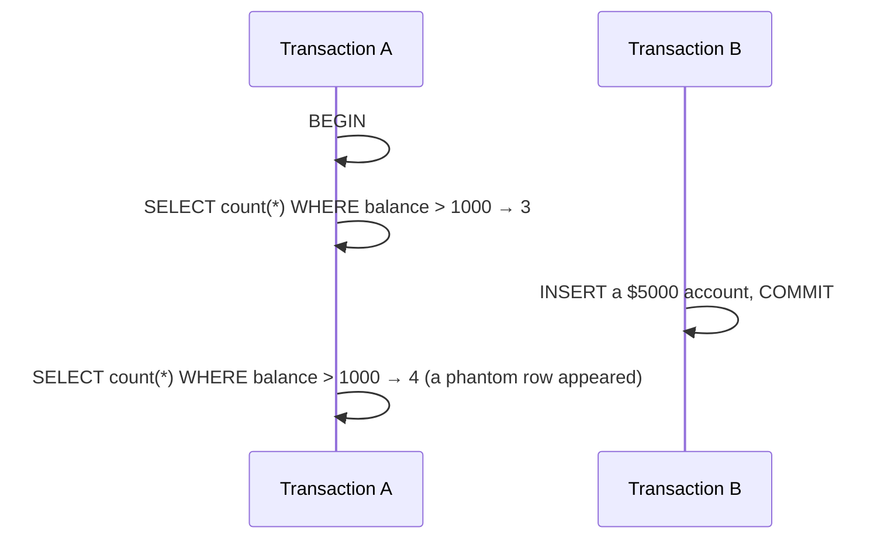
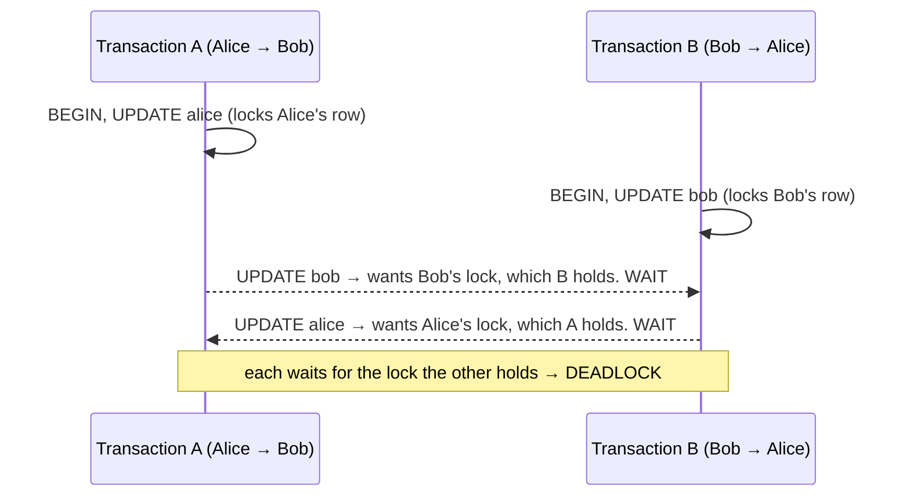

# Isolation & Concurrency in Real Life

Phase 2 said isolation makes each transaction "behave as if it had the database to itself." That's the dream. The reality is that giving every transaction a truly private universe is slow, so databases offer it as a *dial* — and most ship with the dial turned down for speed. This phase is about what slips through when it's turned down, and the one concurrency hazard that can bite at *any* setting: the deadlock. This is the part of the topic people get burned by in production, so we'll go gently and concretely.

## The concurrency cheat-card

> **Seeing weird behavior under load? Find the symptom, then read the section.**

| Symptom | What it is | Where |
|---|---|---|
| Read a value that later vanished (the other side rolled back) | **Dirty read** (§1) | below |
| Read a row twice in one transaction, got two different values | **Non-repeatable read** (§1) | below |
| Ran the same `WHERE` twice, the second time new rows appeared | **Phantom read** (§1) | below |
| "Too much locking / too slow" vs "occasional weird read" | You're choosing an **isolation level** (§2) | below |
| Transaction aborted with "deadlock detected" | Two transactions waited on each other (§3) | below |

---

## 1. What goes wrong when transactions overlap

When two transactions touch the same data at the same time, three classic anomalies can appear, in increasing order of subtlety. You don't need to memorize the names, but you do need to recognize the *shapes* — they explain bugs that look like the database "lying" to you.

**Dirty read.** Your transaction reads a change another transaction made but *hasn't committed yet* — and then that other transaction rolls back. You acted on data that never really existed.



*What just happened:* B read a value A was still working on, then A changed its mind. B made a decision on a number the database, moments later, pretended never happened. This is the worst anomaly, and most databases forbid it by default.

**Non-repeatable read.** You read the same row twice in one transaction and get two different answers, because someone else committed a change in between.



*What just happened:* Within a single transaction, a value you already read shifted under your feet. If your logic assumed the first read was still true (say, you checked the balance, then deducted from it), you've got a bug.

**Phantom read.** You run a query with a `WHERE` filter, then run it again, and *new rows* that match have appeared (or matching rows have vanished) because another transaction committed an insert or delete.



*What just happened:* It's like a non-repeatable read, but for *which rows match* rather than the value in one known row. The set you're reasoning about grew or shrank mid-transaction.

💡 **Key point.** Notice the progression: dirty read = reading uncommitted garbage; non-repeatable read = a row you read *changed*; phantom = the *set* of matching rows changed. Each is subtler and more expensive to prevent than the last.

## 2. Isolation levels: the safety-vs-speed dial

Here's the design decision databases made. Preventing every anomaly means heavy locking and bookkeeping, which slows everything down and makes transactions wait on each other; preventing *none* is fast but lets garbage through. So the SQL standard defines four **isolation levels** — settings on the dial — each promising to block more anomalies than the last, at more cost.

| Isolation level | Dirty read | Non-repeatable read | Phantom | Feel |
|---|---|---|---|---|
| Read Uncommitted | possible | possible | possible | fastest, least safe |
| Read Committed | prevented | possible | possible | the common default |
| Repeatable Read | prevented | prevented | possible* | stricter |
| Serializable | prevented | prevented | prevented | safest, slowest |

(Source: the SQL standard's isolation levels, as summarized in the [PostgreSQL docs on transaction isolation](https://www.postgresql.org/docs/current/transaction-iso.html).)

⚠️ **Gotcha: "default" and the fine print vary by database.** The standard says what each level must *at least* prevent, but vendors differ in defaults and in how strict they actually are. PostgreSQL and Oracle default to Read Committed; MySQL's InnoDB defaults to Repeatable Read. And the asterisk above is real: PostgreSQL's Repeatable Read actually blocks phantoms too (implemented more strictly than the standard requires). The lesson isn't to memorize a grid — it's to **look up your specific database's default and behavior** before you rely on a guarantee. Assuming Serializable when you're running Read Committed is how subtle money bugs are born.

You set the level per transaction when you need something stronger than the default:

```sql
BEGIN TRANSACTION ISOLATION LEVEL SERIALIZABLE;
-- ...your reads and writes are now protected from all three anomalies...
COMMIT;
```

*What just happened:* You turned the dial up to maximum for this one transaction. The database will now ensure the result is as if your transaction had run completely alone — at the cost of more contention, and (as we'll see) a higher chance it gets aborted and asks you to retry.

📝 **Terminology.** "Serializable" means the outcome is equivalent to running the overlapping transactions *one after another in some order* (in series), with no interleaving visible. It's the formal name for the "as if it had the database to itself" promise from Phase 2.

## 3. ⚠️ Deadlocks: two transactions waiting on each other forever

There's one concurrency hazard that isn't about *reading* the wrong thing — it's about getting *stuck*. It can happen at any isolation level, and it surprises people because nothing they wrote looks wrong.

To change a row, a transaction takes a **lock** on it so no one else can change it at the same time. A deadlock happens when two transactions each hold a lock the other one is waiting for — a perfect standoff. Neither can move, because each is waiting for the other to let go first.

The classic recipe: two transfers grab the same two rows in *opposite order*.



*What just happened:* A locked Alice and then asked for Bob; B locked Bob and then asked for Alice. Now A is waiting on B and B is waiting on A. Left alone they'd wait forever — so the database steps in.

Databases detect deadlocks automatically and break the tie by **killing one of the transactions** (the "victim") and rolling it back, so the other can proceed. The victim's connection gets an error:

```sql
-- The losing transaction sees something like:
ERROR:  deadlock detected
DETAIL:  Process 1234 waits for ShareLock on transaction 5678; blocked by process 4321.
HINT:  See server log for more details.
```

*What just happened:* The database noticed the standoff, picked your transaction as the victim, and rolled it back entirely (atomicity again — nothing partial survives). The *other* transaction completed normally. Your code now has an error to deal with, and nothing it did committed.

A deadlock victim error isn't a logic bug — it's the database doing exactly its job, and the fix is almost always to **catch the error and try the transaction again.** The retry usually succeeds, because the conflicting transaction has by now finished and released its locks.

```text
   try:
       run the whole transaction (BEGIN … COMMIT)
   on "deadlock detected":
       wait a tiny, slightly random moment
       try the whole transaction again   (give up after a few attempts)
```

Two practical notes that prevent most deadlocks in the first place:

- **Acquire rows in a consistent order.** The deadlock above happened only because A and B grabbed Alice and Bob in opposite orders. If every transfer always touches the lower account id first, the standoff can't form.
- **Keep transactions short** (the Phase 1 rule again). The less time you hold locks, the less window there is to collide.

🪖 **War story.** A team I know had a nightly batch job that deadlocked against live user traffic a few times a week. The "bug" was that the batch processed rows in insertion order while the API touched them in id order. Adding a single `ORDER BY id` to the batch — so both sides locked rows in the same order — made the deadlocks disappear. No retry logic, no isolation change; just agreeing on an order.

## Tying it back to scaling

Everything here is the cost of letting transactions overlap on *one* database. When that database can't keep up and you split data across several machines, these problems get harder, not easier: a transaction needing rows on two different servers can't be protected by a single database's locks and isolation. That's the wall where single-node ACID meets distributed systems — and where the trade-offs in [Scaling a Database](/guides/scaling-a-database) take over.

## Recap

1. Overlapping transactions can cause **dirty reads** (reading uncommitted data), **non-repeatable reads** (a row's value changes mid-transaction), and **phantom reads** (the set of matching rows changes).
2. **Isolation levels** are a dial from Read Uncommitted (fast, unsafe) to Serializable (safe, slow); each blocks more anomalies at more cost.
3. **Defaults and exact behavior differ by database** — look up yours; don't assume.
4. A **deadlock** is two transactions each waiting on a lock the other holds; the database kills one as a victim and rolls it back.
5. Handle deadlocks by **retrying** the transaction; prevent most of them by **locking rows in a consistent order** and keeping transactions short.

---

[← Phase 2: ACID, Explained](02-acid-explained.md) · [Guide overview →](_guide.md)

**Related:** [Querying Basics — SELECT & WHERE](/guides/querying-basics-select-where) · [Scaling a Database](/guides/scaling-a-database)
