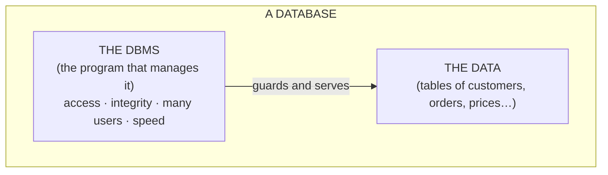
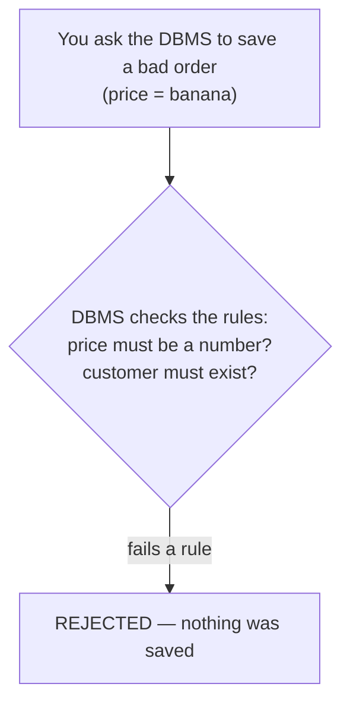

# More Than a Spreadsheet

Let's start with the idea everything else rests on, because almost everyone's first mental picture of a database is wrong in the same way. They picture a really big table — Excel with more rows. That picture isn't *useless*, but it misses the half that actually matters. Get this one idea right and the whole topic opens up.

## What a database actually is

Here's the part that surprises people: **a database is two things, not one.**

A database is an **organized store of data** *plus* a **program that manages all access to it**. That program is the real hero, and it has a name: the **DBMS** — the Database Management System. When people say "the database is down" or "ask the database," they usually mean the DBMS, the running program, not the bytes on disk.

📝 **Terminology.** *DBMS* = Database Management System: the software that stores your data, enforces the rules about it, and answers every request to read or change it. PostgreSQL, MySQL, and SQLite are all DBMSs. In casual speech "database" gets used for both the data and the DBMS — now you can tell which one someone means.

**Why people get this wrong.** A spreadsheet is *just* the data — a grid of cells you edit directly with your own hands. There's no guardian sitting between you and the cells. A database flips that: **you never touch the data directly.** You ask the DBMS, and it decides what to do. That layer in the middle is the entire point, and it's the thing a spreadsheet doesn't have.

## Why you outgrow files and spreadsheets

A file or a spreadsheet is genuinely fine for a while. The trouble is that three problems show up the moment your data matters to more than one person or grows past "small," and a spreadsheet has no answer for any of them. Seeing the three problems tells you exactly what the DBMS is *for*.

### 1. Many people at once

Picture a shared spreadsheet of seat reservations. Two people both see "Seat 14A: free." Both click to book it. Both save. One of those bookings silently vanishes — or worse, both think they got it.

**What the DBMS does instead.** It serves many users at the same time and keeps them from colliding. When one request is in the middle of changing something, the DBMS makes the others wait their turn or refuses the conflicting change outright. The data stays consistent even with hundreds of people hitting it at once.

📝 **Terminology.** *Concurrency* = many users (or programs) reading and writing the same data at the same time. Handling it safely is one of the main reasons databases exist.

### 2. Integrity — keeping the data honest

In a spreadsheet, nothing stops you from typing `banana` into the "price" column, leaving a customer's email blank, or recording an order for a customer who doesn't exist. The cells will hold whatever you type. Later, your code chokes on the garbage and you have no idea when it got in.

**What the DBMS does instead.** It enforces rules *about* the data, every time, no matter who or what is writing. "This column must be a number." "This field can't be empty." "Every order must point to a real customer." The DBMS refuses anything that breaks a rule, so bad data can't get in through the front door in the first place.

💡 **Key point.** *Integrity* is the database's promise that the data obeys the rules you set — always, automatically, for every writer. A spreadsheet trusts you to be careful. A database doesn't have to.

### 3. Finding things, fast, at scale

Searching a spreadsheet of a thousand rows is instant. A spreadsheet of ten million rows is a different animal — and "find every order over $100 placed last March by customers in Ohio" is a question a spreadsheet can barely express, let alone answer quickly.

**What the DBMS does instead.** It's built to *query* — to answer precise questions about huge amounts of data fast — using behind-the-scenes structures called **indexes** that let it jump straight to the matching rows instead of scanning every one. You ask the question; the DBMS figures out the fast way to answer it.

📝 **Terminology.** *Query* = a precise question (or instruction) you send to the database — "give me all customers in Ohio," "add this order," "raise every price by 10%." You'll write real queries in [/guides/querying-basics-select-where](/guides/querying-basics-select-where).

⚠️ **Gotcha — "it works fine in my spreadsheet" is a trap.** Every one of these problems is invisible while your data is small and only you are using it. They all arrive at once the day a second user shows up or the row count explodes — usually the worst possible day. The reason to reach for a database is not today's size; it's the integrity and the concurrency you'll need before you notice you need them.

## So when do you actually need one?

You don't need a database to jot down a grocery list. You start needing one when **more than one person (or program) touches the same data**, when **bad data would cause real harm**, or when **you have to ask sharp questions of a lot of records**. Notice that none of those is "the data is big." Size is the *least* important reason. The DBMS earns its keep on correctness and sharing, long before it earns it on scale.

## Recap

1. A database is **two things**: an organized store of data **plus** a managing program, the **DBMS**.
2. You **never touch the data directly** — you ask the DBMS, which is the whole point of the design.
3. Files and spreadsheets break down on **three things a DBMS handles for you**: many users at once (**concurrency**), keeping data honest (**integrity**), and answering sharp questions fast (**querying at scale**).
4. You reach for a database for **correctness and sharing first**, not because the data got big.

Next, we'll open up "the organized store" and see how the data is actually shaped — the tables, rows, columns, and the one idea that ties them together.

---

[← Guide overview](_guide.md) · [Phase 2: Tables, Rows, Columns & Keys →](02-tables-rows-columns-keys.md)
