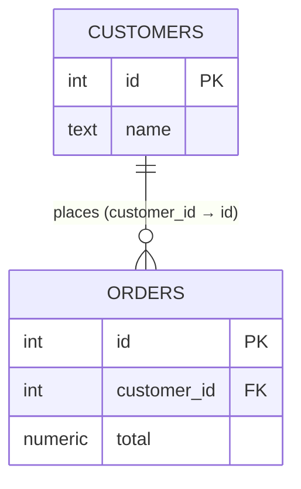

# Tables, Rows, Columns & Keys

Now that you know a database is *data plus a manager*, let's look at how that data is shaped. The most common kind of database - and the one worth learning first - organizes everything into **tables**. The good news: you already understand tables, because a table looks a lot like a spreadsheet. The new ideas are small, and there are only four of them.

📝 **Terminology.** A database built around tables is called **relational** - it's the model behind PostgreSQL, MySQL, SQLite, SQL Server, and most databases you'll meet. We'll touch on the non-relational world in [Phase 3](03-the-database-vs-your-app.md); for now, "database" means relational.

## A table - the familiar part

A **table** holds all the data about one *kind* of thing - one table for customers, one for orders, one for products. Inside a table, every entry has the same shape, like a grid.

Here's a `customers` table:

```text
   ┌─────┬──────────────┬─────────────────────┬────────────┐
   │ id  │ name         │ email               │ city       │   ← columns (the fields)
   ├─────┼──────────────┼─────────────────────┼────────────┤
   │ 1   │ Ada Lovelace │ ada@example.com     │ London     │   ← a row (one customer)
   │ 2   │ Alan Turing  │ alan@example.com    │ Manchester │   ← another row
   │ 3   │ Grace Hopper │ grace@example.com   │ New York   │   ← another row
   └─────┴──────────────┴─────────────────────┴────────────┘
```

That's it - a table is rows and columns about one kind of thing. The four ideas that make it a *database* table and not a spreadsheet are the rows, the columns, the schema, and the key. Let's take them one at a time.

## Rows - the records

A **row** is one single record - one complete thing of the table's kind. In the table above, each row is one customer: Ada is a row, Alan is a row. A thousand customers means a thousand rows.

📝 **Terminology.** You'll hear *row*, *record*, and sometimes *tuple* used for the same idea: one entry in a table. They're interchangeable; "row" is the most common.

**Why this matters.** Almost everything you do with a database is really "do something to some rows": *read* the rows that match a question, *add* a new row, *change* a row, *delete* a row. Hold onto that - it's the whole job, dressed up in different commands.

## Columns - the fields, with types

A **column** is one field that every row has - `name`, `email`, `city`. Where a database departs from a spreadsheet: **each column has a fixed type**, and the DBMS enforces it. The `id` column holds whole numbers, a `price` column would hold decimals, a `created_at` column holds dates. You cannot put `banana` in a number column - the DBMS will refuse it.

📝 **Terminology.** A column's *type* (also called its *data type*) is the kind of value it's allowed to hold: integer, text, decimal, date/time, true-or-false, and so on. Choosing types is part of designing a table.

**Why this saves you later.** This is the *integrity* promise from [Phase 1](01-more-than-a-spreadsheet.md), made concrete. Because the type is fixed up front, a whole category of bugs - text where a number should be, a date that's secretly a typo - becomes impossible. The DBMS catches it at the door instead of your code catching it at 2am.

## The schema - the agreed shape

Put the table's name, its columns, and their types together and you have the table's **schema** - the agreed-upon shape that *every* row must follow. The schema for our table is roughly: "a `customers` table with an integer `id`, a text `name`, a text `email`, and a text `city`."

```text
   SCHEMA of "customers"   (the blueprint - defined once, up front)
   ─────────────────────────────────────────────────────────────
     id     →  integer        a whole number
     name   →  text           letters and characters
     email  →  text
     city   →  text
   ─────────────────────────────────────────────────────────────
   Every row in the table must match this shape. No exceptions.
```

📝 **Terminology.** *Schema* = the defined structure of your data: which tables exist, what columns they have, what types those columns are, and the rules connecting them. It's the blueprint; the rows are the building.

⚠️ **Gotcha - the schema is decided *before* you add data, and changing it later takes real care.** Unlike a spreadsheet where you toss in a new column whenever you feel like it, a relational database wants its shape defined up front. You *can* change a schema afterward (it's called a *migration*), but it's a deliberate, planned operation, especially once there's live data in the table. This rigidity feels annoying at first and turns out to be a feature: it's what guarantees every row is consistent.

## The key - the one idea that ties it together

This is the new concept worth slowing down for, because everything relational is built on it.

A **key** is a column whose value is **unique for every row** - a value that points to exactly one row and no other. In our table, that's `id`: customer `1` is Ada and only Ada, forever. The key is the row's permanent, unambiguous name.

📝 **Terminology.** The column chosen as the row's unique identifier is the **primary key**. By convention it's often a column called `id` holding a number the database hands out automatically, one per new row.

**Why people get this wrong.** "Why not just use the name as the identity?" Because names aren't unique and they change. Two customers can both be named "Alan Turing." A person gets married and changes their name. An email gets reassigned. If you point to a row *by something that can repeat or change*, your pointer eventually breaks. A primary key is deliberately a value that **never repeats and never changes**, so a reference to it is rock-solid.

The key is how you (and the DBMS) refer to one specific row with zero ambiguity. "Update customer **2**." "Delete order **5057**." "This order belongs to customer **2**." That last one is the seed of the whole relational idea: one table can point at a row in another table *by its key*. An `orders` table can carry a `customer_id` column whose value is the `id` of the customer who placed it.



Read it as: a row in `orders` carries a `customer_id`, and `customer_id = 2` means "this order
belongs to the `customers` row whose `id` is 2" - so orders 5057 and 5058 both point at Alan Turing.

💡 **Key point.** A key turns a table from an isolated grid into something you can *reliably point at*. Unique, unchanging identity per row is the foundation that lets tables connect to each other - which is where the real power of relational databases comes from.

**Why this saves you later.** The day you need "all orders for this one customer," or you need to update someone's record without accidentally hitting a namesake, the key is what makes it exact and safe. Building data on keys instead of on names or positions is the difference between data you can trust and data you're forever cleaning up.

> The deeper story of how tables connect through keys - and how to avoid duplicating data - has its own guide: [/guides/relationships-and-keys](/guides/relationships-and-keys). This phase gives you the foundation it builds on.

## Recap

1. **Tables** hold all the data about one kind of thing; they look like spreadsheet grids.
2. A **row** is one record (one customer, one order); a **column** is one field, and **every column has a fixed type** the DBMS enforces.
3. The **schema** is the agreed shape - tables, columns, and types - defined up front; every row must match it.
4. A **key** (the **primary key**, often `id`) is a unique, unchanging value that names exactly one row - the foundation that lets you reference rows safely and connect tables together.

Next, we'll step back from the data and look at where the database actually *lives*: it's a separate program you talk to over a connection, in a language called SQL.

---

[← Guide overview](_guide.md) · [Phase 3: The Database vs Your App →](03-the-database-vs-your-app.md)

## Try it yourself

Every row of the sample `books` table - try changing the query:

```sql runnable
SELECT * FROM books;
```
