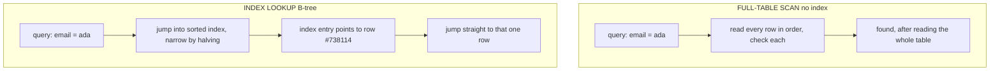

# Indexes

In the last phase, you watched the database read ten million rows to return one. The obvious wish is: *I just want it to know where that row is.* That wish has a name, and it's been the answer for fifty years. It's an **index** — and the analogy that makes it click is sitting on your bookshelf.

Think about how you find one topic in a 900-page textbook. You don't read all 900 pages. You flip to the **index** at the back, find the topic alphabetically, and it tells you "page 412." Then you go straight to page 412. The book's pages are in *book order*; the index is a *second, sorted copy of just the keywords* with pointers to where they live. A database index is exactly this, for your table.

## What an index actually is

**What it actually is.** An index is a **separate, sorted structure** stored alongside your table. It contains the values from one column (say, `email`), kept in sorted order, and next to each value a pointer to the full row it came from. The table itself stays an unordered pile; the index is the sorted "back of the book" that tells the database where each value lives.

Because the index is *sorted*, the database doesn't read it top to bottom either. It uses the same trick you use with a physical index: it can jump to roughly the middle, see whether your value is before or after, throw away half, and repeat. Each step halves what's left.

📝 **Terminology.** Most database indexes are **B-trees** (balanced trees). You don't need the internals — the working mental model is "a sorted structure the database can jump into and narrow down by halving, instead of reading from the start." That halving is why a B-tree lookup stays fast even as the table grows huge: doubling the rows adds only one more step, not double the work.



**Why people get this wrong.** A common picture is that an index "sorts the table" or "makes the table faster." It doesn't touch the table's order at all. It's an *additional* object — extra data on disk — that the database consults *first* to find out which rows it needs, and only then goes to the table for those specific rows. Two structures: the pile (table) and the sorted lookup (index).

## Creating one

**What it does in real life.** You create an index on the column(s) you search by. The syntax is nearly identical across PostgreSQL, MySQL, and SQLite:

```sql
CREATE INDEX idx_users_email ON users (email);
```

```console
CREATE INDEX
```

*What just happened:* The database read through the `users` table once, pulled out every `email` value with a pointer back to its row, sorted them, and saved that as a new structure named `idx_users_email`. From now on, a query filtering on `email` can consult this sorted index to find matching rows in a few hops instead of scanning the table. The naming (`idx_<table>_<column>`) is a convention, not a requirement — but a consistent convention saves you later when you're trying to remember what indexes exist.

The database's planner now has a *choice* for `WHERE email = ...`: scan the whole table, or use the index. For a query that returns a few rows out of millions, it will pick the index — and the same query that timed out becomes instant. (In Phase 3 you'll confirm the switch with `EXPLAIN`.)

## The cost — why you don't index everything

If indexes make reads fast, why not put one on every column? Because indexes are not free, and the bill comes due on the other side of the ledger.

⚠️ **Gotcha — indexes slow down writes.** An index is a *second copy* of that column's data, kept sorted. Every time you `INSERT`, `UPDATE`, or `DELETE` a row, the database must update the table *and* update every index on that table to keep them in sync. One index, modest cost. Ten indexes on a hot table, and every single write now does eleven pieces of work instead of one. On a write-heavy table, over-indexing can make the whole thing *slower*, not faster.

⚠️ **Gotcha — indexes use disk and memory.** Each index is real, stored data — sometimes a significant fraction of the table's own size. More indexes means more disk used, and more of your database's memory cache spent holding index pages instead of actual rows.

So indexing is a trade: **faster reads in exchange for slower writes and more space.** That trade is almost always worth it for the columns you actually search by, and almost always a waste for the ones you don't.

💡 **The rule of thumb:** index the columns you **filter** on (`WHERE`), **join** on (`ON`), and **sort** on (`ORDER BY`) — those are the lookups that benefit. Don't index columns you only ever read back as output, columns you rarely filter by, or low-value columns "just in case." Index for the queries you actually run.

This is also where it connects to the rest of your schema. The columns you join on are typically your foreign keys (see [Relationships & Keys](/guides/relationships-and-keys)), and the columns in your join conditions (see [SQL Joins Explained](/guides/sql-joins-explained)) are prime index candidates — an unindexed join column is one of the most common causes of a slow join. A primary key, worth noting, is already indexed for you automatically; you don't need to add one for it.

**Why this saves you later.** Knowing the trade means you can answer the next "slow query" calmly. You won't carpet-bomb the table with indexes (and quietly wreck write performance), and you won't refuse to add the one index that would fix everything. You'll add *the right index for the query that's actually slow* — which is exactly what Phase 3 teaches you to identify.

## Recap

1. **An index is a separate, sorted structure** with pointers back to rows — the "back of the book," not a reordering of the table.
2. **It's usually a B-tree**, so the database finds a value by jumping and halving, staying fast even as the table grows.
3. **`CREATE INDEX idx_users_email ON users (email);`** builds one; the planner then *chooses* whether to use it.
4. **Indexes cost you on writes and disk** — every write must update every index, and each index takes real space.
5. **Index what you filter, join, and sort on** — not every column, not "just in case." Index for the queries you run.

You now know the disease (the scan) and the cure (the right index). The last skill is the one that ties them together: *seeing* which one your database is using, so you stop guessing. That's `EXPLAIN`, and it's next.

Watch it animated: [database indexes](/explainers/Indexes.dc.html)

---

[← Phase 1: The Full-Table Scan](01-the-full-table-scan.md) · [Guide overview](_guide.md) · [Phase 3: Reading EXPLAIN →](03-reading-explain.md)
