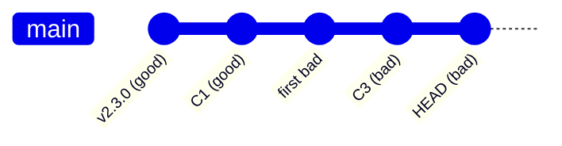

# git bisect - Letting Git Drive the Search

You've got the mental model from [Phase 1](01-binary-search-thinking.md): halve the range, test the
midpoint, keep the half with the break. Doing that by hand means checking out commits, computing each new
midpoint, and tracking cleared halves - fiddly bookkeeping Git will happily do for you.

`git bisect` is that binary search, built into Git. Supply the two ends and answer "good or bad?" at each
step; Git picks the midpoints, checks out the code, and tells you when it finds the culprit.

## What git bisect actually is

A guided session where Git walks you through a binary search over your commit history. Hand it a
known-bad commit and a known-good commit, and Git keeps checking out the midpoint of the *remaining*
suspect range for you to judge. Each judgment discards half the commits, until one is left - the first
one where things went bad.

Git physically *moves your working tree* to each commit it wants tested, so the code on disk is that
commit's code. You test it, type `git bisect good` or `git bisect bad`, and Git jumps to the next one -
handling the bookkeeping so you only ever answer one question at a time.

📝 **Terminology.** *First bad commit* is what bisect hunts for: the earliest commit where the bug is
present - everything before is good, it and everything after is bad. It's the change that introduced the
bug, the thing you want to read.

The hunt walks a line of commits looking for the exact good→bad flip:



## A full bisect session, start to finish

Say checkout is broken on `main` today, but worked at the `v2.3.0` release tag - that's your known-good;
`HEAD` is your known-bad.

**Start and mark the two ends.**
```console
$ git bisect start
$ git bisect bad                 # current commit (HEAD) is broken
$ git bisect good v2.3.0         # this tag is known to work
Bisecting: 214 revisions left to test after this (roughly 8 steps)
[a1b2c3d4e5f6a7b8c9d0e1f2a3b4c5d6e7f8a9b0] Refactor cart pricing
```
*What just happened:* Git did the Phase 1 math (214 commits, roughly 8 tests), then checked out the
*midpoint* commit (`a1b2c3d…`, "Refactor cart pricing") - ready to test.

**Test it, then tell Git the verdict.** Run your reliable yes/no test - here, a checkout in the app:
```console
$ npm test -- checkout
... 1 passing
$ git bisect good
Bisecting: 106 revisions left to test after this (roughly 7 steps)
[f9e8d7c6b5a4f3e2d1c0b9a8f7e6d5c4b3a2f1e0] Add promo-code validation
```
*What just happened:* The test passed, so you marked it `good`. Git threw away this commit and everything
older (all still-working), halving the range from 214 to 106, and checked out the new midpoint.

**Keep going.** Each round, test what's checked out and mark it:
```console
$ npm test -- checkout
... 1 failing
$ git bisect bad
Bisecting: 52 revisions left to test after this (roughly 6 steps)
[c4d5e6f7a8b9c0d1e2f3a4b5c6d7e8f9a0b1c2d3] Tidy currency formatting
```
*What just happened:* This time the test *failed*, so you marked it `bad`. Git discarded this commit and
everything *newer* (all broken), keeping the older half where the good→bad flip must be - 106 down to 52.

**Git names the culprit.** After the last round:
```console
$ npm test -- checkout
... 1 failing
$ git bisect bad
3f0a1b2c3d4e5f6a7b8c9d0e1f2a3b4c5d6e7f8a is the first bad commit
commit 3f0a1b2c3d4e5f6a7b8c9d0e1f2a3b4c5d6e7f8a
Author: Dana Lee <dana@acme.dev>
Date:   Tue Jun 3 14:22:10 2026 -0400

    Switch cart total to integer cents

 src/cart/total.js | 18 ++++++++---------
 1 file changed, 9 insertions(+), 9 deletions(-)
```
*What just happened:* The range collapsed to one commit, and Git declared it the **first bad commit**,
printing author, date, message, and files touched. "Something broke checkout" is now "this 18-line change
to `total.js` broke checkout."

**Clean up - mandatory.** Your working tree is still parked mid-search. Put yourself back:
```console
$ git bisect reset
Previous HEAD position was 3f0a1b2 Switch cart total to integer cents
Switched to branch 'main'
```
*What just happened:* `git bisect reset` ended the session and returned your working tree to the branch
you were on before `git bisect start`. Skip it and you're left in a detached state on an old commit.

⚠️ **Gotcha - don't forget `git bisect reset`.** A bisect leaves you on a "detached HEAD." Fix the bug
there and your fix lands detached from any branch, easy to lose. Always `reset` first, *then* fix on a
real branch. (Already committed in a detached state and panicked?
[Git Disaster Recovery](/guides/git-disaster-recovery) walks you back.)

💡 **Key point.** Marked a commit wrong? No need to start over - `git bisect log` shows every verdict, and
`git bisect replay` plus editing can redo it. Simpler: if only the *last* answer was wrong, `git bisect
reset` and start fresh - eight tests is cheap.

## Skip a commit you can't test

Sometimes the midpoint can't be tested - it doesn't build, or fails for an unrelated reason, so your
yes/no test can't give an honest answer. Don't guess - tell Git to set it aside:
```console
$ git bisect skip
Bisecting: 52 revisions left to test after this (roughly 6 steps)
[b2c3d4e5f6a7b8c9d0e1f2a3b4c5d6e7f8a9b0c1] Bump build tooling
```
*What just happened:* `git bisect skip` told Git "I can't judge this one," so it tried a nearby commit
instead. Use it only when genuinely untestable, never to dodge an uncertain verdict - a guess corrupts
the search (Phase 1's warning).

## Let Git run the whole thing: `git bisect run`

If your yes/no test is a command - a script or test suite exiting `0` for good, non-zero for bad - you
don't have to sit there answering each round. Hand it to `git bisect run` and Git drives the search itself:
```console
$ git bisect start
$ git bisect bad
$ git bisect good v2.3.0
$ git bisect run npm test -- checkout
running 'npm test' '--' 'checkout'
... (Git checks out a commit, runs the command, reads the exit code, repeats) ...
3f0a1b2c3d4e5f6a7b8c9d0e1f2a3b4c5d6e7f8a is the first bad commit
bisect run success
```
*What just happened:* For each midpoint, Git ran `npm test -- checkout` and read the exit code as your
verdict (`0` = good, non-zero = bad) - looping unattended through all ~8 rounds and printing the first bad
commit at the end. Write the test once, get the culprit hands-free.

📝 **Terminology.** *Exit code* (or *exit status*) is the number a command returns on finishing - `0` for
success by convention, anything else for failure. `git bisect run` reads it as the good/bad answer, so
your test must exit `0` only when the bug is *absent*. (Exit `125` means untestable, same as `skip`.)

**Why this saves you later.** A `git bisect run` one-liner turns "spend an afternoon hunting the
regression" into "write one test, walk away, come back to the exact commit." Still `reset` before you fix.

## Recap

1. **`git bisect start`**, then **`git bisect bad`** (broken end) and **`git bisect good <commit>`**
   (working end) - Git checks out the midpoint for you.
2. **Test what's checked out**, then mark it **`git bisect good`** or **`git bisect bad`**; Git halves the
   range and hands you the next midpoint.
3. Git announces the **first bad commit** with its full message and changed files - the change to read.
4. **`git bisect reset`** when done, *always* - it returns you from the detached commit to your branch.
5. **`git bisect skip`** an untestable commit; never guess a verdict.
6. **`git bisect run <command>`** automates the whole loop using the command's exit code (`0` = good).

---

[← Phase 1: Binary-Search Thinking](01-binary-search-thinking.md) · [Guide overview](_guide.md) · [Phase 3: Bisecting Beyond Git →](03-bisecting-beyond-git.md)
