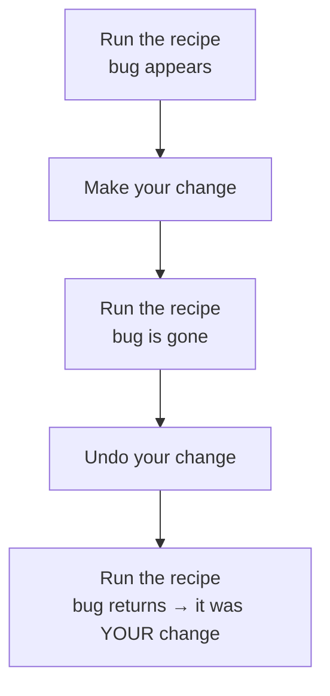
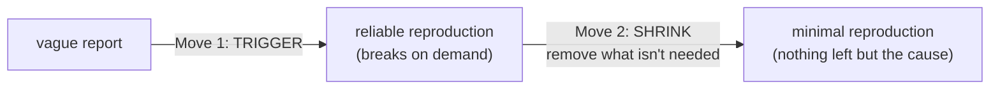

# Why Reproduction Is the Whole Game

When a bug report says "it's broken sometimes," the natural urge is to dive into the code and hunt for the mistake by eye. That rarely works, and the reason reframes the whole job.

Reading code tells you what *should* happen. A bug is where what *should* happen and what *does* happen come apart. Seeing that gap means watching the program actually misbehave - which means being able to *make* it misbehave. That ability is reproduction, and it's the foundation everything else stands on.

## The mental model: a bug you can't trigger is a rumor

**What reproduction actually is.** A recipe: a specific, repeatable sequence - these steps, on this setup, with this data - that makes the bug appear every time you follow it. Not "it broke once"; "it breaks *whenever I do this*."

**Why this is the whole game.** A bug you can trigger on demand stops being scary - it's now a science experiment. Run it, change one thing, run it again, watch what moves. Add logging and *see the log fire*. Step through it in a debugger knowing the bug is coming. Without a reproduction you're reasoning about something you've never observed - which is why a bug you can't trigger isn't really a bug yet. It's a rumor.

```text
   A rumor                          An experiment
   ───────                          ─────────────
   "it crashes sometimes"           do A, then B, then C → it crashes, every time

   - can't watch it happen          - watch it happen on demand
   - can't tell what triggers it    - change one input, see what moves
   - can't prove a fix works        - run the recipe again → no crash = fixed
```

💡 **Key point.** "I can't fix this bug" almost always means "I can't reproduce this bug *yet*." Solve the reproduction and the fix usually follows fast - which is why early effort belongs in reproduction, not code-reading.

## The other half: reproduction is how you *verify* the fix

People skip this part: reproduction isn't only for *finding* the bug - it's the only reliable way to know you *fixed* it.

The trap: you can't reliably trigger the bug, so you change something suspicious and it doesn't show up. Fixed, or just didn't happen this time? You can't tell. Ship that "fix," the bug returns next week, and you've burned trust for nothing.

A solid reproduction closes that loop:



*What just happened:* steps 1 and 3 prove the bug is real and your change removed it. Undoing the fix and watching the bug return proves it was *your change* that did the work, not coincidence. That round trip is the difference between "I think this is fixed" and "I know this is fixed."

⚠️ **Gotcha.** "It didn't happen when I tried it" is not "it's fixed" - especially for anything intermittent. If you couldn't make the bug happen *before* your change either, you've tested nothing; that's an experiment with no control. Get a reliable reproduction first, confirm the bug, then change code. Phase 3 covers earning that reliability when a bug won't cooperate.

## The two moves, in order: trigger, then shrink

Every reproduction effort is the same two moves, in this order.

**Move 1 - make it happen reliably.** Get from "it broke once, somewhere" to "I can make it break right now, on purpose." This is the hard part and the payoff part. Even a clumsy, slow reproduction - "log in as this exact user, click through eight screens, upload this file" - beats nothing, because now you can *watch*.

**Move 2 - shrink it.** Once it triggers reliably, start removing things: drop steps that don't matter, cut data to the smallest input that still breaks, strip out uninvolved parts of the system. Each removal that *doesn't* stop the bug proves that thing innocent - what's left when nothing more can go points straight at the cause.



🪖 **War story.** A teammate spent a full afternoon reading a payment module line by line, certain the bug was "in there somewhere." Only when he stopped and forced himself to run a real checkout that failed did he notice the failure only hit orders over a certain amount - one observation that narrowed a thousand lines to one branch in about a minute. Reproducing first would have saved the afternoon.

**Why this saves you later.** Most "this bug is impossible" panics come from trying to fix before you can trigger. Flip the order - reproduce first, fix second - and the work stops feeling like guessing and starts feeling like turning a knob and watching a needle move. Next up: the variables you adjust to get a bug happening reliably, then pare it down.

## Recap

1. **Reproduction is a repeatable recipe** that makes the bug appear every time - not "it happened once."
2. **A bug you can't trigger is a rumor.** You can't watch it, can't experiment on it, can't reason from observation.
3. **Reproduction is also how you verify a fix:** trigger it, fix it, confirm it's gone, then undo and confirm it returns.
4. **"It didn't happen when I tried" ≠ fixed** - that's an experiment with no control.
5. **Two moves, in order: trigger, then shrink.** Make it happen reliably first; then remove everything that isn't load-bearing until only the cause is left.

---

[← Guide overview](_guide.md) · [Phase 2: Nailing It Down →](02-nailing-it-down.md)
