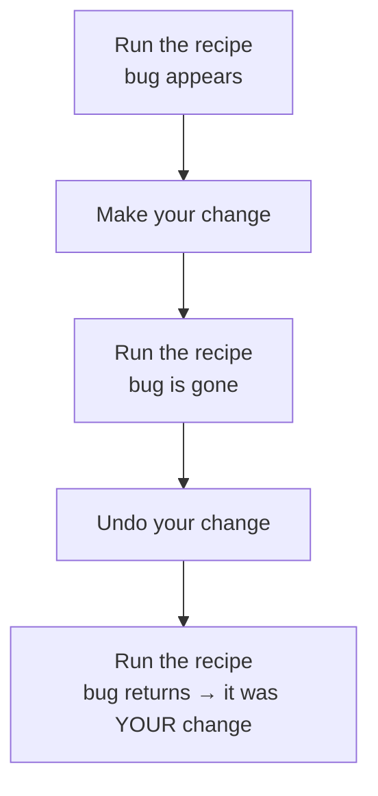
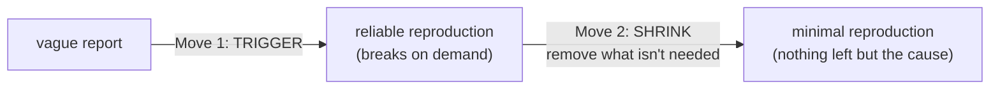

# Why Reproduction Is the Whole Game

When a bug report says "it's broken sometimes," the natural urge is to dive straight into the code and start reading, looking for the mistake by eye. Sometimes that works. Usually it doesn't - and the reason it doesn't is worth understanding, because it reframes the whole job.

Reading code tells you what *should* happen. A bug is, by definition, the place where what *should* happen and what *does* happen come apart. To see that gap, you have to watch the program actually misbehave. And to watch it misbehave, you have to be able to *make* it misbehave. That ability - making the bug happen when you want it - is reproduction, and it's the foundation everything else stands on.

## The mental model: a bug you can't trigger is a rumor

**What reproduction actually is.** Reproduction is a recipe. It's a specific, repeatable sequence - these steps, on this setup, with this data - that makes the bug appear every time you follow it. Not "it broke once"; "it breaks *whenever I do this*."

**Why this is the whole game.** A bug you can trigger on demand stops being scary, because you've converted it into a science experiment. You can run it, change one thing, run it again, and watch what moves. You can add logging and *see the log fire*. You can step through it in a debugger knowing the bug is definitely coming. Without a reproduction you have none of that - you're reasoning about a thing you've never actually observed. That's why a bug you can't trigger isn't really a bug yet. It's a rumor.

```text
   A rumor                          An experiment
   ───────                          ─────────────
   "it crashes sometimes"           do A, then B, then C → it crashes, every time

   - can't watch it happen          - watch it happen on demand
   - can't tell what triggers it    - change one input, see what moves
   - can't prove a fix works        - run the recipe again → no crash = fixed
```

💡 **Key point.** "I can't fix this bug" almost always really means "I can't reproduce this bug *yet*." Solve the reproduction and the fix usually follows quickly. That's why pouring your early effort into reproduction - not into reading code - is the high-leverage move.

## The other half: reproduction is how you *verify* the fix

Here's the part people skip. Reproduction isn't only for *finding* the bug - it's the only honest way to know you *fixed* it.

Picture the trap. You can't reliably trigger the bug. You read the code, spot something suspicious, change it, and... the bug doesn't show up. Did you fix it? Or did it just not happen this time? You genuinely cannot tell. You ship the "fix," the bug comes back next week, and you've burned trust for nothing.

A solid reproduction closes that loop:



*What just happened:* steps 1 and 3 prove the bug is real and your change removed it. Steps 4 and 5 - undoing the fix and watching the bug come back - prove it was *your change* that did the work, not some unrelated coincidence. That round trip is the difference between "I think this is fixed" and "I know this is fixed."

⚠️ **Gotcha.** "It didn't happen when I tried it" is not the same as "it's fixed" - especially for anything intermittent. If you couldn't make the bug happen *before* your change either, you haven't tested anything; you've just rerun an experiment with no control. The cure is to get a reliable reproduction *first*, confirm the bug with it, and only then change code. Phase 3 is entirely about earning that reliability when a bug refuses to cooperate.

## The two moves, in order: trigger, then shrink

Every reproduction effort is the same two moves, and the order matters.

**Move 1 - make it happen reliably.** Get from "it broke once, somewhere" to "I can make it break right now, on purpose." This is the hard part and the part that pays off. Even a clumsy, slow reproduction - "log in as this exact user, click through these eight screens, upload this specific file" - is a massive win over nothing, because now you can *watch*.

**Move 2 - shrink it.** Once it triggers reliably, start removing things. Drop steps that turn out not to matter. Cut the data down to the smallest input that still breaks. Strip away the parts of the system that aren't involved. Each thing you remove that *doesn't* stop the bug is a thing you've proven is innocent - and what's left, when you can't remove anything more, is pointing straight at the cause.



🪖 **War story.** A teammate spent a full afternoon reading a payment module line by line, certain the bug was "in there somewhere." It wasn't until he stopped reading and forced himself to reproduce it - actually run a real checkout that failed - that he noticed the failure only happened for orders over a certain amount. That single observation, which no amount of code-reading had surfaced, narrowed a thousand lines down to one branch in about a minute. Reproducing first would have saved the afternoon.

**Why this saves you later.** Most "this bug is impossible" panics come from trying to fix before you can trigger. The moment you flip the order - reproduce first, fix second - the work stops feeling like guessing and starts feeling like turning a knob and watching a needle move. The next phase is about Move 1 and the start of Move 2: the specific variables you adjust to get a bug happening reliably and then pare it down.

## Recap

1. **Reproduction is a repeatable recipe** that makes the bug appear every time - not "it happened once."
2. **A bug you can't trigger is a rumor.** You can't watch it, can't experiment on it, can't reason from observation.
3. **Reproduction is also how you verify a fix:** trigger it, fix it, confirm it's gone, then undo and confirm it returns.
4. **"It didn't happen when I tried" ≠ fixed** - that's an experiment with no control.
5. **Two moves, in order: trigger, then shrink.** Make it happen reliably first; then remove everything that isn't load-bearing until only the cause is left.

---

[← Guide overview](_guide.md) · [Phase 2: Nailing It Down →](02-nailing-it-down.md)
