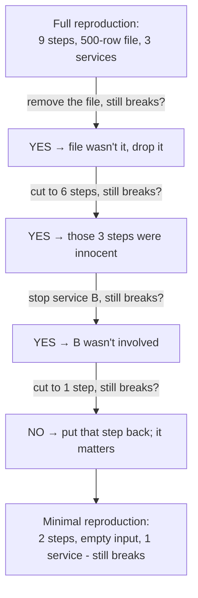

# Nailing It Down

You've got a bug that happened *somewhere*, and your goal from Phase 1 is clear: make it happen *here, now, on demand*. The frustration at this stage is usually the same - you follow what you think are the steps, and nothing breaks. The bug worked fine for you and fails for them, or fails on the server and not on your laptop.

That gap is never magic. A program is deterministic: feed it the exact same conditions and it does the exact same thing, every single time. So if it breaks for someone and not for you, *some condition is different* - and there are really only four places that difference can hide. Find which one differs and you've found your reproduction.

## The four variables that decide everything

When a bug reproduces for one person and not another, the difference is in one of these four. Walk them in order; it's roughly most-common-first.

| Variable | The question to ask | Where it bites |
|---|---|---|
| **Steps** | What *exactly* did they do, in what order? | "I clicked save" hides three earlier clicks that set it up |
| **Environment** | What versions, OS, browser, config, flags? | The classic "works on my machine" |
| **Data** | What *specific* input/record triggered it? | An empty list, a huge file, a name with an emoji |
| **State / timing** | What was true *before*, and what raced? | A stale cache, a half-finished signup, two requests at once |

The skill is going through these deliberately instead of guessing. Let's take them one at a time.

### Steps: the report is always missing some

**What it actually is.** The steps are the precise sequence of actions that leads to the bug - *all* of them, including the boring setup the reporter didn't think to mention.

**Why people get this wrong.** Bug reports compress. "It crashes when I save" feels complete to the person writing it, but in their head they also logged in as an admin, opened a draft from last week, and edited one field - none of which made it into the ticket. You reproduce the literal words, it works fine, and you conclude they're imagining things. They're not; you're missing steps 1 through 3.

**What to do.** Get the *exact* sequence. Watch them do it, or have them write down every click. Then reproduce it literally - same order, nothing skipped. Order matters more than people expect: doing B then A can leave the program in a different state than A then B.

⚠️ **Gotcha.** Beware the invisible first step that happened *days* ago. "It's been broken since I changed my email" means the trigger is account state set long before the click that surfaces it. If the literal steps don't reproduce it, ask "what's different about *your account / your project / your file* compared to a fresh one?" - that's usually the missing setup.

### Environment: "works on my machine," decoded

**What it actually is.** The environment is everything *around* your code that the code depends on: language and library versions, the operating system, the browser, environment variables, feature flags, locale and timezone, even CPU architecture. Your machine and theirs are two different environments, and the bug may live in the difference.

📝 **Terminology.** *"Works on my machine"* isn't an excuse - it's a *diagnosis*. It's a precise statement that the bug depends on an environment difference. The job is to find *which* part of the environment differs.

**How to read the difference.** Compare the two environments fact by fact. The fastest first check is versions:

```console
$ node --version
v20.11.0
```
*What just happened:* you printed the exact Node.js version this machine runs. If the reporter is on `v18` and you're on `v20`, that gap alone can explain a bug - a function that behaves differently, or didn't exist, across versions. Run the equivalent for whatever your code depends on (the language runtime, the database, the browser) and line the answers up side by side. The first mismatch is your prime suspect.

🪖 **War story.** A date-formatting bug that "only happened for some users" turned out to be timezone: it broke for anyone west of UTC because a calculation rolled over to the previous day. It was invisible to the whole team - they were all in the same office, in the same timezone. The environment difference was the *user's clock*, not anything in the code.

**Why this saves you later.** Once you treat "works on my machine" as "an environment variable differs," you stop arguing about whether the bug is real and start listing differences. Containers, version pins, and shared config exist largely to *shrink* this gap so fewer bugs can hide in it.

### Data: the bug is often in the input, not the code

**What it actually is.** Data is the specific input the code was chewing on when it broke - the exact record, file, request body, or field value.

**Why people get this wrong.** We test with tidy, typical data. Bugs love the *untidy* edges: the empty list, the field that's `null`, the 200 MB upload, the name with an apostrophe or an emoji, the number that's exactly zero, the duplicate that shouldn't exist. "It works" usually means "it works on the nice data I tried." The reporter hit ugly data.

**What to do.** Get the *actual* offending data, not a stand-in. If a user's record triggers it, reproduce with a copy of *that* record (scrubbing anything sensitive first). The specific value is frequently the entire bug - and once you have it, you often don't even need the original steps; feeding that input straight to the code reproduces it instantly.

### State and timing: what was true before, and what raced

**What it actually is.** State is everything the program was already holding when the bug hit - what's in the cache, the session, the database, a half-completed workflow. Timing is *when* things happened relative to each other: two requests arriving at once, an event firing before setup finished, a response coming back slower than expected.

**Why this is the slipperiest one.** Steps, environment, and data are things you can write down and re-create. State and timing are about the *situation* the program was in, which is harder to see and harder to recreate - which is exactly why these produce the intermittent bugs that Phase 3 is devoted to. For now, the move is to ask: *what was true before the steps began?* A fresh login behaves differently from a session that's been open for hours; an empty database differently from a full one.

## Now shrink it: build the minimal reproduction

Once you can trigger the bug reliably - even clumsily - start Move 2 from Phase 1: remove everything that isn't load-bearing. A **minimal reproduction** is the smallest set of steps, data, and setup that *still* triggers the bug. Nothing in it can be removed without the bug disappearing.

You build it by subtraction. Remove one thing, run the recipe, and watch:



*What just happened:* each time you removed something and the bug *still* happened, you proved that thing was innocent and threw it out. The one time removing a step made the bug *stop*, you'd cut something essential - so you put it back. What survives this process is the irreducible core, and that core points almost directly at the cause. A bug that took nine steps to describe might shrink to "call this function with an empty list."

💡 **Key point.** Shrinking isn't just tidying up - it's *diagnosis in disguise*. Every successful removal eliminates a suspect. By the time you can't remove anything more, the surviving steps and data *are* a description of where the bug lives. The minimal reproduction is often a finished bug report and half a fix at the same time.

⚠️ **Gotcha.** Change *one thing at a time* while shrinking. If you delete three steps and swap the data set in a single go and the bug vanishes, you don't know which change did it - and you've lost your reproduction. Slow, single steps feel tedious but keep every result meaningful.

## Recap

1. **Four variables decide whether a bug reproduces:** the exact steps, the environment, the input data, and the state/timing. When it reproduces for one person and not another, one of these differs.
2. **Reports are always missing steps** - get the literal, complete sequence, and watch for setup that happened earlier.
3. **"Works on my machine" is a diagnosis,** not an excuse: an environment difference. Compare versions, OS, browser, config, locale fact by fact.
4. **The bug is often in the data** - reproduce with the actual offending input, not a tidy stand-in.
5. **State and timing** are the slippery ones; they're what make bugs intermittent (next phase).
6. **Shrink by subtraction, one change at a time.** A minimal reproduction is the smallest recipe that still breaks - and it doubles as a diagnosis.

---

[← Phase 1: Why Reproduction Is the Whole Game](01-why-reproduction-is-the-whole-game.md) · [Guide overview](_guide.md) · [Phase 3: When It Won't Reproduce (Heisenbugs) →](03-when-it-wont-reproduce.md)
