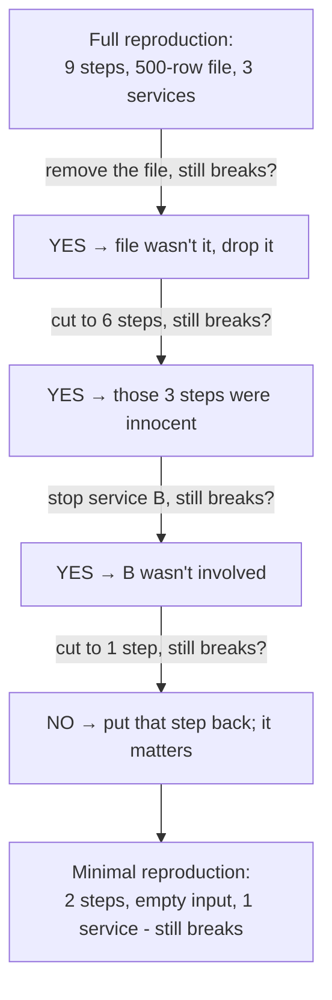

# Nailing It Down

Your goal from Phase 1: make the bug happen *here, now, on demand*. The usual frustration - you follow what you think are the steps and nothing breaks. Worked for you, failed for them; fails on the server, not your laptop.

That gap is never magic. A program is deterministic: same conditions, same outcome, every time. If it breaks for someone and not you, *some condition differs* - and only four places can hide that difference. Find which one and you've found your reproduction.

## The four variables that decide everything

When a bug reproduces for one person and not another, the difference is in one of these four. Walk them in order - roughly most-common-first.

| Variable | The question to ask | Where it bites |
|---|---|---|
| **Steps** | What *exactly* did they do, in what order? | "I clicked save" hides three earlier clicks that set it up |
| **Environment** | What versions, OS, browser, config, flags? | The classic "works on my machine" |
| **Data** | What *specific* input/record triggered it? | An empty list, a huge file, a name with an emoji |
| **State / timing** | What was true *before*, and what raced? | A stale cache, a half-finished signup, two requests at once |

The skill is going through these deliberately instead of guessing.

### Steps: the report is always missing some

**What it is.** The precise sequence of actions leading to the bug - *all* of them, including boring setup the reporter didn't think to mention.

**Why people get this wrong.** Bug reports compress. "It crashes when I save" feels complete, but in the reporter's head they also logged in as admin, opened last week's draft, and edited a field - none of which made the ticket. Reproduce the literal words and it works fine; you're missing steps 1-3, not chasing a phantom.

**What to do.** Get the *exact* sequence - watch them do it, or have them write down every click - then reproduce it literally, same order, nothing skipped. Order matters: B then A can leave different state than A then B.

⚠️ **Gotcha.** Beware the invisible first step from *days* ago - "broken since I changed my email" means the trigger is account state set long before the click that surfaces it. If literal steps don't reproduce it, ask what's different about *your account / project / file* versus a fresh one.

### Environment: "works on my machine," decoded

**What it is.** Everything *around* your code that it depends on: language/library versions, OS, browser, environment variables, feature flags, locale, timezone, even CPU architecture. Your machine and theirs differ, and the bug may live in that gap.

📝 **Terminology.** *"Works on my machine"* isn't an excuse - it's a *diagnosis* that the bug depends on an environment difference. The job is finding *which* part.

**How to read the difference.** Compare the two environments fact by fact. Versions are the fastest first check:

```console
$ node --version
v20.11.0
```
*What just happened:* printing the exact Node.js version this machine runs. Reporter on `v18`, you on `v20`? That gap alone explains bugs where a function behaves differently, or doesn't exist, across versions. Check runtime, database, and browser versions the same way; the first mismatch is your prime suspect.

🪖 **War story.** A date-formatting bug that "only happened for some users" was timezone: it broke for anyone west of UTC because a calculation rolled to the previous day - invisible to the whole team since everyone sat in the same office and timezone. The difference was the *user's clock*, not the code.

**Why this saves you later.** Treat "works on my machine" as "an environment variable differs" and you stop arguing whether the bug is real. Containers, version pins, and shared config exist largely to shrink this gap.

### Data: the bug is often in the input, not the code

**What it is.** The specific input the code was chewing on when it broke - the exact record, file, request body, or field value.

**Why people get this wrong.** We test with tidy, typical data. Bugs love the *untidy* edges: an empty list, a `null` field, a 200 MB upload, a name with an apostrophe or emoji, a number that's exactly zero, a duplicate that shouldn't exist. "It works" usually means "it works on the nice data I tried" - the reporter hit ugly data.

**What to do.** Get the *actual* offending data, not a stand-in. If a user's record triggers it, reproduce with a copy of that record (scrub anything sensitive first). The value is often the whole bug - feed it straight to the code and you may not even need the original steps.

### State and timing: what was true before, and what raced

**What it is.** State is everything the program already held when the bug hit: cache, session, database, a half-completed workflow. Timing is *when* things happened relative to each other - two requests at once, an event firing before setup finished, a slow response.

**Why this is the slipperiest one.** Steps, environment, and data can be written down and re-created; state and timing are about the *situation* the program was in - harder to see and recreate, and why they produce the intermittent bugs Phase 3 covers. For now ask: *what was true before the steps began?* A fresh login differs from an hours-old session; an empty database from a full one.

## Now shrink it: build the minimal reproduction

Once the bug triggers reliably - even clumsily - start Move 2: remove everything not load-bearing. A **minimal reproduction** is the smallest set of steps, data, and setup that *still* triggers the bug, with nothing left to remove. Build it by subtraction: remove one thing, run the recipe, watch.



*What just happened:* each removal where the bug *still* happened proved that thing innocent, so out it went. The one removal that made the bug *stop* meant you'd cut something essential, so back it went. What survives is the irreducible core, pointing almost directly at the cause - a nine-step bug might shrink to "call this function with an empty list."

💡 **Key point.** Shrinking is *diagnosis in disguise*. Every successful removal eliminates a suspect. Once nothing more can go, what survives *is* a description of where the bug lives - often a finished bug report and half a fix at once.

⚠️ **Gotcha.** Change *one thing at a time*. Delete three steps and swap the data set in one go, and if the bug vanishes you won't know which change did it - you've lost your reproduction. Slow, single steps feel tedious but keep every result meaningful.

## Recap

1. **Four variables decide whether a bug reproduces:** steps, environment, input data, and state/timing. One of these differs when it reproduces for one person and not another.
2. **Reports are always missing steps** - get the literal, complete sequence, and watch for setup that happened earlier.
3. **"Works on my machine" is a diagnosis,** not an excuse: an environment difference. Compare versions, OS, browser, config, locale fact by fact.
4. **The bug is often in the data** - reproduce with the actual offending input, not a tidy stand-in.
5. **State and timing** are the slippery ones; they make bugs intermittent (next phase).
6. **Shrink by subtraction, one change at a time.** A minimal reproduction is the smallest recipe that still breaks - and doubles as a diagnosis.

Watch it animated: [reproducing a bug](/explainers/ReproSteps.dc.html)

---

[← Phase 1: Why Reproduction Is the Whole Game](01-why-reproduction-is-the-whole-game.md) · [Guide overview](_guide.md) · [Phase 3: When It Won't Reproduce (Heisenbugs) →](03-when-it-wont-reproduce.md)
