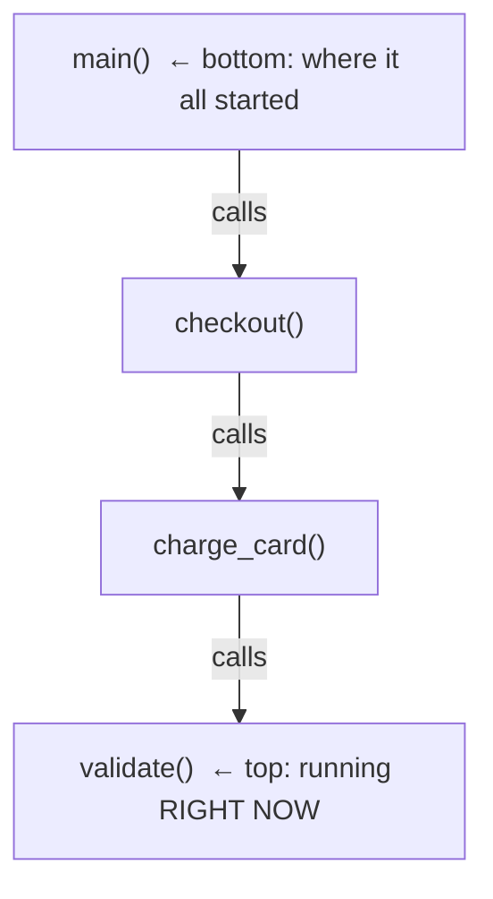
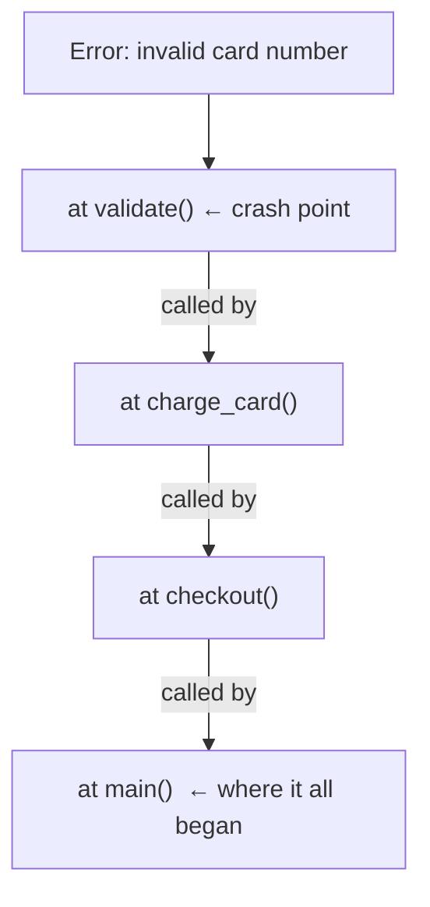

# What a Stack Trace Actually Is

Before we read a single line of one, let's build the mental model. The whole reason a stack trace looks like noise is that nobody explains the one idea it's a picture *of*: the call stack. Get that idea, and the trace stops being a wall of text and becomes a story you can follow.

## The call stack - functions standing on each other's shoulders

**What it actually is.** When your program runs, it doesn't execute everything at once. It calls one function, which calls another, which calls another - and it has to *remember its way back*. The way it remembers is a stack: a pile of "I was in the middle of this, hold my place" notes.

Each note is called a **stack frame** - one for every function that has started but hasn't finished yet. When a function gets called, a new frame is pushed onto the top of the pile. When that function returns, its frame is popped off and the program picks up where it left off in the frame underneath.

📝 **Terminology.** A *frame* (or *stack frame*) is the program's bookmark for one in-progress function call: which function it is, where in that function we are, and the local variables it's working with. A *stack trace* is a printout of that whole pile of frames.

Picture an order-checkout flow. `main` calls `checkout`, which calls `charge_card`, which calls `validate`:

The bottom of the stack is where your program *started*. The top is what it's doing at this exact instant. Everything in between is the unbroken chain of "this function called that function" that got you here.

**Why "stack."** A stack is last-in, first-out - like a stack of plates. The last function you called is the first one to finish and come off the top. That's exactly how function calls unwind: the deepest call returns first, back up through its caller, and its caller's caller, until you're back at `main`.

## A trace is that stack, frozen at the moment it broke

**What it actually is.** Now suppose `validate` hits something it can't handle and throws an error. Instead of returning normally, the program *stops* and takes a snapshot of the entire stack - every frame, top to bottom - exactly as it stood at the instant of failure. That snapshot is the stack trace.

💡 **Key point.** A stack trace says two things, together: **"here is where it broke"** (the top frame - the function that was running) and **"here is the chain of who-called-whom that led there"** (every frame below it, down to where the program started). It is the call stack, photographed at the worst moment.

That's why it's so valuable. It isn't telling you *only* the line that exploded. It's handing you the entire path the program took to reach that line - which is usually where the real answer is hiding.

⚠️ **Gotcha: the order is not the same in every language.** Some languages print the trace top-frame-first (the crash point at the top); others print it bottom-frame-first (the crash point at the *bottom*, after a "most recent call last" note). Same picture, printed from opposite ends. We'll deal with this head-on in the next phase - for now, the thing to hold onto is that *one end is the crash point and the other end is where it all started.* Knowing which end you're looking at is half the battle, and it's a battle you'll win every time once you've seen both.

## Why this mental model saves you later

Every confusing trace you'll ever meet is a variation on this one picture. A forty-line Java trace, a tangled async JavaScript trace, a Python traceback nested three exceptions deep - they are all the same thing: *a pile of frames, captured at the moment something went wrong.* When you read one, you are not decoding hieroglyphs. You are reading a list of "who called whom," with a clearly marked place where it all fell apart.

That reframe is the entire point of this phase. The trace isn't the bug yelling at you. It's the program, in its last conscious act, drawing you a map back to the problem.

## Recap

1. Running code is a **call stack** - a pile of **frames**, one per function that has started but not yet finished.
2. The **bottom** frame is where the program started; the **top** frame is what it was doing the instant it broke.
3. A **stack trace** is that stack **frozen at the moment of failure** - "where it broke" plus "the chain of who-called-whom that led there."
4. Languages print the trace from **opposite ends** (crash-point-first or crash-point-last) - same picture, and you'll learn to tell them apart next.

---

[← Guide overview](_guide.md) · [Phase 2: How to Read One (Without Panicking) →](02-how-to-read-one.md)
