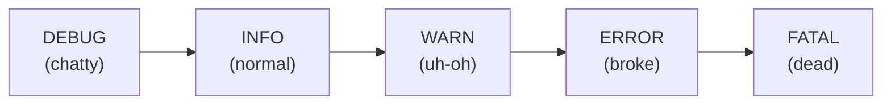

# What Logs Actually Are

A wall of log text isn't random - once you see its structure, it stops being scary.

## A log is a program's running diary

**What it actually is.** A log is a diary the program writes about itself, one line at a time. Every time
something worth noting happens - a user logged in, a database query ran, a file failed to open - it writes
a short, timestamped note and moves on: often the *only* record of what the program was thinking right
before things went wrong.

**Why people picture this wrong.** Newcomers often think a log is an error report, appearing only when
things break. It isn't: a healthy program logs constantly, almost all boring and normal ("handled request,
all fine"). Errors are a small fraction mixed into a long, calm diary - why finding them feels hard, and
why the next phase's skills matter.

**Where logs live.** Depending on the program: a file (often `/var/log/app.log`), straight to your
terminal, or both - always lines of text, in time order.

## The anatomy of a single log line

Most log lines, across most tools and languages, share the same four parts. Spot them once and you can
read logs you've never seen before:

```text
2026-06-19T14:32:07.214Z   ERROR   [payment-service]   Charge failed for order 4821: card declined
└────────── 1 ──────────┘  └─ 2 ─┘  └────── 3 ──────┘   └──────────────── 4 ─────────────────────┘

  1  timestamp  - exactly when this happened (here, in UTC; the Z means "Zulu"/UTC time)
  2  level      - how serious it is (see below)
  3  source     - which part of the program wrote it (a service, module, or file name)
  4  message    - the human-readable note: what actually happened
```

*What just happened:* You read a log line the way the program meant it: **when** (timestamp), **how bad**
(level), **who** (source), **what** (message). Order varies and some logs add extras - a thread name, a
request ID - but these four are the backbone.

⚠️ **Gotcha: timestamps and time zones.** That `Z` (or `+00:00`) means **UTC**, not your local clock.
Servers commonly log in UTC even when you're elsewhere. If a user says "it broke at 3pm" and the log shows
`19:00`, you're probably not on the wrong line - you're four hours off. Check the log's time zone before
hunting by time.

## Log levels - how serious is this line?

**What they actually are.** A **level** is a one-word severity tag - routine note vs. five-alarm fire, at
a glance. Almost every logging system uses the same five (sometimes with a `TRACE` below DEBUG), least to
most serious:



📝 **Terminology.** What each one means in practice - the vocabulary the rest of the guide leans on:

- **DEBUG** - tiny developer details: "variable x = 42," "entering function." Useful deep in a problem,
  noise otherwise. Usually *off* in production.
- **INFO** - normal, healthy events: "server started," "user 4821 logged in," "order placed." The steady
  heartbeat of a working program - most of your log, and that's good.
- **WARN** - something's off but the program kept going: "retrying connection," "config value missing,
  using default," "disk 85% full." Nothing broke *yet*. ⚠️ People skim past it - but as you'll see next
  phase, the real cause of a crash often hides in a WARN just *before* the error.
- **ERROR** - something actually failed: a request didn't complete, a save didn't happen, an exception was
  thrown. Usually what you're hunting for - but "an error happened" isn't "*the* error," more on that soon.
- **FATAL** (sometimes **CRITICAL**) - the program couldn't continue and is crashing. Rare and serious; if
  you see it, the program likely stopped right after.

**Why levels exist.** Logging *everything* drowns you and slows the program; logging *too little* leaves
you blind when things break. Levels are the compromise: tag every line, then dial it - INFO+ normally,
DEBUG+ when chasing a bug. That's why production logs are usually quiet and a dev machine chatty.

💡 **Key point.** Levels are your fastest filter. In a crisis, "show me only ERROR and FATAL" turns
thousands of lines into a handful - the whole next phase is built on this idea.

## Reading a few real lines together

A short slice of a log telling a small story - read the level on each line to follow what happened:

```console
2026-06-19T14:31:55.001Z  INFO   [api]       Received request POST /orders (order 4821)
2026-06-19T14:31:55.040Z  INFO   [inventory] Reserved 2 units of item SKU-99
2026-06-19T14:32:07.180Z  WARN   [payment]   Payment gateway slow to respond, retrying (attempt 2 of 3)
2026-06-19T14:32:07.214Z  ERROR  [payment]   Charge failed for order 4821: card declined
2026-06-19T14:32:07.220Z  INFO   [api]       Responded 402 Payment Required (order 4821)
```

*What just happened:* You just read the life of one order. A request came in (INFO), inventory was
reserved (INFO), the payment gateway was sluggish so the program retried (WARN), the charge failed because
the card was declined (ERROR), and the program calmly told the user "payment required" (INFO). No one
narrated it - the levels and messages did. **This is the skill:** not memorizing codes, but reading the
diary as a story in time order.

The ERROR here was honest - a declined card really is the cause. That won't always be true; spotting a
loud ERROR that *isn't* the real cause is one of the most valuable things you'll learn, and the headline
gotcha of the next phase.

## Recap

1. A log is a **program's running diary** - short notes, in time order, mostly normal events.
2. Most log lines have four parts: **timestamp** (when), **level** (how serious), **source** (who),
   **message** (what).
3. Watch the time zone - **servers often log in UTC**, which can throw off an "it broke at 3pm" hunt.
4. **Levels**, least to most serious: **DEBUG → INFO → WARN → ERROR → FATAL.** Filter by severity to
   shrink the flood fast.
5. Reading a log is reading a **story in time order** - the loudest ERROR isn't always the real cause.

---

[← Guide overview](_guide.md) · [Phase 2: Finding the Needle →](02-finding-the-needle.md)
