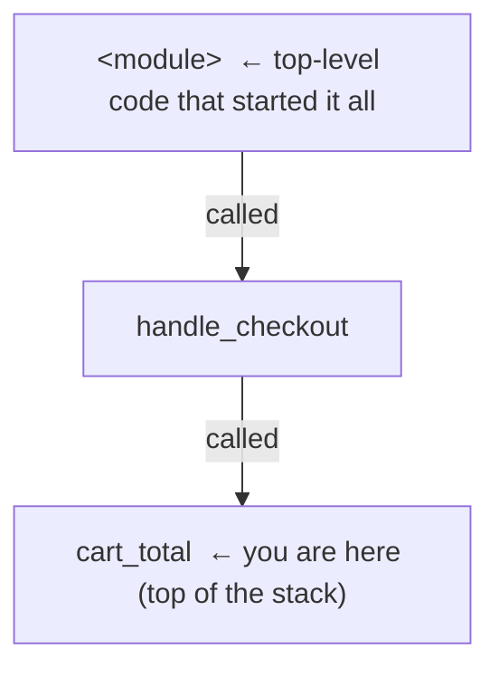

# The Core Moves

Open any debugger - VS Code, PyCharm, IntelliJ, Chrome devtools, GDB on the command line - and you'll find
the same small set of controls wearing different paint. There are maybe six moves total, and once they
click, every debugger you ever touch feels familiar. This phase teaches the moves as *ideas*, so you're not
relearning buttons every time you switch tools.

We'll use a small example throughout: a function that's supposed to total a shopping cart but keeps
returning the wrong number.

```python
def cart_total(items):
    total = 0
    for item in items:
        total += item.price * item.quantity
    return apply_discount(total)

def apply_discount(amount):
    return amount * 0.9
```

## The breakpoint - "pause here"

**What it actually is.** A breakpoint is a marker you place on a line that tells the debugger: *stop the
program right before running this line, and give me control.* In most IDEs you set one by clicking in the
margin to the left of the line number - a red dot appears. The program then runs at full speed until it
reaches that line, and freezes.

**What it does in real life.** Say you put a breakpoint on the `return apply_discount(total)` line and run in
debug mode. The program executes normally - the whole loop runs - and then stops, paused, with `total`
holding whatever the loop produced. You're now standing inside that exact moment.

**A real example.** Here's what a paused session looks like in a typical IDE's debug console (the exact layout
differs, but every debugger shows you these same three things - where you're paused, the local values, and
the call stack):

```console
Paused on breakpoint at cart.py:5

VARIABLES
  Locals:
    items    = [Item(price=10, quantity=2), Item(price=5, quantity=1)]
    total    = 25
    item     = Item(price=5, quantity=1)

CALL STACK
  ▶ cart_total      cart.py:5
    handle_checkout web.py:88
    <module>        web.py:140
```
*What just happened:* The program ran the entire loop and stopped *before* calling `apply_discount`. The
debugger is showing you that `total` is `25` at this instant - the real, current value, no `print()`
required. You can already see the bug-hunting power: you didn't have to guess to add `print(total)`; it's
just *there*, alongside every other local.

⚠️ **Gotcha - you have to run in "debug" mode, not normal run.** A breakpoint only fires if you launched the
program *with the debugger attached* (the "Debug" / bug-icon button, `python -m pdb`, `node --inspect`,
etc.). Hit plain "Run" and your breakpoints sit there doing nothing, and you'll swear the debugger is
broken. It isn't - it just wasn't invited.

## Inspecting variables - "what's true right now?"

**What it actually is.** While paused, the debugger shows you every variable currently in scope and its value.
Objects expand like folders - click to drill into nested fields. This is the payoff from Phase 1: instead of
betting on what to print, you see *all* the local state at once.

**What it does in real life.** In the snapshot above, you can read `total = 25` and expand `items` to inspect
each `Item`. If `total` looks wrong, you've found *where* it went wrong without re-running anything. Most
debuggers also give you a little expression box (an "evaluate" or "console" panel) where you can type, say,
`items[0].price * items[0].quantity` and get the answer *in the live paused context* - a calculator that
runs inside your frozen program.

## Stepping - moving forward one piece at a time

Once paused, you don't have to let the program finish. You control how it moves forward, one piece at a
time. There are three step commands, and the difference between them is the single most useful thing in this
guide.

📝 **The current line.** When paused, there's always one "next line to run" - the line the debugger is about
to execute. Stepping decides how much of that line (and what's inside it) runs before you get control back.

**Step over - "run this line, don't show me the details."**
The debugger runs the current line completely, *including any function it calls*, and pauses on the next line
in your current function. You stay at the same level. Use this when you trust the function being called and
only care about the result.

```console
# Paused at:  total += item.price * item.quantity   (line 4)
> step over
# Now paused at: total += item.price * item.quantity (line 4, next loop iteration)
#   total = 25
```
*What just happened:* You executed one iteration's worth of work and landed on the same line for the next
loop pass. `total` went from `20` to `25`. Stepping over the multiplication didn't dive into anything -
it ran the line and stopped.

**Step into - "take me inside the function being called."**
If the current line calls a function *you* wrote and want to inspect, step into descends into it and pauses
on its first line. This is how you follow the bug down into a helper.

```console
# Paused at:  return apply_discount(total)   (line 5)
> step into
# Now paused at: return amount * 0.9         (apply_discount, line 8)
#   amount = 25
```
*What just happened:* Instead of running `apply_discount` invisibly, you climbed *inside* it. Now you can see
its argument (`amount = 25`) and watch it compute. This is the move that answers "is the bug in this
function, or in the one it calls?"

**Step out - "I've seen enough in here, finish this function and pop me back up."**
Run the rest of the current function and pause at the line that called it (one level up). Use it when you
stepped into something and realized the bug isn't here.

```console
# Paused inside apply_discount (line 8)
> step out
# Now paused back in cart_total, at the line after the call
#   return value = 22.5
```
*What just happened:* The debugger finished `apply_discount`, returned its result (`22.5`), and dropped you
back where the call was made. You skipped the boring rest of the helper without losing your place.

⚠️ **Gotcha - step into can drop you into library code.** If you step into a line that calls a *framework* or
*standard-library* function, you can end up paused inside someone else's source you've never seen, several
levels deep, wondering where you are. The fix: step *out* to climb back, or use "step over" on lines that
only call library code. Many debuggers also have a "skip my non-project files" / "just-my-code" setting that
prevents this - worth turning on.

## The call stack - "how did I get here?"

**What it actually is.** The call stack is the chain of function calls that led to where you're paused - each
function that's currently "waiting" for the one below it to return. In the snapshot earlier, the stack was:



**What it does in real life.** Click any frame in the stack and the debugger jumps you to that function's
line *and shows you its variables at the moment it made the call below it.* So when `cart_total` got a weird
`items` list, you can click `handle_checkout` one frame down and see exactly what *it* passed in - without
re-running. This is the same structure you see in a crash; if reading these frames feels shaky, the
companion guide [Reading a Stack Trace](/guides/reading-a-stack-trace) walks through it in depth.

💡 **Key point.** Variables answer *what is true here*; the call stack answers *how did we get into this
situation*. Most real bugs need both - the wrong value, and the path that produced it.

## Watch expressions - "keep an eye on this for me"

**What it actually is.** A watch expression is a small piece of code you pin to the debugger so it
re-evaluates *every time the program pauses*. Instead of expanding `items` and doing mental math at each
stop, you add a watch like `total / len(items)` and the debugger keeps it updated automatically.

**What it does in real life.** Watching `item.price * item.quantity` while you step through the loop lets you
see that product change at every iteration, side by side, so the moment it produces something wrong jumps
out at you. A watch can be any valid expression in your language - a variable, a calculation, a method call,
a comparison like `total > 100`.

⚠️ **Gotcha - watch expressions can have side effects.** Because a watch *runs* its expression on every pause,
watching something like `cache.pop(key)` or `next(iterator)` will actually mutate your program's state each
time it evaluates - quietly changing the very thing you're debugging. Keep watches to *read-only* expressions
(plain reads and pure calculations). If you need to run something with effects, do it once in the
evaluate/console panel, not as a standing watch.

## The whole picture

Here's the mental model of a paused session, with every move you've learned in one frame:

```text
  ┌─────────────────────────────── PAUSED ───────────────────────────────┐
  │                                                                       │
  │   cart.py                                                             │
  │     1  def cart_total(items):                                         │
  │     2      total = 0                                                  │
  │     3      for item in items:                                         │
  │  ●  4          total += item.price * item.quantity   ◄── current line │
  │     5      return apply_discount(total)                               │
  │     ●  = breakpoint                                                   │
  │                                                                       │
  │   VARIABLES (what's true right now)   CALL STACK (how we got here)    │
  │     total = 20                          ▶ cart_total      cart.py:4   │
  │     item  = Item(price=5, qty=1)          handle_checkout web.py:88   │
  │     items = [Item, Item]                  <module>        web.py:140  │
  │                                                                       │
  │   WATCH (re-checked on every pause)   CONTROLS                        │
  │     item.price * item.quantity = 5      step over → run line, stay    │
  │     total > 100                = False  step into → go inside a call  │
  │                                         step out  → finish & pop up   │
  └───────────────────────────────────────────────────────────────────── ┘
```

Every debugger you'll meet is some arrangement of these five regions. Learn them once; recognize them
everywhere.

## Recap

1. A **breakpoint** pauses the program *before* a line runs - but only when launched in debug mode.
2. **Inspecting variables** shows you all live state at once; an evaluate box runs expressions in the paused
   context.
3. **Step over** runs a line whole; **step into** descends into a call; **step out** finishes the current
   function and pops you up one level.
4. The **call stack** is the chain of callers - click a frame to see *its* variables and how you got here.
5. A **watch expression** re-evaluates on every pause - keep it read-only to avoid side effects.

You can now drive any debugger through a normal bug. Next, the moves that crack the bugs `print()` can't
touch.

---

[← Phase 1: Why a Debugger Beats print()](01-why-a-debugger-beats-print.md) · [Guide overview](_guide.md) · [Phase 3: Debugging for Real →](03-debugging-for-real.md)
