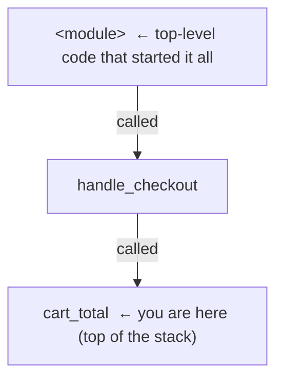

# The Core Moves

Open any debugger - VS Code, PyCharm, IntelliJ, Chrome devtools, GDB - and you'll find the same controls
wearing different paint. Maybe six moves total; once they click, every debugger feels familiar. This phase
teaches them as *ideas*, not buttons to relearn per tool.

One example runs throughout: a function meant to total a shopping cart but returning the wrong number.

```python
def cart_total(items):
    total = 0
    for item in items:
        total += item.price * item.quantity
    return apply_discount(total)

def apply_discount(amount):
    return amount * 0.9
```

## The breakpoint - "pause here"

**What it actually is.** A breakpoint tells the debugger: *stop right before this line and give me control.*
Set one by clicking the margin left of the line number - a red dot appears. The program runs full speed
until it reaches that line, then freezes.

**What it does in real life.** Put a breakpoint on `return apply_discount(total)` and run in debug mode: the
loop runs, then execution stops with `total` holding whatever the loop produced.

**A real example.** A paused session in a typical debug console (layout varies, but every debugger shows
where you're paused, local values, and the call stack):

```console
Paused on breakpoint at cart.py:5

VARIABLES
  Locals:
    items    = [Item(price=10, quantity=2), Item(price=5, quantity=1)]
    total    = 25
    item     = Item(price=5, quantity=1)

CALL STACK
  ▶ cart_total      cart.py:5
    handle_checkout web.py:88
    <module>        web.py:140
```
*What just happened:* The loop ran and stopped *before* calling `apply_discount`. `total` is `25` right now
- no `print()` required, sitting alongside every other local.

⚠️ **Gotcha - run in "debug" mode, not normal run.** A breakpoint only fires with the debugger *attached*
(the "Debug" / bug-icon button, `python -m pdb`, `node --inspect`). Plain "Run" does nothing - not broken,
just not invited.

## Inspecting variables - "what's true right now?"

**What it actually is.** While paused, the debugger shows every variable in scope and its value. Objects
expand like folders, click to drill in - the payoff from Phase 1: instead of betting on what to print, you
see *all* the local state at once.

**What it does in real life.** In the snapshot above, read `total = 25` and expand `items` to inspect each
`Item` - if `total` looks wrong, you've found *where*, no re-running needed. Most debuggers also give an
"evaluate" / "console" panel: type `items[0].price * items[0].quantity` for the answer *in the live paused
context* - a calculator running inside your frozen program.

## Stepping - moving forward one piece at a time

Once paused, you control how the program moves forward. Three step commands exist, and the difference
between them is the single most useful thing in this guide.

📝 **The current line.** When paused, there's always one "next line to run." Stepping decides how much of
it - and what's inside it - runs before control returns to you.

**Step over - "run this line, don't show me the details."**
Runs the current line completely, *including any function it calls*, and pauses on the next line, same
level. Use when you trust the called function and just want the result.

```console
# Paused at:  total += item.price * item.quantity   (line 4)
> step over
# Now paused at: total += item.price * item.quantity (line 4, next loop iteration)
#   total = 25
```
*What just happened:* One iteration ran, landing on the same line for the next pass - `total` went from
`20` to `25`, without diving into the multiplication.

**Step into - "take me inside the function being called."**
Descends into a function you want to inspect, pausing on its first line - how you follow the bug into a
helper.

```console
# Paused at:  return apply_discount(total)   (line 5)
> step into
# Now paused at: return amount * 0.9         (apply_discount, line 8)
#   amount = 25
```
*What just happened:* Instead of running `apply_discount` invisibly, you climbed *inside* it and can see its
argument (`amount = 25`) compute. Answers "is the bug here, or in the caller?"

**Step out - "I've seen enough in here, finish this function and pop me back up."**
Runs the rest of the function, pausing at the caller. Use once you've confirmed the bug isn't here.

```console
# Paused inside apply_discount (line 8)
> step out
# Now paused back in cart_total, at the line after the call
#   return value = 22.5
```
*What just happened:* `apply_discount` finished, returned `22.5`, and dropped you back at the call site,
skipping the rest of the helper without losing your place.

⚠️ **Gotcha - step into can drop you into library code.** Stepping into a line that calls *framework* or
*standard-library* code can pause you inside unfamiliar source, several levels deep. Fix: step *out*, or
"step over" library-only lines. Many debuggers offer a "just-my-code" setting that prevents this - worth
turning on.

## The call stack - "how did I get here?"

**What it actually is.** The call stack is the chain of calls that led here - each function "waiting" for the
one below it to return. In the earlier snapshot:



**What it does in real life.** Click any frame and the debugger jumps to that function's line, showing its
variables *at the moment it made the call below it*. If `cart_total` got a weird `items` list, click
`handle_checkout` to see what it passed in - without re-running. Same structure as a crash; if reading
frames feels shaky, [Reading a Stack Trace](/guides/reading-a-stack-trace) covers it in depth.

💡 **Key point.** Variables answer *what is true here*; the call stack answers *how did we get here*. Most
real bugs need both.

## Watch expressions - "keep an eye on this for me"

**What it actually is.** A watch expression is code pinned to the debugger that re-evaluates *every pause* -
add `total / len(items)` once and it stays updated automatically, instead of expanding `items` and doing
mental math each stop.

**What it does in real life.** Watching `item.price * item.quantity` while stepping through the loop shows
that product change every iteration, so the moment it goes wrong jumps out. A watch can be any valid
expression: a variable, a calculation, a method call, a comparison like `total > 100`.

⚠️ **Gotcha - watch expressions can have side effects.** A watch *runs* its expression every pause, so
watching `cache.pop(key)` or `next(iterator)` mutates state each time - quietly changing the thing you're
debugging. Keep watches *read-only*; for side effects, use the evaluate/console panel once instead.

## The whole picture

The mental model of a paused session, every move you've learned in one frame:

```text
  ┌─────────────────────────────── PAUSED ───────────────────────────────┐
  │                                                                       │
  │   cart.py                                                             │
  │     1  def cart_total(items):                                         │
  │     2      total = 0                                                  │
  │     3      for item in items:                                         │
  │  ●  4          total += item.price * item.quantity   ◄── current line │
  │     5      return apply_discount(total)                               │
  │     ●  = breakpoint                                                   │
  │                                                                       │
  │   VARIABLES (what's true right now)   CALL STACK (how we got here)    │
  │     total = 20                          ▶ cart_total      cart.py:4   │
  │     item  = Item(price=5, qty=1)          handle_checkout web.py:88   │
  │     items = [Item, Item]                  <module>        web.py:140  │
  │                                                                       │
  │   WATCH (re-checked on every pause)   CONTROLS                        │
  │     item.price * item.quantity = 5      step over → run line, stay    │
  │     total > 100                = False  step into → go inside a call  │
  │                                         step out  → finish & pop up   │
  └───────────────────────────────────────────────────────────────────── ┘
```

Every debugger is some arrangement of these five regions. Learn them once, recognize them everywhere.

## Recap

1. A **breakpoint** pauses the program *before* a line runs - only in debug mode.
2. **Inspecting variables** shows all live state at once; an evaluate box runs expressions in context.
3. **Step over** runs a line whole; **step into** descends into a call; **step out** finishes the function
   and pops up a level.
4. The **call stack** is the chain of callers - click a frame to see *its* variables and how you got here.
5. A **watch expression** re-evaluates on every pause - keep it read-only.

You can now drive any debugger through a normal bug. Next: the moves that crack bugs `print()` can't touch.

Watch it animated: [using breakpoints](/explainers/Breakpoints.dc.html)

---

[← Phase 1: Why a Debugger Beats print()](01-why-a-debugger-beats-print.md) · [Guide overview](_guide.md) · [Phase 3: Debugging for Real →](03-debugging-for-real.md)
