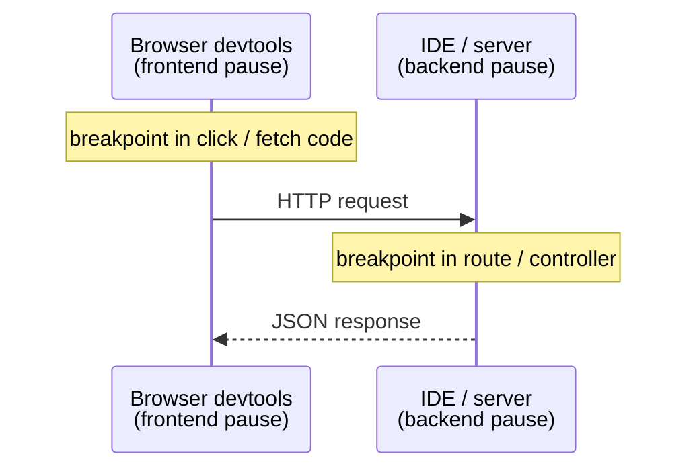

# Debugging for Real

This phase covers moves that turn the debugger from "a nicer print()" into a tool that solves bugs nothing
else can: pausing at the exact moment things go wrong, catching the instant a value changes, following one
action from a click into your backend. We close with the one case where the debugger can *lie* to you.

## Conditional breakpoints - "pause only when X is true"

**What it actually is.** A normal breakpoint pauses *every* time; a conditional one only when your condition
evaluates true. Set one by right-clicking a breakpoint and entering an expression (most IDEs: "Edit
Breakpoint" → Condition). Recall the "200th loop iteration" misery from Phase 1, where a plain breakpoint
forces 199 clicks of "continue" - a conditional one with `item.id == 4096` fires *once*, right when the loop
hits the culprit.

**A real example.**

```console
# Breakpoint on:  total += item.price * item.quantity
# Condition:      item.quantity < 0

Paused on breakpoint at cart.py:4  (condition met: item.quantity < 0)
  item  = Item(price=10, quantity=-3)
  total = 140
```
*What just happened:* The loop ran full speed through every item, stopping only at the negative quantity - a
needle found without touching the haystack.

💡 **Key point.** The condition evaluates in the paused context with normal operators - high-value patterns:
`user.id == 42` (one user), `count > 1000` (past a threshold), `result is None` (the failing case). Also
worth knowing: a **hit count** condition ("pause on the 50th time this line runs") covers knowing *how many*
iterations in but not *which value* causes it.

## Watchpoints - "pause when this value changes"

**What it actually is.** A breakpoint is tied to a *line of code*; a watchpoint ("data breakpoint") is tied
to a *piece of data* - it pauses the instant a variable or field *changes*, no matter which line did it. This
solves the worst bug: "this value is wrong by the time I look, but I have no idea where it got set" - instead
of `print()` scattered across dozens of suspect lines, tell the debugger *what* to watch and it tells you
*where* it changed.

**What it does in real life.** Set a watchpoint on `account.balance`. The moment any code assigns it a new
value, execution freezes on that line, and the call stack shows who did it.

```console
Watchpoint hit: account.balance changed
  old value: 500
  new value: -120
Paused at billing.py:73  in apply_refund()
```
*What just happened:* No guessing which function corrupted the balance - the debugger stopped on the exact
line that wrote it. A day-long bug, solved in one stop.

⚠️ **Gotcha - watchpoint support varies.** GDB, LLDB, and many IDEs support them well, but availability
depends on language and platform: some watch only a fixed number at once (often tied to CPU hardware
support), some interpreted-language debuggers offer none (fall back to a conditional breakpoint instead). If
you don't see the option, that's why.

## Debugging across the stack

Modern bugs love the seam between frontend and backend: the click sending the wrong payload, the API
returning the wrong shape, the response the UI mishandles. The power move: debug *both sides of the same
action at once*, running two debuggers in parallel:



- **Frontend:** in devtools' **Sources** panel, breakpoint where the click handler sends the request - same
  Phase 2 moves (breakpoints, stepping, variables, call stack, watches), just in browser clothing.
- **Backend:** attach your IDE's debugger to the server and breakpoint the route that receives it.

**What it does in real life.** Trigger the action: the *frontend* breakpoint fires first, showing the
payload about to be sent. Continue and the *backend* breakpoint catches the request, showing what arrived
and how it's read. The bug - "UI sends `userId`, API reads `user_id`" - becomes obvious once you see both
sides.

📝 **Source maps.** Frontend code is usually bundled and minified, so the browser shows unreadable
one-letter-variable soup. *Source maps* are build-generated files mapping the bundle back to your original
source - gibberish in devtools means they aren't served, fix that first.

## Reading the call stack at a breakpoint

You met the call stack in Phase 2 as "how did I get here" - deep in real code it's your primary navigation
tool, same skill as reading a crash: top-to-bottom, newest frame first, click down to the frame that
*actually* made the bad decision.

```mermaid
flowchart TD
  mod["&lt;module&gt;  web.py:140  ← where it all started"] -->|called| disp["dispatch  web.py:51"]
  disp -->|called| hc["handle_checkout  web.py:88"]
  hc -->|called cart_total(cart.items)| ct["cart_total  cart.py:5"]
  ct -->|called apply_discount(total)| ad["apply_discount  cart.py:8  ← paused; amount looks wrong"]
```

Paused in `apply_discount` with a wrong `amount`? The value came from above. Click `cart_total` to see
`total` at the call; click `handle_checkout` to see what `cart.items` looked like when *it* called in -
walking *backward* up the chain of causes until reality first diverged from what you expected.

> This is the live version of [Reading a Stack Trace](/guides/reading-a-stack-trace): a crash hands you a
> *dead* stack printed after the fact, a breakpoint a *live* one you can click through - same structure, far
> more power. You need the bug on demand first, though - [How to Reproduce a Bug](/guides/how-to-reproduce-a-bug)
> is the prerequisite for putting a breakpoint anywhere useful.

## ⚠️ The big gotcha: a breakpoint changes the timing

The one that humbles everyone eventually: a debugger doesn't observe your program like a camera - to pause
one part, it *stops the clock* on it, and in timing-sensitive code that can change the outcome.

**Where this bites: race conditions.** Say two threads race to update a shared counter, and the bug is that
both sometimes read it before either writes. You set a breakpoint - but while that thread sits paused, the
*other* keeps running (or, depending on settings, also stops). Either way you've changed their relative
timing, and the interleaving that caused the bug may now never happen: it *disappears the moment you look
for it*, nicknamed a **heisenbug** after the physicist's uncertainty principle.

For timing-sensitive and concurrent bugs, lean on tools that *don't* stop the clock:

- **Logging**, not breakpoints. Timestamped, thread-ID'd log lines run the program at full speed, showing
  the real interleaving unaltered - one case where Phase 1's logging genuinely beats the debugger.
- **Conditional logpoints.** A "logpoint" is a breakpoint that *logs and keeps going* instead of pausing -
  no-code-edit logging without freezing execution.
- **Purpose-built tools.** Thread sanitizers and race detectors catch these without a human watching live.

💡 **Key point.** The debugger is near-perfect for *sequential* logic, where pausing changes nothing, but an
unreliable witness for *concurrency and timing*, since pausing is itself an intervention. Know which kind of
bug you have before trusting what the breakpoint shows you.

## Recap

1. **Conditional breakpoints** pause only when your expression is true - cures "the bug is on some
   iteration"; hit-count conditions cover "pause on the Nth time."
2. **Watchpoints** pause when a *value* changes, showing *where* it got set, where supported.
3. **Debug across the stack**: a breakpoint in browser devtools (Sources panel) plus one in your backend,
   following one action across the boundary. Serve source maps so frontend code is readable.
4. At a breakpoint, **walk the call stack backward** - click each caller's frame until you find where
   reality first went wrong.
5. ⚠️ A breakpoint **changes timing** - for race conditions and concurrency, reach for logging, logpoints, or
   race detectors instead.

You now have the universal debugger toolkit: pause precisely, inspect everything, step with intent, navigate
the stack, and know when it's the wrong tool - the judgment separating print-debugging from real debugging.

---

[← Phase 2: The Core Moves](02-the-core-moves.md) · [Guide overview](_guide.md)
