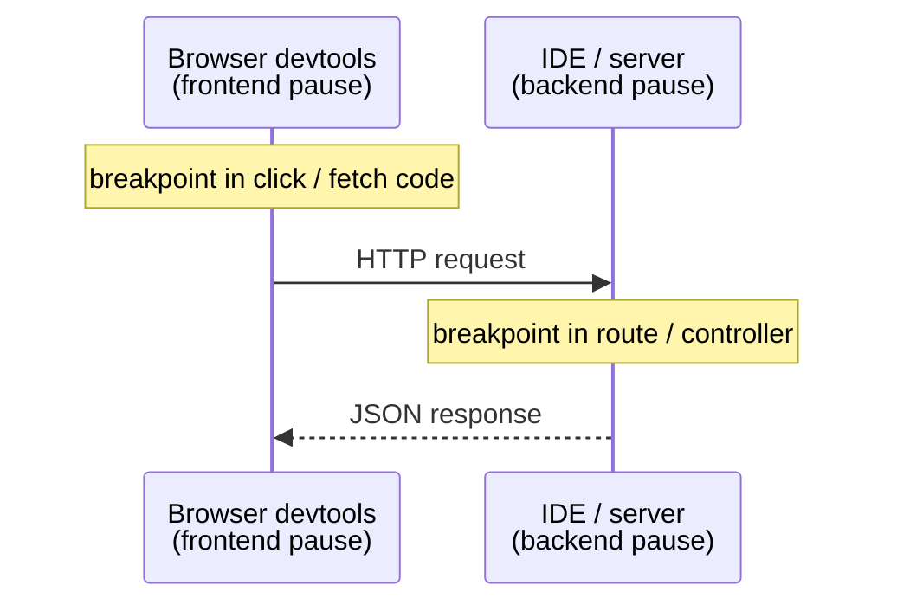

# Debugging for Real

You can now pause a program and walk through it. This phase is about the moves that turn the debugger from
"a nicer print()" into something that solves bugs you couldn't crack any other way: pausing only at the
exact moment things go wrong, catching the precise instant a value changes, and following a single action
from a browser click all the way down into your backend. We'll close with the one situation where the
debugger can *lie* to you - and what to do about it.

## Conditional breakpoints - "pause only when X is true"

**What it actually is.** A normal breakpoint pauses *every* time execution reaches a line. A conditional
breakpoint pauses only when a condition you write evaluates to true. You set one by adding a breakpoint, then
right-clicking it and entering an expression (most IDEs: "Edit Breakpoint" → Condition).

**Why this is a game-changer.** Remember the "bug on the 200th loop iteration" misery from Phase 1? A plain
breakpoint inside that loop forces you to click "continue" 199 times. A conditional breakpoint with
`item.id == 4096` fires *once* - the moment the loop touches the item that breaks things - and drops you
straight into the scene of the crime.

**A real example.**

```console
# Breakpoint on:  total += item.price * item.quantity
# Condition:      item.quantity < 0

Paused on breakpoint at cart.py:4  (condition met: item.quantity < 0)
  item  = Item(price=10, quantity=-3)
  total = 140
```
*What just happened:* The loop ran at full speed through every well-behaved item and only stopped when it hit
one with a negative quantity - instantly revealing the bad data that was quietly subtracting from the total.
You found a needle without searching the haystack by hand.

💡 **Key point.** The condition is evaluated in the paused context, so it can reference any in-scope variable
and use your language's normal operators. A few high-value patterns: `user.id == 42` (only this user),
`count > 1000` (only once it's gone too far), `result is None` (only on the failing case).

A close cousin worth knowing: most debuggers also offer a **hit count** condition ("pause on the 50th time
this line runs") for when you know *how many* iterations in the trouble starts but not *which value* causes
it.

## Watchpoints - "pause when this value changes"

**What it actually is.** A breakpoint is tied to a *line of code*. A watchpoint (sometimes called a "data
breakpoint") is tied to a *piece of data* - it pauses the program the instant a particular variable or field
*changes*, no matter which line did it.

**Why this is a game-changer.** This solves the worst kind of bug: "this value is wrong by the time I look at
it, but I have no idea where it got set." With `print()` you'd scatter logs across dozens of suspect lines.
A watchpoint flips the problem around - you tell the debugger *what* to watch and it tells you *where* it
changed.

**What it does in real life.** You set a watchpoint on `account.balance`. You run the program. The moment any
code anywhere assigns a new value to `account.balance`, execution freezes on that exact line, and the call
stack shows you who did it.

```console
Watchpoint hit: account.balance changed
  old value: 500
  new value: -120
Paused at billing.py:73  in apply_refund()
```
*What just happened:* You never had to guess which function corrupted the balance. The debugger stopped on
the precise line that wrote the bad value and showed you the call stack that led there. That's a bug that
could've cost a day, solved in one stop.

⚠️ **Gotcha - watchpoint support varies.** Native debuggers (GDB, LLDB) and many IDEs support data
watchpoints well, but availability and limits depend on the language and platform - some can only watch a
fixed number at once (often tied to CPU hardware support), and some interpreted-language debuggers don't
offer true watchpoints at all (you fall back to a conditional breakpoint that checks the value). If you don't
see the option, that's why - it's not you.

## Debugging across the stack

Modern bugs love to live in the seam between frontend and backend: the button click that sends the wrong
payload, the API that returns the wrong shape, the response the UI then mishandles. The power move is
debugging *both sides of the same action at once.*

**The setup.** You run two debuggers in parallel:



- **Frontend:** open your browser's devtools, go to the **Sources** panel, and set a breakpoint right where
  the click handler builds and sends the request. The same Phase 2 moves apply - devtools has breakpoints,
  stepping, a scope/variables pane, a call stack, and watch expressions, just in browser clothing.
- **Backend:** attach your IDE's debugger to the running server and set a breakpoint in the route that
  receives the request.

**What it does in real life.** You trigger the action in the browser. The *frontend* breakpoint fires first -
you inspect the payload the UI is about to send. You continue; the request flies to the server, and your
*backend* breakpoint catches it - now you see exactly what arrived and how the handler reads it. You've
followed one user action across the network boundary, watching the data the whole way. The bug - "the UI
sends `userId` but the API reads `user_id`" - becomes obvious the instant you can see both sides.

📝 **Source maps.** Frontend code is usually bundled and minified before it runs, so the browser would show
you unreadable one-letter-variable soup. *Source maps* are files your build generates that map that bundle
back to your original source, letting devtools show real code and real variable names. If devtools shows you
gibberish, source maps aren't being served - fix that before debugging the frontend.

## Reading the call stack at a breakpoint

You met the call stack in Phase 2 as "how did I get here." When you're paused deep in real code, it becomes
your primary navigation tool. The skill is the same one you use on a crash: read it top-to-bottom, newest
frame first, and click your way down to the frame that *actually* made the bad decision.

```mermaid
flowchart TD
  mod["&lt;module&gt;  web.py:140  ← where it all started"] -->|called| disp["dispatch  web.py:51"]
  disp -->|called| hc["handle_checkout  web.py:88"]
  hc -->|called cart_total(cart.items)| ct["cart_total  cart.py:5"]
  ct -->|called apply_discount(total)| ad["apply_discount  cart.py:8  ← paused; amount looks wrong"]
```

Paused in `apply_discount` with a wrong `amount`? The value came from above. Click `cart_total` to see what
`total` was when it made the call; click `handle_checkout` to see what `cart.items` looked like when *it*
called in. You're walking *backward* up the chain of causes, reading each frame's frozen variables, until you
reach the frame where reality first diverged from what you expected.

> This is the live, paused version of the exact skill in [Reading a Stack Trace](/guides/reading-a-stack-trace).
> A crash hands you a *dead* stack printed after the fact; a breakpoint hands you a *live* one you can click
> through and inspect. Same structure, far more power. And before any of this, you need the bug to happen
> on demand - [How to Reproduce a Bug](/guides/how-to-reproduce-a-bug) is the prerequisite for putting a
> breakpoint anywhere useful.

## ⚠️ The big gotcha: a breakpoint changes the timing

Here's the one that humbles everyone eventually. A debugger doesn't observe your program from the outside
like a camera - to pause one part, it *stops the clock* on that part. And in code where timing matters,
stopping the clock can change the outcome.

**Where this bites: race conditions.** Suppose two threads are racing to update a shared counter, and the bug
is that they sometimes both read it before either writes - a classic race. You set a breakpoint to catch it.
But while that one thread sits paused at your breakpoint, the *other* thread keeps running (or, depending on
your debugger's settings, also stops). Either way, you've changed the relative timing of the two threads -
and the specific interleaving that caused the bug may now never happen. The bug *disappears the moment you
look for it.*

This even has a nickname: a **heisenbug** - a bug that changes behavior when you try to observe it, after the
physicist's uncertainty principle.

**What to do instead.** For timing-sensitive and concurrent bugs, lean on the tools that *don't* stop the
clock:

- **Logging**, not breakpoints. Add carefully placed log lines (with timestamps and thread IDs) and let the
  program run at full, real speed. The logs show you the actual interleaving without altering it. This is
  one of the cases Phase 1 flagged where `print()`/logging genuinely beats the debugger.
- **Conditional logpoints.** Many debuggers offer a "logpoint" - a breakpoint that *logs a message and keeps
  going* instead of pausing. You get debugger-style, no-code-edit logging without freezing execution.
- **Purpose-built tools.** Thread sanitizers and race detectors are designed to find these without relying on
  a human catching the interleaving live.

💡 **Key point.** The debugger is a near-perfect instrument for *sequential* logic - the order is the order,
pausing changes nothing. It is an unreliable witness for *concurrency and timing*, because the act of
pausing is itself an intervention. Know which kind of bug you have before you trust what the breakpoint
shows you.

## Recap

1. **Conditional breakpoints** pause only when your expression is true - the cure for "the bug is on some
   iteration." Hit-count conditions cover "pause on the Nth time."
2. **Watchpoints** pause when a *value* changes, telling you *where* something got set - when support exists
   for your platform.
3. **Debug across the stack** by running a breakpoint in browser devtools (Sources panel) and another in your
   backend, and following one action across the boundary. Serve source maps so frontend code is readable.
4. At a breakpoint, **walk the call stack backward** - click each caller's frame to inspect its frozen
   variables until you find where reality first went wrong.
5. ⚠️ A breakpoint **changes timing** - for race conditions and concurrency, reach for logging, logpoints, or
   race detectors instead.

You now have the universal debugger toolkit: pause precisely, inspect everything, step with intent, navigate
the stack, and - just as important - know when the debugger is the wrong tool for the job. That judgment is
what separates print-debugging from real debugging.

---

[← Phase 2: The Core Moves](02-the-core-moves.md) · [Guide overview](_guide.md)
