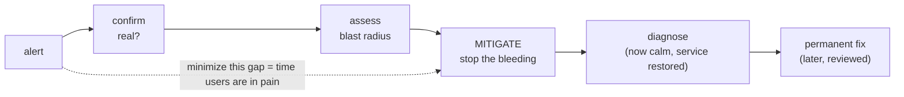

# The First Five Minutes

The first five minutes of an outage decide how the next two hours go. Not because you'll solve it in five
minutes — you usually won't — but because this is the window where panic does its damage. This is when people
start typing commands they can't explain, restart things at random, or freeze and stare at a dashboard
hoping it turns green on its own.

So before anything else, take one real breath. The site being down is bad. *You* making it worse by acting
faster than you can think is the actual danger, and it's the one you control. Here is exactly what to do, in
order. Use the card while it's happening; read the rest when you can.

## The PROD-DOWN CHECKLIST

> **Alert just fired? Don't touch anything yet. Do these, in order. Breathe between each one.**

| # | Do this | Why |
|---|---|---|
| 1 | **Breathe. Say "I will not change anything until I understand the blast radius."** | Panic-actions are the #1 way a small outage becomes a big one. |
| 2 | **Confirm it's real.** Is it the service, or your laptop/VPN/the monitoring? | You can't fix an outage that isn't happening — and you'll cause one chasing a ghost. |
| 3 | **Declare the incident out loud.** Post in the incident channel: *"Declaring an incident: checkout 500s. I'm coordinating."* | Makes it official, pulls in help, starts the clock and the record. |
| 4 | **Assess the blast radius.** *Who* is affected, *what* can't they do, *how bad* (all users or some?). | Severity drives everything: who you wake, how fast you act, what risks are acceptable. |
| 5 | **Note the start time and the last change.** When did it begin? What deployed/changed just before? | The last change is the prime suspect, every single time. |
| 6 | **Stop the bleeding.** Mitigate first — roll back, flag off, scale, fail over. *Do not diagnose yet.* | Restore service first, understand later. (Full menu in [Phase 2](02-triage-and-mitigate.md).) |
| 7 | **Only now, start investigating** — with service restored or at least stabilized. | Calm debugging beats frantic debugging every time. |

---

## Don't panic, and don't start randomly changing things

**What's actually happening to you.** When the alert fires, your body dumps adrenaline. That's useful for
running from a predator and terrible for debugging. Adrenaline narrows your attention, makes you act before
you think, and makes "do *something*" feel like progress even when the something is harmful. Recognizing this
is half the battle: the jittery urge to start typing is a chemical, not a plan.

**The wrong picture.** Most people think the goal in minute one is to *fix* the outage. It isn't. The goal in
minute one is to not make it worse and to understand what you're dealing with. The fix comes after.

**The cardinal rule:** *don't change anything you can't explain and can't undo.* Restarting a service you
don't understand, clearing a cache "just to see," bouncing a database — these feel like action, but if you
can't explain why it would help and can't reverse it, you might be turning a degraded service into a dead one,
or destroying the very evidence you'll need to understand what happened.

⚠️ **The "let me try a few things" trap.** The most expensive outages are the ones where someone fixed the
real problem in minute two but then kept tinkering, and the third or fourth "let me try this" broke something
new. Once service is restored, *stop touching it.* Resist the urge to keep optimizing while you're still
shaking.

🪖 **War story.** A teammate once got paged for high latency, and within a minute restarted the app servers,
flushed the cache, and failed over the database — all at once, "to be safe." Latency went away. So did the
ability to tell which one mattered, and the cache flush caused a thundering-herd of cold requests that took
the site fully down for ten minutes. One change at a time, observed, would have been faster *and* safer. When
in doubt, change one thing and watch.

## Confirm it's real before you respond to it

**Why this comes first.** You'd be amazed how many "outages" are the responder's own VPN dropping, an expired
local cert, a monitoring check that itself broke, or a single bad node that the load balancer is already
routing around. Spending fifteen adrenaline-soaked minutes "fixing" a problem that was never there is its own
kind of outage — and you might break something real while you flail.

**How to confirm fast.** Look from the *user's* angle, not your laptop's:

```console
$ curl -s -o /dev/null -w "%{http_code} %{time_total}s\n" https://api.example.com/health
503 0.42s
$ curl -s -o /dev/null -w "%{http_code} %{time_total}s\n" https://api.example.com/health
503 0.39s
```
*What just happened:* You asked the production health endpoint directly, twice, from outside your own
environment, and it answered `503` (service unavailable) both times in under half a second. Two consistent
failures from a clean path means it's almost certainly real and server-side, not your network and not a fluke.
If you'd gotten `200`s here, you'd pause and suspect your own connection, the alerting, or a single bad
instance before declaring a full incident.

💡 **Key point.** "Is it real?" and "is it *everywhere*?" are different questions, and you want both. A 503
from one region but 200s from another is a very different (and often smaller) incident than a 503 from
everywhere — and that distinction is the start of your blast-radius assessment.

## Assess the blast radius

This is the most important judgment call in the first five minutes, because it sets the size of your response.
You wouldn't wake the VP and the whole on-call tree for a cosmetic bug affecting one beta feature — and you
*would* for "no one can check out." Blast radius is how you tell those apart.

📝 **Terminology.** *Blast radius* is borrowed from explosives: how far the damage reaches. In an incident it
means **who is affected, what they can't do, and how widely** — the real-world impact, not the technical
symptom. "A queue is backed up" is a symptom; "customers' orders aren't being confirmed" is blast radius.

Ask three questions, in plain language:

```text
   ┌─────────────────────────────────────────────────────────────┐
   │  BLAST RADIUS  =  WHO  ×  WHAT  ×  HOW BAD                     │
   ├─────────────────────────────────────────────────────────────┤
   │  WHO     → all users? a region? logged-in only? one customer? │
   │  WHAT    → core flow (checkout, login) or an edge feature?    │
   │  HOW BAD → fully broken, degraded/slow, or cosmetic?          │
   └─────────────────────────────────────────────────────────────┘
        big radius  → act fast, pull in people, accept bolder fixes
        small radius → calmer pace, fewer people, careful fixes
```

The combination, not any single answer, sets the severity. "Slow" (how bad) for "everyone" (who) on
"checkout" (what) is an all-hands emergency. "Fully broken" for "one internal admin report" is a ticket for
tomorrow. Say your assessment out loud in the channel so everyone shares the same picture:

> *"Blast radius: all logged-in users, checkout returns 500, started ~14:03. This is customer-facing and
> revenue-impacting — treating as high severity."*

⚠️ **Don't under-call it to avoid the fuss.** There's a strong pull to label things minor so you don't have to
wake people or run a formal response. Resist it. It is far cheaper to spin down an over-declared incident
("false alarm, sorry, go back to bed") than to discover an hour in that the thing you called minor has been
quietly losing orders the whole time. When unsure, round *up*.

## Note the start time and the last change

**Why this tiny step pays off enormously.** Two facts, written down in the first minute, will shape the entire
investigation: *when did it start* and *what changed right before*. The overwhelmingly common cause of a
sudden outage is a recent change — a deploy, a config flip, a feature flag, a migration, an infra change. If
the graph turned red at 14:03 and a deploy went out at 14:01, you have your prime suspect before you've read a
single log line.

```console
$ kubectl rollout history deployment/checkout-api
REVISION  CHANGE-CAUSE
6         release v2.31.0
7         release v2.32.0      # shipped 14:01, two minutes before the alerts
```
*What just happened:* You asked the deployment for its recent revisions and saw that `v2.32.0` rolled out at
14:01 — moments before the 14:03 alert. That timing correlation doesn't *prove* the deploy is the cause, but
it makes it the first thing to mitigate. (Correlation is a lead, not a verdict — but in the first five minutes,
a strong lead is exactly what you want.)

💡 **Key point.** "What changed?" beats "what's wrong?" as your opening question. *What's wrong* can take an
hour to fully understand. *What changed* you can often answer in thirty seconds — and changing it back is
frequently the whole fix.

## Stop the bleeding — restore service first, understand later

Here is the mindset that separates calm responders from heroes-who-make-it-worse:

> **Restore service first. Understand later.**

When you cut yourself badly, you apply pressure *before* you investigate which blood vessel you nicked. Same
here. If you can get users working again — by rolling back, flipping a flag, failing over — *do that now*,
even if you don't yet understand the root cause. A restored service buys you the single most valuable thing in
an incident: time to think clearly instead of under fire.

**The wrong picture.** Engineers love understanding things. The instinct is "I need to know *why* before I
touch anything." That instinct is correct for a normal Tuesday bug and dangerous during an outage. Every
minute you spend on root cause while users are broken is a minute of impact you could have stopped. You can —
and should — find the root cause. *After* the bleeding stops.

**The reframe.** Mitigation and diagnosis are two separate jobs. Mitigation answers "how do I make the pain
stop *right now*?" Diagnosis answers "why did this happen and how do I prevent it?" In the first five minutes,
you only have one job, and it's mitigation.



The whole game in the early phase is shrinking that shaded gap — the time users are actually hurting — and you
shrink it with mitigation, not understanding. Phase 2 is the menu of how to stop the bleeding.

🪖 **War story.** During one outage, a senior engineer rolled back a deploy within four minutes, the site came
back, and *then* she said: "Okay. It's stable. Now let's figure out what that deploy did." The room exhaled.
Nobody had to debug a live fire. The bug turned out to be subtle and took an hour to fully understand — an hour
that, thanks to the rollback, cost zero customer impact. That's the whole pattern: stop the bleeding fast,
then diagnose at leisure.

> ⏭️ Once service is breathing again and you've got room to investigate, the skills that carry you are
> log-reading and stack-trace reading. See [Reading Logs Without Drowning](/guides/reading-logs-without-drowning)
> and [Reading a Stack Trace](/guides/reading-a-stack-trace) for the calm-investigation half of the job.

## Recap

1. **Don't panic, don't randomly change things.** The adrenaline urge to "do something" is the danger. Change
   nothing you can't explain and can't undo.
2. **Confirm it's real** from the user's angle before you respond — not your laptop, VPN, or a broken check.
3. **Assess the blast radius** — *who × what × how bad* — and say it out loud. It sets your severity. When
   unsure, round up.
4. **Note the start time and the last change.** "What changed?" is faster to answer than "what's wrong?" and is
   usually the prime suspect.
5. **Stop the bleeding before you diagnose.** Restore service first, understand later — mitigation and root
   cause are two separate jobs, and only one of them is your job in minute one.

---

[← Guide overview](_guide.md) · [Phase 2: Triage & Mitigate →](02-triage-and-mitigate.md)
