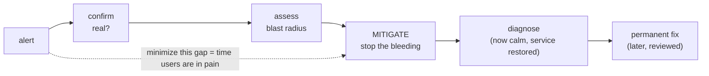

# The First Five Minutes

The first five minutes of an outage decide how the next two hours go - this is when panic does its damage:
typing commands you can't explain, restarting things at random, freezing at a dashboard hoping it turns green.
The site being down is bad; *you* making it worse by acting faster than you can think is the danger you
control. Here's exactly what to do, in order - use the card while it's happening, read the rest when you can.

## The PROD-DOWN CHECKLIST

> **Alert just fired? Don't touch anything yet. Do these, in order. Breathe between each one.**

| # | Do this | Why |
|---|---|---|
| 1 | **Breathe. Say "I will not change anything until I understand the blast radius."** | Panic-actions are the #1 way a small outage becomes a big one. |
| 2 | **Confirm it's real.** Is it the service, or your laptop/VPN/the monitoring? | You can't fix an outage that isn't happening - and you'll cause one chasing a ghost. |
| 3 | **Declare the incident out loud.** Post in the incident channel: *"Declaring an incident: checkout 500s. I'm coordinating."* | Makes it official, pulls in help, starts the clock and the record. |
| 4 | **Assess the blast radius.** *Who* is affected, *what* can't they do, *how bad* (all users or some?). | Severity drives everything: who you wake, how fast you act, what risks are acceptable. |
| 5 | **Note the start time and the last change.** When did it begin? What deployed/changed just before? | The last change is the prime suspect, every single time. |
| 6 | **Stop the bleeding.** Mitigate first - roll back, flag off, scale, fail over. *Do not diagnose yet.* | Restore service first, understand later. (Full menu in [Phase 2](02-triage-and-mitigate.md).) |
| 7 | **Only now, start investigating** - with service restored or at least stabilized. | Calm debugging beats frantic debugging every time. |

---

## Don't panic, and don't start randomly changing things

The alert dumps adrenaline into your system - useful for running from a predator, terrible for debugging. It
makes "do *something*" feel like progress even when it's harmful; the urge to type is chemical, not a plan.
Minute one isn't for *fixing* the outage, it's for not making it worse - the fix comes after.

**The cardinal rule:** *don't change anything you can't explain and can't undo.* Restarting a service you
don't understand, clearing a cache "just to see," bouncing a database - these feel like action, but might turn
a degraded service into a dead one, or destroy the evidence you need.

⚠️ **The "let me try a few things" trap.** The most expensive outages are the ones where someone fixed the
real problem in minute two but kept tinkering, and the third "let me try this" broke something new. Once
service is restored, *stop touching it.*

🪖 **War story.** A teammate paged for high latency once restarted the app servers, flushed the cache, and
failed over the database all at once, "to be safe." Latency went away, but so did the ability to tell which
change mattered - the cache flush caused a thundering herd that took the site down ten more minutes. One at a
time, observed, is faster *and* safer.

## Confirm it's real before you respond to it

Plenty of "outages" are the responder's own VPN, an expired cert, a broken monitoring check, or one bad node
the load balancer already routes around - fixing a problem that was never there is its own outage. Confirm
fast, from the *user's* angle, not your laptop's:

```console
$ curl -s -o /dev/null -w "%{http_code} %{time_total}s\n" https://api.example.com/health
503 0.42s
$ curl -s -o /dev/null -w "%{http_code} %{time_total}s\n" https://api.example.com/health
503 0.39s
```
*What just happened:* Hitting the health endpoint directly, twice, from outside your own environment returned
`503` both times in under half a second - consistent failures from a clean path, almost certainly real and
server-side. Two `200`s instead would point at your own connection or a single bad instance.

💡 **Key point.** "Is it real?" and "is it *everywhere*?" are different questions - you want both answered. A
503 from one region but 200s from another is a smaller incident than a 503 everywhere.

## Assess the blast radius

The most important judgment call in the first five minutes: it sets the size of your response. You wouldn't
wake the whole on-call tree for a cosmetic bug in a beta feature, but you *would* for "no one can check out."

📝 **Terminology.** *Blast radius*, from explosives, means how far the damage reaches: **who's affected, what
they can't do, how widely** - real-world impact, not technical symptom. "A queue is backed up" is a symptom;
"orders aren't being confirmed" is blast radius. Three questions, in plain language:

```text
   ┌─────────────────────────────────────────────────────────────┐
   │  BLAST RADIUS  =  WHO  ×  WHAT  ×  HOW BAD                     │
   ├─────────────────────────────────────────────────────────────┤
   │  WHO     → all users? a region? logged-in only? one customer? │
   │  WHAT    → core flow (checkout, login) or an edge feature?    │
   │  HOW BAD → fully broken, degraded/slow, or cosmetic?          │
   └─────────────────────────────────────────────────────────────┘
        big radius  → act fast, pull in people, accept bolder fixes
        small radius → calmer pace, fewer people, careful fixes
```

The combination, not any single answer, sets the severity: "slow" for "everyone" on "checkout" is an all-hands
emergency; "fully broken" for "one internal admin report" is a ticket for tomorrow. Say it out loud in the
channel so everyone shares the same picture:

> *"Blast radius: all logged-in users, checkout returns 500, started ~14:03. This is customer-facing and
> revenue-impacting - treating as high severity."*

⚠️ **Don't under-call it to avoid the fuss.** Resist labeling things minor to skip waking people - it's far
cheaper to spin down an over-declared incident ("false alarm, go back to bed") than discover an hour later the
"minor" thing was quietly losing orders. When unsure, round *up*.

## Note the start time and the last change

Two facts, written down in the first minute, shape the whole investigation: *when did it start* and *what
changed right before*. The overwhelmingly common cause of a sudden outage is a recent change - a deploy, a
config flip, a feature flag, a migration, an infra change. Graph turned red at 14:03, deploy went out at
14:01? Prime suspect, before reading a single log line.

```console
$ kubectl rollout history deployment/checkout-api
REVISION  CHANGE-CAUSE
6         release v2.31.0
7         release v2.32.0      # shipped 14:01, two minutes before the alerts
```
*What just happened:* You checked the deployment's recent revisions and saw `v2.32.0` rolled out at 14:01 -
moments before the 14:03 alert. That timing doesn't *prove* the deploy caused it, but makes it the first thing
to mitigate. Correlation is a lead, not a verdict - and that's exactly what you want right now.

💡 **Key point.** "What changed?" beats "what's wrong?" as your opening question - *what's wrong* can take an
hour to understand, *what changed* you can often answer in thirty seconds, and changing it back is often the
whole fix.

## Stop the bleeding - restore service first, understand later

The mindset that separates calm responders from heroes-who-make-it-worse:

> **Restore service first. Understand later.**

When you cut yourself badly, you apply pressure *before* investigating which blood vessel you nicked. Same
here: if you can get users working again - rolling back, flipping a flag, failing over - *do that now*, even
without understanding root cause. A restored service buys you the most valuable thing in an incident: time to
think clearly instead of under fire.

Engineers love understanding first - correct instinct for a normal bug, dangerous during an outage. Every
minute spent on root cause while users are broken is impact you could have stopped. Mitigation and diagnosis
are separate jobs, and in the first five minutes you only have one: mitigation.



The whole game in the early phase is shrinking that shaded gap - the time users are hurting - with mitigation,
not understanding. Phase 2 is the menu for stopping the bleeding.

🪖 **War story.** A senior engineer once rolled back a deploy within four minutes, the site came back, and
*then* she said: "Okay, it's stable. Now let's figure out what that deploy did." Nobody had to debug a live
fire. The bug was subtle and took an hour to fully understand - an hour that, thanks to the rollback, cost
zero customer impact.

> ⏭️ Once service is breathing again and you've got room to investigate, the skills that carry you are
> log-reading and stack-trace reading. See [Reading Logs Without Drowning](/guides/reading-logs-without-drowning)
> and [Reading a Stack Trace](/guides/reading-a-stack-trace) for the calm-investigation half of the job.

## Recap

1. **Don't panic, don't randomly change things.** The adrenaline urge to "do something" is the danger. Change
   nothing you can't explain and can't undo.
2. **Confirm it's real** from the user's angle before you respond - not your laptop, VPN, or a broken check.
3. **Assess the blast radius** - *who × what × how bad* - and say it out loud. When unsure, round up.
4. **Note the start time and the last change.** "What changed?" beats "what's wrong?" and is usually the prime
   suspect.
5. **Stop the bleeding before you diagnose.** Restore service first, understand later - only one of those is
   your job in minute one.

---

[← Guide overview](_guide.md) · [Phase 2: Triage & Mitigate →](02-triage-and-mitigate.md)
