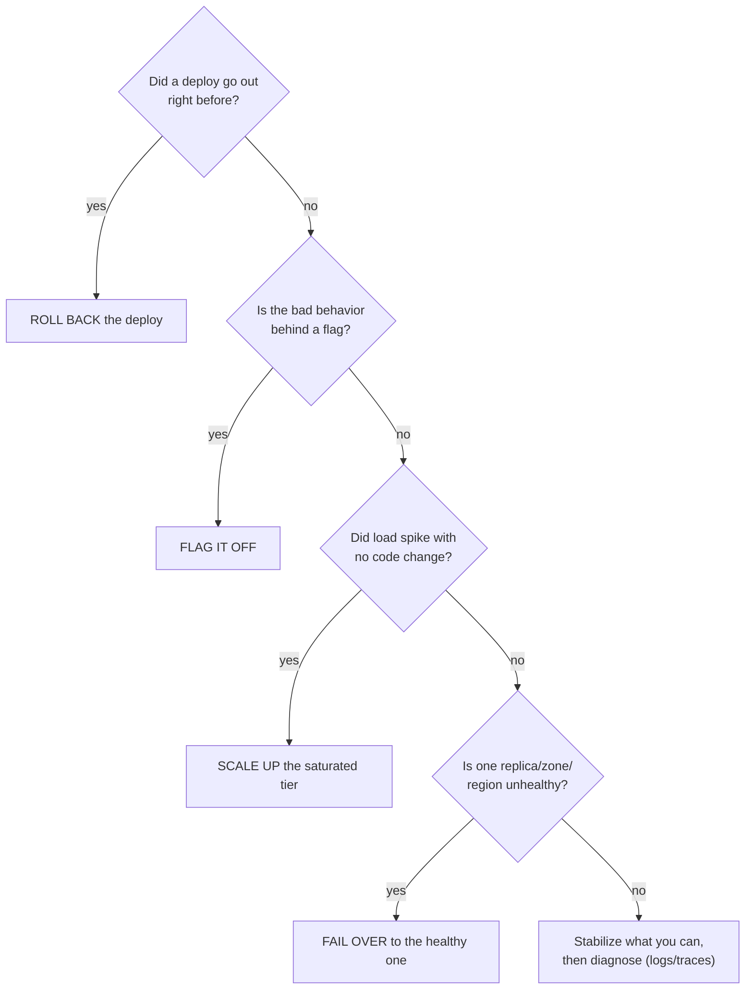

# Triage & Mitigate

You've confirmed it's real, know the blast radius, and spotted the prime suspect. Now make the pain stop: fast
mitigations that get users working before you fully understand what broke, plus how to *run* the incident so
five people helping doesn't become five people colliding.

Carry this mindset throughout: **in the moment, mitigation beats root cause.** You're not trying to be right,
you're trying to make the graph green. Clever diagnosis waits until the bleeding stops.

## The mitigation menu - reach for these first

Ordered roughly by how often they work and how fast they are - start at the top. The unifying idea: a sudden
outage usually means *something changed*, so the fastest fixes *undo a change*.

### 1. Roll back the last deploy (the most common fix, full stop)

**Why this is first.** If the outage started right after a deploy, rolling it back is the single most likely
fix in incident response - it directly undoes the prime suspect, is fast, and is usually reversible. Reach for
it before anything cleverer.

```console
$ kubectl rollout undo deployment/checkout-api
deployment.apps/checkout-api rolled back
$ kubectl rollout status deployment/checkout-api
Waiting for deployment "checkout-api" rollout to finish: 2 of 4 updated replicas are available...
deployment "checkout-api" successfully rolled out
```
*What just happened:* `rollout undo` told Kubernetes to redeploy the *previous* known-good revision;
`rollout status` confirmed the old pods came up healthy. If `v2.32.0` was the culprit, checkout recovers within
a minute or two. You haven't found the bug, but you've removed it from production - that's the job right now.

> ⏭️ A rollback is, at heart, a Git operation - putting production back on a known-good commit. The deeper
> mechanics of reverting safely live in [Git Disaster Recovery](/guides/git-disaster-recovery); during an
> incident, your deploy tool's "rollback" or "redeploy previous" button is usually the fastest front door.

⚠️ **Rollback gotcha: the irreversible migration.** Rolling back code is safe; a *database migration* often
isn't - if the deploy added a column, backfilled data, or changed a schema, old code may not run against the
new database, and reversing it can lose data. Ask: *"Did this release include a database change?"* If yes,
pause and get the person who wrote it on the call first - the one place "just roll it back" digs the hole
deeper.

### 2. Turn off the feature flag

**When it beats a rollback.** If the broken behavior sits behind a flag, flipping it off is faster and more
surgical than a rollback - no redeploy, no waiting for pods, and it disables *only* the bad thing, leaving the
rest of the release in place.

```console
$ flagctl set checkout_new_pricing --off
flag "checkout_new_pricing" → OFF (effective immediately, all environments)
```
*What just happened:* You disabled the new code path at runtime. Requests fall back to old, known-good
behavior with nothing redeployed - if the new pricing logic was the problem, checkout recovers in seconds.

💡 **Key point.** This is *why* mature teams put risky changes behind flags: a flag turns "emergency rollback
under pressure" into "flip a switch." No flag on risky changes yet? Postmortem action item
([Phase 3](03-after-the-blameless-postmortem.md)).

### 3. Scale up / give it more resources

**When this is the move.** If nothing changed in code but load spiked - a traffic surge, a viral moment, a
batch job hammering the database - give the system more room while you find the source.

```console
$ kubectl scale deployment/checkout-api --replicas=12
deployment.apps/checkout-api scaled
```
*What just happened:* You scaled to 12 replicas, adding capacity to absorb the load. This is a *mitigation*,
not a cure - if a slow query or runaway client is the real cause, more replicas may only buy minutes, but
that's exactly what you're shopping for.

⚠️ **Scaling can move the bottleneck, not remove it.** Tripling app servers when the *database* is the
bottleneck makes things *worse* - more app servers means more connections hammering the same overwhelmed
database. Scale the tier that's actually saturated, and watch downstream effects.

### 4. Fail over to a healthy replica/region

**When this saves you.** If a database replica, availability zone, or region is unhealthy and you have a
standby, failing over restores service without fixing the sick component - you isolate the damage and route
around it.

```console
$ ./failover.sh --promote db-replica-2 --region us-west-2
Promoting db-replica-2 to primary...
Health check passed. Traffic now routing to us-west-2.
```
*What just happened:* You promoted a healthy standby and shifted traffic to it. The primary is still broken,
but users are now served by the healthy one, buying time to investigate the failed component out of the
critical path.

⚠️ **Know your failover before the fire.** Failover is the mitigation most likely to go wrong *if you've never
practiced it* - a stale replica can serve old data, a half-configured standby can fail under real traffic. Not
confident the standby is healthy and current? A rollback or flag-flip is safer. (Practicing failover before
the fire is, you guessed it, a postmortem action item.)

---



📝 **Terminology.** *Mitigation* = anything that reduces or stops user impact, whether or not it fixes the
cause. *Remediation* (the permanent fix) = fixing root cause so it can't recur. In the moment you want
mitigation; the postmortem produces remediation. "The pain stopped" ≠ "the problem is fixed" - different
milestones.

## Running the incident - so help doesn't become chaos

Once more than one or two people are involved, *coordination* matters as much as the fix. The classic failure
mode isn't too few people - it's several skilled engineers debugging in parallel, stepping on each other, making
simultaneous changes nobody knows about, while leadership has no idea what's happening. A well-run incident
with three beats a chaotic one with ten.

### One coordinator (the incident commander)

One person - the **incident commander (IC)** - runs the response. Crucially, *the IC usually isn't the one
with hands on the keyboard*: their job is to coordinate, not fix - track what's being tried, decide what to
try next, keep comms flowing, pull in the right people.

📝 **Terminology.** *Incident Commander (IC)* - the single person accountable for coordinating the response.
Not necessarily the most senior or knowledgeable, just the one holding the overall picture so responders can
focus on their piece. The role can (and during long incidents, should) be handed off, but exactly one person
holds it at any moment.

**Why "exactly one" matters.** With no coordinator, everyone assumes someone else is watching the whole board,
and nobody is; with two, they give conflicting directions. One named IC means there's always an answer to
"what are we doing and who's deciding?" First on scene with nobody else stepped up? *You're* IC until you hand
it off - say so: *"I'm IC for this. [Name], can you investigate the database? I'll handle comms."*

### A clear comms channel and status updates

Spin up (or use a standing) incident channel and put *everything* there - what's being tried, what's ruled
out, status updates. Anyone joining can scroll up and catch the story instead of asking people to re-explain,
and it becomes your timeline (next section) for free.

**Two audiences, two cadences.** Responders need detail. *Everyone else* - leadership, support, the rest of the
company - needs a short, regular heartbeat so they stop interrupting to ask "any update?":

> *14:18 - Incident update: Checkout is failing for all users (started ~14:03). Suspected cause: the 14:01
> release. Rolling it back now. Next update in 15 min or when status changes.*

💡 **Key point.** "Next update at [time]" is the single most calming sentence in incident comms - it frees
responders from answering "any update?" Send it even if it's just "still working, no change, next update in
15."

### Write the timeline as you go

Don't wait and reconstruct the timeline afterward - adrenaline scrambles memory and you *will* misremember the
order and times. Drop one-line, timestamped notes into the channel *as things happen* for an accurate timeline,
zero memory required.

```text
   14:03  alerts fire - checkout 500s, all regions
   14:05  declared incident, IC = Maria
   14:07  blast radius: all logged-in users, checkout fully down
   14:08  noticed deploy v2.32.0 went out 14:01 - prime suspect
   14:12  rolling back v2.32.0
   14:15  rollback complete, 500s dropping
   14:17  checkout confirmed working - bleeding stopped
   14:18  posted status update; starting root-cause investigation
```

*What this gives you:* a clear, minute-by-minute record while it's fresh, for mining later - *time to detect*
(alert to declared) and *time to mitigate* (declared to bleeding stopped) - numbers only trustworthy if
written down live.

### ⚠️ The most dangerous person on the call: the silent hero

There's an anti-pattern that feels like heroism and is actually sabotage: the engineer who goes quiet, fixes
(or "fixes") something alone, and tells no one. Even when they're *right*, they've broken the incident:

- Nobody else knows a change was made, so when the graph moves, the team can't tell what caused it.
- If their change makes things worse, others may simultaneously make *other* changes - now two uncontrolled
  variables, no idea which did what.
- The timeline gets a hole in it, so the postmortem can't learn from what actually happened.

🪖 **War story.** Mid-incident, the graphs suddenly recovered - then, a minute later, crashed harder. One
engineer had quietly restarted a service at the same moment another had quietly cleared a cache; each assumed
*their* change worked, and neither had announced it. Untangling who did what cost more time than the original
bug. The rule that prevents this is simple and absolute:

> **Announce every change before you make it, in the channel.** *"I'm about to restart the worker pool -
> objections? Going in 30 seconds."* No silent fixes. No exceptions. The hero who saves the day silently turns
> a 20-minute incident into a 2-hour mystery.

The discipline keeps the response a *coordinated* effort instead of several people gambling in the dark.

## Recap

1. **Mitigation beats root cause in the moment.** Make the graph green first; be clever later.
2. **The mitigation menu, top to bottom:** roll back the deploy (most common fix) → flag it off → scale the
   saturated tier → fail over to a healthy replica/region.
3. **Watch the gotchas:** irreversible DB migrations make rollbacks dangerous; scaling can move the bottleneck;
   never fail over to an unverified standby.
4. **One incident commander**, coordinating rather than typing, so there's always a single answer to "what are
   we doing?"
5. **One comms channel, regular heartbeat updates** ("next update at [time]"), and a **timeline written live** -
   not reconstructed from memory.
6. **No silent heroes.** Announce every change before you make it - the quiet fixer is the most dangerous
   person on the call.

---

[← Guide overview](_guide.md) · [Phase 3: After - the Blameless Postmortem →](03-after-the-blameless-postmortem.md)
