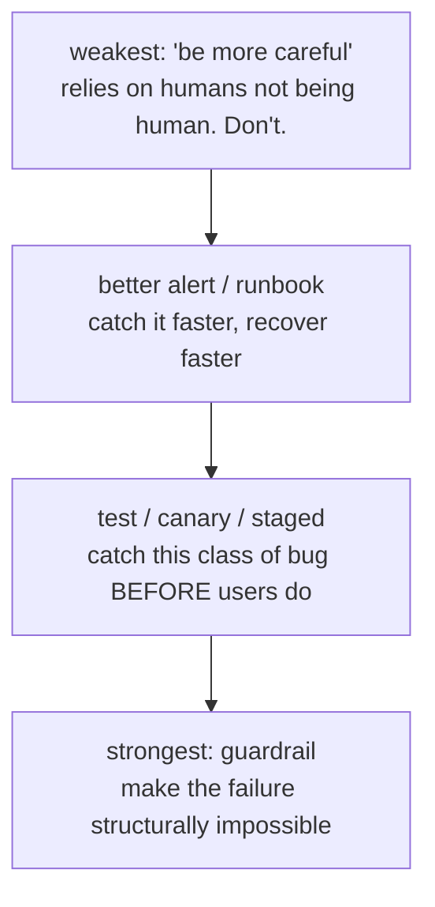

# After: the Blameless Postmortem

The site is back. Your heart rate is coming down. Every instinct now says: close the laptop, never speak of
this again. That instinct is the single most expensive mistake in the whole incident - because an outage you
don't learn from is an outage you've *prepaid for next time.*

Here's the reframe that makes the rest of this phase worth your evening:

> **Every outage is tuition. The only question is whether you let it buy something.**

You've already paid the cost - the stress, the downtime, the lost sleep. The postmortem is how you collect what
you bought: understanding and prevention. Skip it and you paid full price for nothing. This phase is how to run
that process so it's honest, useful, and safe to participate in.

## Start while it's fresh: the timeline

**Why timeline-first.** Before any analysis, write down *what happened, in order, with timestamps.* If you kept
a live timeline during the incident ([Phase 2](02-triage-and-mitigate.md)), this is mostly assembled already -
which is exactly why you did it. If you didn't, reconstruct it now, today, while memories are warm; every day
you wait, the details blur and the order scrambles.

A good timeline is purely factual - no blame, no analysis yet, just events:

```text
   13:55  release v2.32.0 merged and auto-deployed to prod
   14:01  v2.32.0 finished rolling out to all pods
   14:03  error-rate alert fires (checkout 500s)
   14:05  incident declared, IC assigned
   14:08  v2.32.0 identified as prime suspect (timing)
   14:12  rollback initiated
   14:17  checkout recovered - user impact ends
   14:40  root cause confirmed: null-pointer on missing promo field
```

From this you can read the two numbers that actually measure your response:

- **Time to detect** - incident start to alert firing (here, ~2 minutes: 14:01 → 14:03).
- **Time to mitigate** - declared to user-impact-ended (here, ~12 minutes: 14:05 → 14:17).

📝 **Terminology.** You'll also hear **MTTR** - *mean time to recovery/resolve* - the average of how long
incidents take to recover from, across many incidents. One incident gives you a data point; MTTR is the trend.
Don't fabricate or eyeball these - read them off the real timeline you recorded.

💡 **Key point.** These numbers tell you *where to invest.* Slow to detect? You have an alerting gap. Fast to
detect but slow to mitigate? You have a tooling or runbook gap. The timeline turns a bad night into a concrete
diagnosis of your *response*, not just the bug.

## Root cause vs. contributing factors

**The wrong picture.** The seductive trap of a postmortem is hunting for *the one cause* - the single line of
code, the single person, the single bad command - declaring it found, and going home. Real outages almost never
have one cause. They have a *chain*: several things that were each individually survivable but lined up to let
the failure through.

**The right model.** Separate the two:

- **Root cause** - the technical trigger. *"A null-pointer exception when an order arrived without a promo-code
  field."* True, but by itself an incomplete story.
- **Contributing factors** - everything that let that trigger become a customer-facing outage. The deploy had
  no canary stage. The code had no test for the missing-field case. There was no alert until customers were
  already failing. Rollback took twelve minutes because nobody had practiced it.

```text
   ROOT CAUSE          ──► the technical trigger that fired
   (null on promo field)

   CONTRIBUTING FACTORS ──► why the trigger reached users
     • no canary / staged rollout caught it
     • no test covered the missing-field case
     • no alert until customers were already failing
     • rollback was slow (never rehearsed)

   The lesson lives in the contributing factors,
   because that's where you have the most leverage to prevent the NEXT,
   different, outage.
```

💡 **Key point.** The contributing factors are where the *real* value is. Fixing the null-pointer prevents that
exact bug from recurring. Fixing "we have no canary stage" prevents an entire *class* of future outages you
haven't even hit yet. Always push past "what broke?" to "why did what broke reach our users?"

## Blameless: systems fail, not people

This is the heart of the whole practice, and it's worth saying plainly:

> **A blameless postmortem treats the failure as a property of the system, not a fault of a person.**

📝 **Terminology.** *Blameless* doesn't mean "no accountability" or "nobody made a mistake." It means the
postmortem's job is to fix the *system that allowed the mistake to cause an outage*, not to identify a human to
punish. The question is never "who screwed up?" - it's always "why did our system let a normal human error turn
into a customer-facing outage?"

**Why this is non-negotiable, not just kindness.** It is genuinely nicer to not throw people under the bus - but
that's not the real argument. The real argument is cold and practical: **blame destroys the information you need
to prevent the next outage.** In a culture that hunts for someone to fire:

- People hide what they actually did, so your timeline is fiction and you can't learn from it.
- People stop volunteering for risky-but-important work, so the most fragile systems get the least attention.
- The deepest, most useful insights - "honestly, I didn't understand what that flag did" - never get spoken,
  because saying them is dangerous.

A blameless culture is what makes people tell you the truth, and the truth is the only raw material a postmortem
has. **Punish honesty and you'll get silence; reward honesty and you'll get the information that prevents the
next outage.**

**The reframe in practice.** "Maria deployed the bad code" is blame, and it teaches you nothing - anyone could
deploy that code tomorrow. "Our pipeline let a change with no test for a common input go straight to 100% of
production with no canary and no fast alert" is blameless, and it's *actionable.* Same event; one version hunts
a culprit, the other hunts a fix. The person who pushed the button is almost never the cause; they're the last
visible step in a chain the system should have caught.

🪖 **War story.** The most psychologically safe team I've seen had a ritual: the person "closest to" an incident
often *volunteered* to write the postmortem, and the group would actively reframe any "I messed up" into "what
about the system made that mistake so easy to make, and so costly when made?" New engineers were stunned the
first time - they'd braced to be blamed and instead got helped. That team shipped faster *because* people
weren't afraid; fear makes people slow, defensive, and quiet, and quiet is fatal to learning.

⚠️ **Watch for blame in disguise.** "Blameless" gets quietly violated by phrasing. "Why didn't you test it?" is
blame wearing a process costume. "What would have made it easy to catch this in testing?" is genuinely
blameless. Same concern, completely different result: one makes the person defend themselves, the other makes
the whole team think about the system. Listen for the accusatory "you" and reframe it toward the system.

## Turn the incident into prevention

A postmortem that ends in understanding but no *changes* is a diary entry, not an investment. The output that
matters is a short list of **action items** - concrete, owned, and tracked like any other work.

**What makes an action item real:**

- **Specific and verifiable** - "add a canary stage that holds at 5% for 10 minutes before full rollout," not
  "be more careful with deploys."
- **Owned** - a named person, not "the team" (which means no one).
- **Tracked** - a real ticket with a due date, reviewed like any other work - not a bullet in a doc nobody
  reopens.

The strongest action items remove the *contributing factors*, because each one defuses a whole class of future
outages. They tend to fall into three families:



- **Better alerts** - if you were slow to detect, add or tune an alert so next time you know in seconds, not
  from customers. (Detection gaps come straight off your "time to detect" number.)
- **Tests & canaries** - a test for the input that broke; a canary/staged rollout so a bad deploy hits 5% of
  traffic, trips an alert, and auto-rolls-back before it reaches everyone.
- **Guardrails** - the strongest of all: make the failure *structurally impossible*. A schema constraint that
  rejects the bad data, a type that can't be null, a deploy gate that blocks releases without canary coverage.
  A guardrail beats "remember to be careful" every time, because it doesn't depend on anyone remembering.

💡 **Key point.** Prefer guardrails over vigilance. "We'll remember to check this next time" is the weakest
possible action item - it relies on humans being more reliable than humans are. Every time you can convert a
"remember to…" into a "the system won't let you…", you've turned this one outage into permanent protection.

⚠️ **The graveyard of good intentions.** The most common postmortem failure isn't a bad analysis - it's a great
analysis whose action items are never done. Unowned, undated, untracked items quietly die, and six months later
the *same outage* happens again. If you do one thing with your action items, make it this: put them in the same
backlog as your feature work, with owners and dates, and review them. An action item that isn't tracked didn't
happen.

## Every outage is tuition - make it buy something

Step back and look at the whole arc of this guide. You stayed calm in the first five minutes. You stopped the
bleeding before you diagnosed. You ran the incident with one coordinator, clear comms, and a live timeline. And
now you close the loop: an honest, blameless postmortem that converts the wreckage into prevention.

That last step is what compounds. A team that does this turns each outage into permanent improvements - better
alerts, real tests, structural guardrails - so the system gets *more* resilient over time and incidents get
rarer and shorter. A team that skips it pays the same tuition over and over and learns nothing, reliving the
same outage with different dates.

You already paid for the lesson - in stress, in downtime, in sleep. The blameless postmortem is how you
collect what you already bought. Don't leave it on the table.

> **Make the outage buy something. That's the difference between a team that gets paged at 2am forever and a
> team that, slowly, stops.**

## Recap

1. **Timeline first, while it's fresh** - purely factual, with timestamps; read your *time to detect* and *time
   to mitigate* off it (and don't fabricate the numbers).
2. **Root cause vs. contributing factors** - the trigger is rarely the whole story; the leverage lives in the
   factors that let the trigger reach users.
3. **Blameless means systems fail, not people** - not out of niceness but because blame destroys the honest
   information a postmortem runs on. Punish honesty, get silence.
4. **Watch for blame in disguise** - reframe "why didn't you…?" into "what would have made this easy to catch?"
5. **Turn it into prevention** - specific, owned, tracked action items; prefer guardrails (make it impossible)
   over vigilance (remember to be careful).
6. **Every outage is tuition.** You've already paid. The postmortem is how you collect what it bought.

---

[← Guide overview](_guide.md) · [Phase 1: The First Five Minutes →](01-the-first-five-minutes.md)
