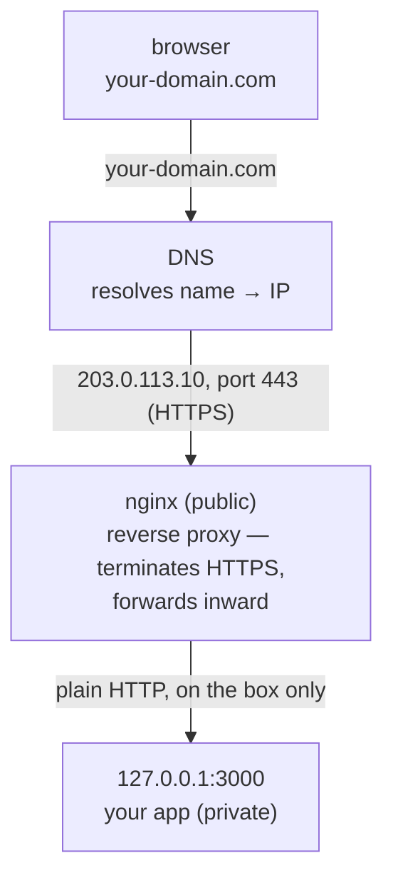

# Make It Public & Safe

Your app is running and self-healing, but it's hiding on `127.0.0.1:3000`, reachable only from the box
itself. The internet can see your server's IP, but not your app. This phase opens the front door — the
right way — so a real person can type a real domain into a browser and get your app over a secure HTTPS
connection.

There are three moving parts, and they fit together in a clean chain. Let's see the whole picture before
touching anything, because each piece only makes sense in light of the others.

## The whole picture first

**What you're building.** A request from a visitor's browser will travel like this:



Three jobs, three tools:

1. **DNS** turns the human name `your-domain.com` into your box's IP address `203.0.113.10`.
2. **nginx** sits at the public edge on ports 80/443, accepts the visitor's connection, and *forwards*
   it to your app on localhost. This is a **reverse proxy**.
3. **HTTPS** (via a Let's Encrypt certificate) encrypts the connection between the browser and nginx, so
   the browser shows the padlock instead of "Not secure."

The crucial idea — the reason this is *safe* and not just *working* — is that your app never faces the
internet directly. Only nginx does. Your app stays bound to localhost behind it.

## Step 1: Point a domain at the box (DNS)

**What it actually is.** **DNS** (*Domain Name System*) is the internet's address book: it maps names
people can remember (`your-domain.com`) to the IP addresses machines actually use (`203.0.113.10`). To
point your domain at your box, you add one record — an **A record** — at wherever you bought or manage
the domain (your registrar or DNS host).

📝 **Terminology.** *A record* = a DNS entry mapping a name to an IPv4 address. (*AAAA record* is the
same for an IPv6 address; add one too if your box has an IPv6 address.) *TTL* = "time to live," how long
resolvers are allowed to cache the answer.

**What you do.** In your DNS provider's dashboard, create an A record. The form maps onto these fields:

```text
   FIELD       TYPICAL VALUE              MEANS
   ─────       ─────────────              ──────────────────────────────────
   Type        A                          maps a name to an IPv4 address
   Name/Host   @  (or "www")              @ = the bare domain; "www" = www.…
   Value       203.0.113.10               your box's public IP
   TTL         3600 (or "Auto")           cache lifetime, in seconds
```

`@` means the root of your domain (`your-domain.com` itself); add a second record with name `www` if you
want `www.your-domain.com` to work too.

**Confirm it took effect.** DNS changes propagate gradually, so don't panic if it's not instant. Check
from your laptop:

```console
$ dig +short your-domain.com
203.0.113.10
```

*What just happened:* `dig +short` asked the DNS system "what's the A record for `your-domain.com`?" and
got back your box's IP — meaning the name now points at your server. If it returns nothing or an old
address, the change hasn't propagated yet; wait a bit (minutes to an hour, depending on TTL) and try
again. Don't move on to the certificate step until this resolves correctly, because the certificate
process relies on the domain reaching your box.

## Step 2: Put nginx in front (reverse proxy)

**What it actually is.** A **reverse proxy** is a server that sits in front of your app, receives
requests from the outside world, and passes them along to your app behind it — then relays the app's
response back out. **nginx** is the most common one. It handles the messy public-facing parts (TLS,
multiple sites, large numbers of connections) so your app can stay simple and private.

**Why a reverse proxy at all?** Three concrete reasons, beyond "everyone does it": it lets you terminate
HTTPS in one well-tested place instead of in your app; it lets one box serve multiple apps/domains on the
same ports; and it keeps your app off the public internet entirely. (nginx does much more — caching, load
balancing across several app instances — which is the subject of
[Load Balancers and nginx](/guides/load-balancers-and-nginx). Here we use just the proxy piece.)

**A real example.** Install nginx:

```console
deploy@web-prod-1:~$ sudo apt install -y nginx
...
deploy@web-prod-1:~$ sudo systemctl status nginx
● nginx.service - A high performance web server and a reverse proxy server
     Active: active (running) since Fri 2026-06-19 14:40:11 UTC; 4s ago
```

*What just happened:* `apt` installed nginx, which on Ubuntu starts itself and is enabled on boot
automatically — note it's already `active (running)`. (You allowed ports 80 and 443 through UFW back in
[Phase 1](01-get-a-box-and-get-in.md), so it's reachable.) Visiting `http://your-domain.com` now would
show nginx's default welcome page — proof the public path works, before we point it at your app.

Now create a site config that forwards traffic to your app. Make a new file:

```console
deploy@web-prod-1:~$ sudo nano /etc/nginx/sites-available/my-app
```

Put this inside:

```text
server {
    listen 80;
    server_name your-domain.com www.your-domain.com;

    location / {
        proxy_pass http://127.0.0.1:3000;
        proxy_set_header Host $host;
        proxy_set_header X-Real-IP $remote_addr;
        proxy_set_header X-Forwarded-For $proxy_add_x_forwarded_for;
        proxy_set_header X-Forwarded-Proto $scheme;
    }
}
```

What this says, line by line:

- **`listen 80`** — accept HTTP on port 80. (Certbot will add the HTTPS/443 piece for you in Step 3.)
- **`server_name`** — this block handles requests for these domain names.
- **`location /`** — for every path on the site...
- **`proxy_pass http://127.0.0.1:3000`** — ...forward the request to your app on localhost port 3000.
  This is the reverse-proxy heart of the file.
- **The `proxy_set_header` lines** — pass along useful information your app would otherwise lose behind
  the proxy: the original `Host`, the visitor's real IP, and whether the original request was HTTP or
  HTTPS. Many frameworks need these to build correct links and log real client addresses.

Enable the site and reload nginx:

```console
deploy@web-prod-1:~$ sudo ln -s /etc/nginx/sites-available/my-app /etc/nginx/sites-enabled/
deploy@web-prod-1:~$ sudo nginx -t
nginx: the configuration file /etc/nginx/nginx.conf syntax is ok
nginx: configuration file /etc/nginx/nginx.conf test is successful
deploy@web-prod-1:~$ sudo systemctl reload nginx
```

*What just happened:* The `ln -s` created a symlink from `sites-available` (where configs live) into
`sites-enabled` (the ones nginx actually loads) — that two-directory pattern is how nginx lets you keep
a config on disk without it being live. **`nginx -t`** tested the configuration for syntax errors
*before* applying it (always run this — a broken config that you reload can take the site down). With the
test passing, `systemctl reload nginx` applied it without dropping existing connections. Now
`http://your-domain.com` reaches your app.

⚠️ **Gotcha — the one that's easy to get wrong.** Do **not** open your app's port (3000) in the
firewall, and do **not** bind your app to `0.0.0.0`. If you do either, people can skip nginx entirely and
hit your app directly — bypassing HTTPS, any access rules, and the whole point of the proxy. Your app
stays on `127.0.0.1`; only nginx (ports 80/443) is public. That separation *is* the safety.

## Step 3: Turn on HTTPS with Let's Encrypt

**What it actually is.** **HTTPS** is HTTP wrapped in encryption (**TLS**), so nobody between the visitor
and your server can read or tamper with the traffic. It requires a **certificate** — a file, signed by a
trusted authority, that proves you control the domain. **Let's Encrypt** is a free, automated certificate
authority, and **Certbot** is the tool that gets and installs its certificates for you. The browser
padlock comes from this.

**A real example.** Install Certbot's nginx plugin and run it:

```console
deploy@web-prod-1:~$ sudo apt install -y certbot python3-certbot-nginx
...
deploy@web-prod-1:~$ sudo certbot --nginx -d your-domain.com -d www.your-domain.com
Saving debug log to /var/log/letsencrypt/letsencrypt.log
Enter email address (used for urgent renewal and security notices): you@example.com
...
Requesting a certificate for your-domain.com and www.your-domain.com

Successfully received certificate.
Certificate is saved at: /etc/letsencrypt/live/your-domain.com/fullchain.pem
Key is saved at:         /etc/letsencrypt/live/your-domain.com/privkey.pem
Deploying certificate
Successfully deployed certificate for your-domain.com to /etc/nginx/sites-enabled/my-app
Successfully deployed certificate for www.your-domain.com to /etc/nginx/sites-enabled/my-app
Congratulations! You have successfully enabled HTTPS on https://your-domain.com
```

*What just happened:* `certbot --nginx -d your-domain.com -d www.your-domain.com` asked Let's Encrypt for
a certificate covering both names. To prove you control the domain, Certbot briefly answered a challenge
over the domain you set up in Step 1 (this is why DNS had to resolve first). On success, it saved the
certificate, then — because of `--nginx` — *edited your site config for you*: it added a `listen 443 ssl`
block pointing at the new certificate and set up a redirect from HTTP to HTTPS. Reload happened
automatically. Visit `https://your-domain.com` and you'll see the padlock.

**Renewal is automatic — but verify it.** Let's Encrypt certificates last 90 days; Certbot installs a
timer to renew them well before expiry. Confirm it's set up:

```console
deploy@web-prod-1:~$ sudo certbot renew --dry-run
Saving debug log to /var/log/letsencrypt/letsencrypt.log
Processing /etc/letsencrypt/renewal/your-domain.com.conf
Simulating renewal of an existing certificate for your-domain.com and www.your-domain.com
Congratulations, all simulations of the renewal succeeded:
  /etc/letsencrypt/live/your-domain.com/fullchain.pem (success)
```

*What just happened:* `renew --dry-run` rehearsed the renewal without actually replacing anything. A
clean run means the automatic renewal will work when the real expiry approaches, so you won't wake up one
day to an expired-certificate warning on your own site. This dry-run is the single best "trust but
verify" step in the whole guide.

## The safety rules, in one place

You've built the happy path. These are the rules that keep it from quietly turning into a bad day. None
are optional for anything real.

- ⚠️ **Never expose your app port directly.** App stays on `127.0.0.1`; only nginx faces the internet.
  Re-read the Step 2 gotcha if this is fuzzy — it's the most common self-inflicted hole.
- ⚠️ **Never run your app as root.** Your systemd unit from
  [Phase 2](02-run-your-app-as-a-service.md) sets `User=deploy` for exactly this reason: if the app is
  compromised, the blast radius is one limited user, not the whole machine.
- ⚠️ **Set up backups before you need them.** A VPS is one machine; disks fail, fingers slip, `rm`
  happens. Snapshot the box on a schedule (most providers offer automated snapshots for a small fee) and,
  separately, back up the *data* that matters — your database and any user-uploaded files — somewhere off
  the box. The test of a backup is restoring it; an untested backup is a hope, not a plan. Doing this on
  day one costs little; doing it after you lose data is impossible.
- 💡 **Keep the box patched.** The `apt update && apt upgrade` from Phase 1 isn't a one-time chore — run
  it regularly, and reboot when a kernel update needs it. An unpatched internet-facing box accumulates
  known holes over time.

## Recap

1. **DNS A record** points your domain at the box's IP; verify with **`dig +short`** before going
   further.
2. **nginx as a reverse proxy** sits public on **80/443** and forwards to your app on **`127.0.0.1:3000`**
   — test the config with **`nginx -t`**, apply with **`systemctl reload nginx`**.
3. **Certbot + Let's Encrypt** gets a free certificate, edits nginx to serve **HTTPS**, and auto-renews
   — confirm with **`certbot renew --dry-run`**.
4. The safety rules: **app port never exposed**, **app never runs as root**, **backups set up before you
   need them**, **box kept patched**.

That's the whole arc — from an empty rented box to your app live at a real `https://` URL, running as a
service that heals itself, behind a proxy that keeps it safe. You went from zero to live.

> Where to go next: when one box isn't enough — multiple app instances, load balancing across them,
> zero-downtime deploys — pick up [Load Balancers and nginx](/guides/load-balancers-and-nginx), which
> builds directly on the reverse proxy you just stood up.

---

[← Phase 2: Run Your App as a Service](02-run-your-app-as-a-service.md) · [Guide overview →](_guide.md)
