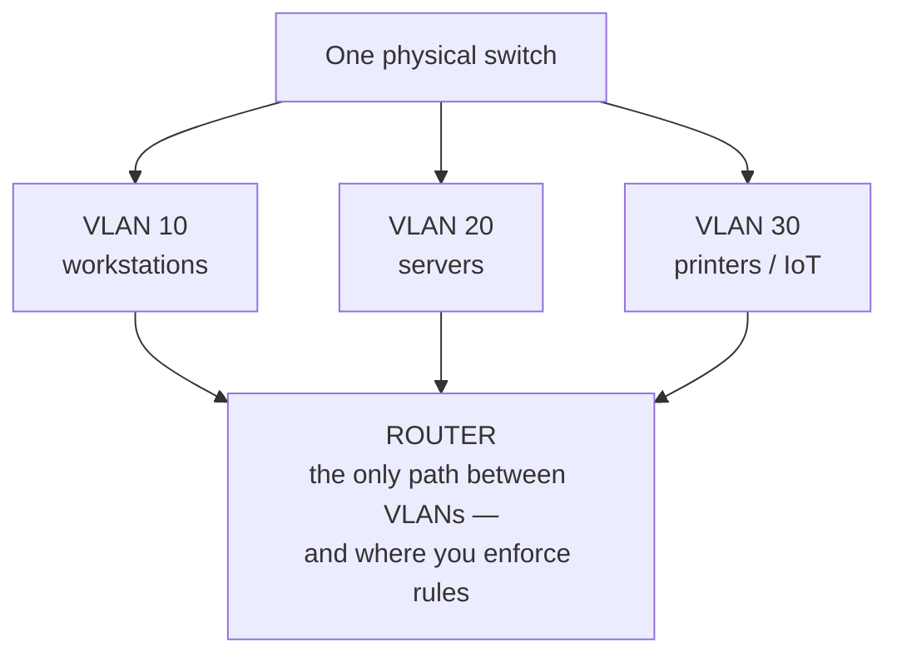
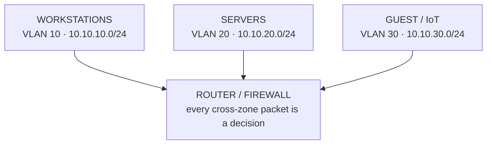

# Segmentation

The first instinct when a network grows is to keep everything on one flat network — one address range, every device able to reach every other device, the way home works. It feels simpler. It is, in fact, the source of nearly every scaling pain you're about to meet: the broadcast chatter that grows with every device, the printer in accounting that's reachable from the guest Wi-Fi, the one compromised laptop that can now knock politely on the door of *every* server in the building.

Segmentation is the design move that fixes all three at once. The mental model is small and it carries the whole phase: **a network you can't divide is a network you can't contain.** When you split one big network into deliberate zones, a problem in one zone — a flood of traffic, a misconfigured host, an attacker who got a foothold — stays in that zone instead of becoming everyone's problem. Everything in this phase is a tool for drawing those dividing lines.

## Why a flat network stops scaling

**What's actually happening.** On a single flat network, every device shares one **broadcast domain** — a region where a message addressed "to everyone here" reaches every device. Broadcasts are how devices find each other (ARP asking "who has this address?", DHCP discovery, and more). That's fine with twenty devices. With two thousand, every device is constantly interrupted to process broadcasts meant for someone else, and every device is, by default, *reachable* by every other.

📝 **Terminology.** *Broadcast domain* = the set of devices that receive each other's broadcast traffic. *Blast radius* = how far the damage spreads when one thing goes wrong — the number of systems a single failure or breach can reach. The whole point of segmentation is to shrink the blast radius.

**Why this bites.** Two separate costs grow on a flat network, and they grow together:

- **Contention** — shared broadcast traffic and shared bandwidth mean everyone slows everyone else down. This is a performance problem.
- **Exposure** — flat means reachable, and reachable means attackable. One foothold sees the entire estate. This is a security problem, and it's the one that ends careers.

You don't solve these by buying faster hardware. You solve them by *dividing the network*, which brings us to the two tools that do the dividing.

## Subnets — dividing by address

**What it actually is.** A **subnet** is a slice of address space that the network treats as one group. You take a large range of IP addresses and carve it into smaller ranges, and each smaller range becomes its own logical network. Traffic *within* a subnet flows directly; traffic *between* subnets has to go through a router, which is exactly the choke point where you get to make decisions ("can sales reach the finance subnet? no").

📝 **Terminology.** *Subnet* = a logically subdivided range of an IP network. *Router* = the device that forwards traffic *between* networks (subnets), as opposed to a switch, which forwards *within* one.

**A gentle take on CIDR.** You'll see subnets written like `10.20.0.0/24`. That trailing `/24` is **CIDR notation**, and it answers one question: *how many of the leading bits are fixed as the network identity, leaving the rest free for hosts?* An address is 32 bits. The number after the slash is how many of those bits name the network; the remainder name individual devices.

```text
   10.20.0.0/24   →  first 24 bits = network, last 8 bits = hosts
                     ┌──────────────────────────┬──────────┐
                     │   network: 10.20.0        │ host: .x │
                     └──────────────────────────┴──────────┘
                     usable host addresses: .1 through .254   (256 minus network + broadcast)

   smaller /26     →  26 network bits, 6 host bits  →  62 usable hosts per subnet
   larger  /16     →  16 network bits, 16 host bits →  ~65,000 hosts (usually too big to want)
```

The rule of thumb: **a bigger number after the slash means a smaller subnet** (more bits spent naming the network leaves fewer for hosts). A `/24` gives you 254 usable addresses — a comfortable size for one department. The two reserved addresses are the network address itself (all host bits `0`) and the broadcast address (all host bits `1`).

**A real example.** You can ask a Linux host what subnet it considers itself part of:

```console
$ ip -4 addr show dev eth0
2: eth0: <BROADCAST,MULTICAST,UP,LOWER_UP> mtu 1500 ...
    inet 10.20.0.37/24 brd 10.20.0.255 scope global eth0
```

*What just happened:* This host's address is `10.20.0.37`, and the `/24` tells it that everything from `10.20.0.1` to `10.20.0.254` is "local" — it can talk to those neighbors directly. Anything *outside* that range (say `10.30.0.5`) it cannot reach on its own; it has to hand the packet to its router. The `brd 10.20.0.255` is the broadcast address for this subnet — the one "to everyone here" address. That single `/24` is the dividing line doing its job.

**Address planning — the part people skip and regret.** Before you assign a single subnet, decide a scheme for the *whole* organization, because subnets are painful to renumber once devices, firewall rules, and DNS entries depend on them. A scheme that reads at a glance pays off for years:

```text
   10.<site>.<purpose>.0/24

   10.10.10.0/24   site 10 (HQ),  purpose 10 = user workstations
   10.10.20.0/24   site 10 (HQ),  purpose 20 = servers
   10.10.30.0/24   site 10 (HQ),  purpose 30 = printers / IoT
   10.20.10.0/24   site 20 (branch), purpose 10 = user workstations
```

Now an address *tells you what it is*. `10.20.30.x`? Branch site, printers. That legibility is worth more than squeezing addresses tightly — leave room to grow. The private ranges you have to play with are generous (`10.0.0.0/8`, `172.16.0.0/12`, `192.168.0.0/16`), so plan for the company you'll be, not the one you are.

**Why this saves you later.** When finance must be unreachable from the guest network, you don't chase down individual devices — you write one rule at the router between two subnets. Subnets turn "control access between groups" from an impossible per-device chore into a handful of decisions at the boundaries.

## VLANs — dividing without rewiring

Subnets divide by *address*. But there's a physical problem subnets alone don't solve: in a real building, the accountant and the engineer often plug into the *same switch*, sometimes the same row of ports. You can't run separate cabling and separate switches for every group — it's ruinously expensive and rigid.

**What it actually is.** A **VLAN** (Virtual LAN) lets one physical switch behave as if it were several separate switches. You tag each port (or each device) as belonging to a VLAN, and the switch refuses to let traffic cross between VLANs on its own — even though the cables all run into the same box. Two machines on the same switch but different VLANs are, as far as the network is concerned, on entirely separate LANs.

📝 **Terminology.** *VLAN* = a logical LAN segment defined in switch configuration rather than by physical wiring. *Tag* = a small label (an 802.1Q tag) added to a frame identifying which VLAN it belongs to, so the label survives across switches.

**What it does in real life.** You map each VLAN to a subnet — VLAN 10 carries the `10.10.10.0/24` workstation subnet, VLAN 20 carries the `10.10.20.0/24` server subnet — and the two ride the same physical hardware without ever mixing. Traffic that *does* need to cross (a workstation reaching a server) is forced up to a router, where, again, you get to decide.



⚠️ **Gotcha.** A VLAN is a *configuration*, not a physical wall, and it's only as good as the config. A misconfigured trunk port, a port accidentally left in the wrong VLAN, or a switch with weak management access can let traffic leak between VLANs that you believed were isolated. Treat VLAN boundaries as real security boundaries only when the switch management plane itself is locked down — otherwise you've drawn a line that an attacker can step over by reconfiguring the switch.

**Why this saves you later.** When a new IoT device shows up — a smart TV in a conference room, a badge reader, a camera — you don't trust it on the network the laptops live on. You drop it on the IoT VLAN, where it can reach exactly what it needs and nothing else. The day one of those cheap devices turns out to have a backdoor, the blast radius is one VLAN, not the whole company.

## Bringing the two together

Subnets and VLANs are not competitors; they're the same dividing line drawn at two layers. The VLAN separates the *traffic* on the wire; the subnet separates the *addresses*; and you map one to the other so a "zone" means the same thing whether you're looking at a switch port or an IP address. The router between zones is where both lines converge, and it's where the next two phases hang their work — scaling decisions and security rules both live at these boundaries.



## Recap

1. A **flat network** doesn't scale: broadcast **contention** grows with every device, and flat means every host is **reachable** — and attackable — by every other.
2. **Segmentation** carves the network into zones so a failure or breach has a small **blast radius** instead of taking down everything.
3. **Subnets** divide by address; **CIDR** (`/24`, `/26`…) just says how many leading bits name the network, leaving the rest for hosts. A bigger slash number means a smaller subnet.
4. **Plan addresses for the whole org up front** with a legible scheme (`10.<site>.<purpose>.0/24`) — renumbering later is painful.
5. **VLANs** divide one physical switch into several logical LANs, so you separate groups without separate cabling. Map one VLAN to one subnet per zone.
6. A VLAN is only as strong as the switch's management security — treat it as a real boundary only when the switch itself is locked down.
7. The **router between zones** is where every cross-zone decision lives — and where scaling and security build next.

Next, keeping all those zones standing when traffic surges and hardware fails: **scaling and reliability**.

---

[← Guide overview](_guide.md) · [Phase 2: Scaling & Reliability →](02-scaling-and-reliability.md)
