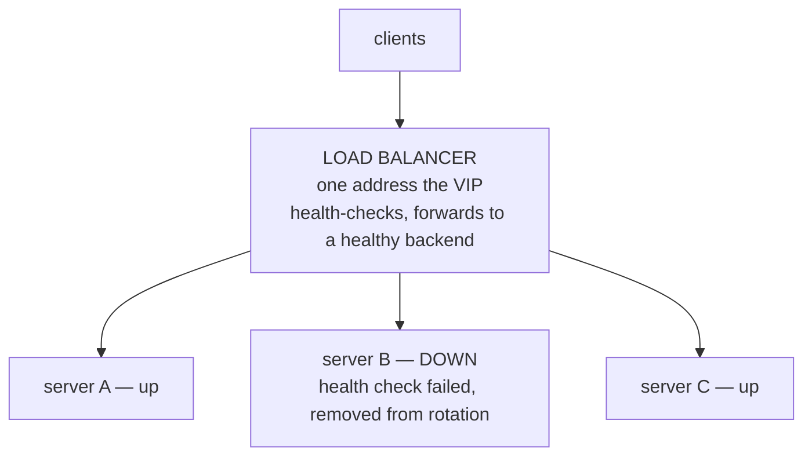
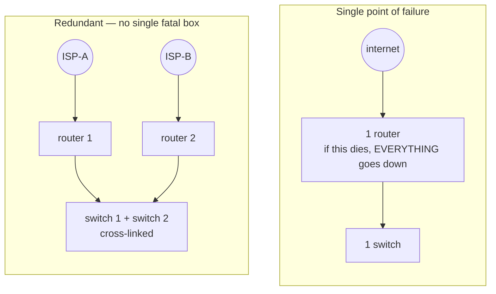

# Scaling & Reliability

You've divided the network into clean zones. Now comes the question that keeps people up at night: what happens when one of these zones gets *busy*, or when a piece of it *dies*? A home network answers both with a shrug — if the router reboots, you wait a minute; if the connection is slow, you live with it. An enterprise can't shrug. A surge of traffic shouldn't take a service down, and a single failed switch, cable, or power supply shouldn't take the *business* down.

The mental model for this phase: **anything you depend on, you must be able to lose.** Reliability isn't a feature you bolt on at the end — it's a posture where you assume each component will eventually fail and you've already arranged for the network to keep working when it does. The two halves of that posture are *spreading work across many things* (so no one thing is overwhelmed) and *having more than one of everything that matters* (so no one thing is fatal). Underneath both sit the quiet services that make the whole network self-operating.

## Load balancers — spreading the work

**What it actually is.** A **load balancer** is a device or service that sits in front of a group of identical servers and distributes incoming requests across them. To the outside world there's one address to talk to; behind it, the balancer is quietly choosing which of several real servers handles each request.

**Why people get this wrong.** The common assumption is that load balancing is purely about *performance* — "we got too much traffic for one server, so we added a balancer to go faster." That's half of it. The other half, and often the more valuable half, is *availability*: because the balancer is constantly checking which backend servers are healthy, it can stop sending traffic to a server that has crashed or is being updated — and your users never notice. One server can be down for maintenance at 2pm on a Tuesday and nobody files a ticket.

📝 **Terminology.** *Backend* (or *upstream*) = one of the real servers behind the balancer that actually does the work. *Health check* = a periodic probe the balancer sends to each backend to decide whether it's fit to receive traffic. *Virtual IP (VIP)* = the single front-facing address the balancer answers on.

**What it does in real life.** Requests arrive at the balancer's one address; it forwards each to a healthy backend, often round-robin (take turns) or by which backend is least busy. Add a server to handle more load, and you've scaled *horizontally* — out, across more machines — rather than *vertically* (buying one ever-bigger machine, which has a ceiling and is itself a single point of failure).



**A real example.** When a load balancer marks a backend unhealthy, you see it in its logs or status. Here's what a health-check transition looks like in an NGINX-style upstream log:

```console
$ tail -f /var/log/lb/health.log
2026-06-19T14:02:11Z upstream backend-b (10.10.20.12:443) check ok
2026-06-19T14:02:16Z upstream backend-b (10.10.20.12:443) check FAILED (timeout)
2026-06-19T14:02:21Z upstream backend-b (10.10.20.12:443) check FAILED (timeout)
2026-06-19T14:02:21Z upstream backend-b marked DOWN, removed from rotation
2026-06-19T14:02:21Z traffic now distributed across: backend-a, backend-c
```

*What just happened:* The balancer was probing `backend-b` every few seconds. When two checks in a row timed out, it concluded the server was unfit and **removed it from rotation** — new requests now go only to the two healthy backends. No human did anything; no client saw an error. When `backend-b` starts passing checks again, the balancer adds it back. This automatic in-and-out is the reliability payoff, not the speed.

**Why this saves you later.** Deployments stop being terrifying. You take backends out of rotation one at a time, update them, and put them back — a rolling update with zero downtime. The thing that used to mean a maintenance window at midnight becomes a routine afternoon task.

## Redundancy — more than one of everything that matters

A load balancer spreads work across many servers — but pause on an uncomfortable question: what happens when the *load balancer itself* fails? If the answer is "everything behind it goes dark," then in fixing one single point of failure you've created a new one.

📝 **Terminology.** *Single point of failure (SPOF)* = any one component whose failure takes down the whole system. The work of reliability is, in large part, hunting down SPOFs and giving each a partner.

**What it actually is.** **Redundancy** means provisioning more than one of any component you can't afford to lose, arranged so that if one fails, another takes over. It applies up and down the stack: two internet connections, two routers, two switches, dual power supplies, multiple network paths between the same two points.

**What it does in real life.** Redundancy comes in two flavors, and the difference matters:

- **Active-passive (failover):** one component does the work; a standby sits ready and takes over when the primary fails. Simpler, but you're paying for hardware that's idle most of the time, and the failover moment can cause a brief blip.
- **Active-active:** both components carry traffic at once, so you get extra capacity *and* resilience — but it's harder to set up correctly.



⚠️ **Gotcha.** Redundancy you've never tested is a guess, not a guarantee. The classic disaster is discovering during a real outage that the "standby" was misconfigured, its software had drifted out of sync, or the failover never actually triggered. Two of everything only helps if you periodically *pull the plug on the primary on purpose* and confirm the secondary takes over cleanly. Untested failover has a way of failing exactly when you need it.

**Why this saves you later.** A backhoe cuts your primary fiber line — a genuinely common cause of outages — and traffic quietly shifts to the second ISP. A switch's power supply dies and its partner keeps the zone alive. The failures still happen; they just stop being *events*. That's the whole goal: turn outages into non-events.

## The infrastructure services a real network runs

Segmentation and redundancy shape the network; two background services make it *usable* without a human assigning everything by hand. They're easy to overlook precisely because, when healthy, you never think about them — and impossible to overlook the day they break, because *everything* seems to break at once.

### DHCP — addresses without a clipboard

**What it actually is.** **DHCP** (Dynamic Host Configuration Protocol) is the service that hands a device its network settings automatically the moment it connects — its IP address, its subnet mask, its default gateway (the router), and which DNS servers to use. Without it, a human would assign every one of those by hand on every device.

**What it does in real life.** A laptop joins the network and shouts a broadcast — "I need an address." The DHCP server answers with an address *from the right subnet's pool*, leased for a set time. This is where the address planning from Phase 1 pays off: you configure one DHCP scope per VLAN/subnet, and devices automatically land in the correct zone.

```console
$ journalctl -u dhcpd --no-pager | tail -n 4
dhcpd[812]: DHCPDISCOVER from 3c:22:fb:1a:9e:40 via eth0.10
dhcpd[812]: DHCPOFFER on 10.10.10.52 to 3c:22:fb:1a:9e:40 via eth0.10
dhcpd[812]: DHCPREQUEST for 10.10.10.52 from 3c:22:fb:1a:9e:40 via eth0.10
dhcpd[812]: DHCPACK on 10.10.10.52 to 3c:22:fb:1a:9e:40 via eth0.10
```

*What just happened:* You're watching the four-step DHCP handshake — DISCOVER, OFFER, REQUEST, ACK — that people remember as **DORA**. A new device (identified by its hardware MAC address) arrived on VLAN 10 (`eth0.10`), the server **offered** it `10.10.10.52` from the workstation pool, the device asked to keep it, and the server confirmed. The device now has a correct, zone-appropriate address and never bothered a human. ⚠️ Because that first DISCOVER is a *broadcast*, and broadcasts don't cross subnets, each segmented zone either needs its own reachable DHCP service or a small relay (a "DHCP relay" / "ip helper") configured on the router to forward those requests — a detail that trips up people the first time they segment a previously flat network.

### Internal DNS — names for the inside

**What it actually is.** You already know DNS as the internet's phone book, turning `example.com` into an address. **Internal DNS** is that same machinery pointed *inward*: a DNS service that resolves names for your private systems — `fileserver.corp.internal`, `printer-3rdfloor.corp.internal` — names the public internet neither knows nor should.

**Why this matters.** Without it, people and scripts hard-code IP addresses, and the day you renumber a server (or fail over to its redundant partner) everything that referenced the raw address breaks. With internal DNS, services refer to each other by *name*; you change the address in one place and every reference follows. It's the same indirection that makes the public internet workable, applied to your own estate — and it pairs naturally with redundancy, because a name can point at a load balancer's VIP rather than any one fragile server.

⚠️ **Gotcha.** DHCP and DNS are exactly the kind of service that must not be a single point of failure — run *two* of each. When DNS is down, machines can't find each other even though the network is technically fine, and the symptom ("everything is broken") is wildly out of proportion to the cause ("one small service stopped"). Apply this phase's own redundancy lesson to the services that make the network work.

## Recap

1. The posture: **assume every component fails eventually**, and arrange for the network to keep working when it does.
2. **Load balancers** spread requests across many backends — that's partly speed (scale *horizontally*, out across machines) and largely **availability**, because health checks pull dead backends from rotation automatically.
3. **Redundancy** gives every component you can't lose a partner, killing **single points of failure** — active-passive (standby) or active-active (both live).
4. **Untested failover is a guess** — deliberately fail the primary and confirm the secondary takes over.
5. **DHCP** hands devices their settings automatically (the **DORA** handshake), landing each in the correct subnet — but segmented zones need a DHCP service or relay per zone, because the request is a broadcast.
6. **Internal DNS** gives private systems names, so addresses can change underneath without breaking every reference.
7. Run **two of every infrastructure service** — DHCP and DNS failing looks like the whole network failing.

Next, the edge: how the network meets the outside world without letting the outside in — **security and the edge**.

---

[← Guide overview](_guide.md) · [Phase 3: Security & the Edge →](03-security-and-the-edge.md)
