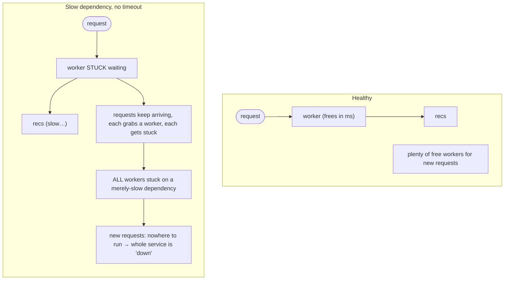

# Everything Fails

There's a moment, the first time you operate a real distributed system, when you realize the rules you
learned writing single-process programs don't hold anymore. On your laptop, when you call a function, it
returns. Maybe it throws, but it *returns* — instantly, reliably, every time. So you carry that instinct
into a world where "calling a function" now means sending bytes across a network to a different machine
that might be overloaded, mid-deploy, garbage-collecting, or gone entirely — and the instinct quietly
betrays you.

The mindset this phase installs is uncomfortable at first and freeing once it lands: **assume every
remote call can fail or hang, and design as if it will.** Not out of pessimism — out of accuracy.
Failure isn't the edge case in a distributed system. It's the baseline. Once you build *expecting* it,
the chaos stops being scary and starts being something you planned for.

## What "distributed" really changes

**What it actually is.** A *distributed system* is any system whose parts run on different machines and
talk over a network: your app calling a database on another host, a payment API, a cache, a queue,
another team's service. The instant a call leaves your process and crosses the network, you've traded a
guarantee for a gamble.

📝 **Terminology.** A *dependency* is anything your code calls and waits on to do its job — a database,
an internal service, a third-party API. When people say "a dependency failed," they mean one of those
calls didn't come back the way you needed.

**Why people get this wrong.** The wrong picture is that a network call is like a local call, only a bit
slower. It isn't. A local call has two outcomes: it returns, or it throws. A network call has *three*:
it returns, it fails, or — the one that gets everybody — **it hangs**, neither succeeding nor failing,
just leaving you waiting. That third outcome is where most outages are born, and we'll come back to it
hard in [Phase 2](02-the-core-patterns.md).

## The fallacies of distributed computing

There's a famous list, originally from engineers at Sun Microsystems, called the **fallacies of
distributed computing** — the false assumptions almost everyone makes when they first build systems that
span machines. You don't need to memorize all of them, but it helps to know the shape of the lies your
intuition tells you (source: the canonical list is widely documented, e.g.
<https://en.wikipedia.org/wiki/Fallacies_of_distributed_computing>):

```text
   The comforting lie            The reality you design for
   ─────────────────────         ─────────────────────────────────────────
   "The network is reliable"  →  packets drop, connections reset, links flap
   "Latency is zero"          →  every call costs real time; it adds up
   "Bandwidth is infinite"    →  big payloads clog; throughput has a ceiling
   "The network is secure"    →  assume it isn't; things in transit are exposed
   "Topology doesn't change"  →  hosts come and go; IPs move; nodes restart
   "There's one administrator" →  many owners, many deploys, no single hand
   "Transport cost is zero"   →  serializing/moving data isn't free
   "The network is homogeneous"→ mixed hardware, versions, and conditions
```

**Why this matters.** Every one of these is an assumption that's *fine* on your laptop and *false* in
production. Each guide phase after this one is, in a sense, a direct answer to one of these fallacies.
Timeouts answer "latency is zero." Retries answer "the network is reliable." Circuit breakers and
bulkheads answer "topology doesn't change" and "one slow part shouldn't be everyone's problem." The
fallacies are the disease; the patterns are the treatment.

💡 **Key point.** You will never make the network reliable. The whole game is building systems that stay
*useful* on top of an unreliable network — not eliminating failure, but containing it.

## The slow dependency that takes down everything

Now the heart of it — the failure mode that surprises people most, because nothing actually *crashed*.

Picture a request to your web service. To answer it, your service calls a downstream dependency — say, a
recommendations service. Normally that call returns in a few milliseconds. Each incoming request ties up
one worker (a thread, a connection, a slot — pick your stack's word) while it waits for the response,
then frees it.

Now the recommendations service gets *slow* — not down, just slow, taking several seconds to respond.
Here's what happens, step by step:



*What just happened:* Each slow call holds a worker hostage for seconds instead of milliseconds. Because
requests keep arriving, they keep grabbing workers, and those workers keep getting stuck. Your pool of
workers is finite, so it fills up. Once every worker is parked waiting on the slow dependency, your
service has no capacity left to serve *anything* — including requests that have nothing to do with
recommendations. From the outside, your service is down. From the inside, nothing crashed; everyone is
just *waiting*.

📝 **Terminology.** This is a **cascading failure** (also called *resource exhaustion* when it's a pool
that fills up): a failure in one component spreads to others because they share a finite resource — here,
your worker pool. One slow part starved everything else.

⚠️ **Gotcha — slow is more dangerous than down.** A dependency that's cleanly *down* often fails fast:
the connection is refused, you get an error in milliseconds, and you can react. A dependency that's
*slow* fails in the worst possible way — it holds your resources hostage. This is why "is it up?" is the
wrong question. The question is "is it *answering in time*?" — and that question only has meaning if
you've set a deadline, which is exactly the next phase.

🪖 **War story.** A classic version of this: a minor, non-critical feature (say, fetching a user's
profile avatar from a third party) shares the same connection pool as everything else. The avatar
provider has a bad day and starts hanging. Within minutes, the *checkout* page — which doesn't show
avatars at all — stops loading, because every connection is tied up waiting on avatars. A feature nobody
would miss took down the feature that makes the money. The fix isn't "make avatars more reliable." It's
isolation, and we'll get there in [Phase 3](03-failing-soft.md).

## Why this mindset saves you later

Everything in the next two phases follows from one decision you make here: **stop treating failure as
exceptional.** Once you accept that any remote call can hang, fail, or lie, you start asking the right
questions about every dependency you add:

- How long am I willing to wait for this? (timeout)
- If it fails transiently, is it safe to try again — and how? (retries)
- If it's clearly broken, how do I stop making it worse? (circuit breaker)
- If it's gone, what can I still give the user? (graceful degradation)
- How do I keep this one failure from becoming everyone's failure? (bulkheads)

You don't bolt resilience on at the end. You design for it from the first dependency, because the slow
Tuesday afternoon is coming whether you planned for it or not. The only choice is whether it's a shrug
or a 2am page.

## Recap

1. A **distributed system** spans machines and talks over a network; the moment a call leaves your
   process, its reliability becomes a gamble, not a guarantee.
2. A network call has **three** outcomes, not two: succeed, fail, or **hang** — and the hang is where
   most outages start.
3. The **fallacies of distributed computing** are the false assumptions (network is reliable, latency
   is zero, …) your single-machine instincts whisper; the resilience patterns are the antidotes.
4. A single **slow** dependency can exhaust a shared resource (your worker/connection pool) and take
   down your *whole* service through **cascading failure** — even parts unrelated to the slow one.
5. **Slow is more dangerous than down.** Design assuming failure, and ask "is it answering in time?",
   not just "is it up?".

---

[← Guide overview](_guide.md) · [Phase 2: The Core Patterns →](02-the-core-patterns.md)
