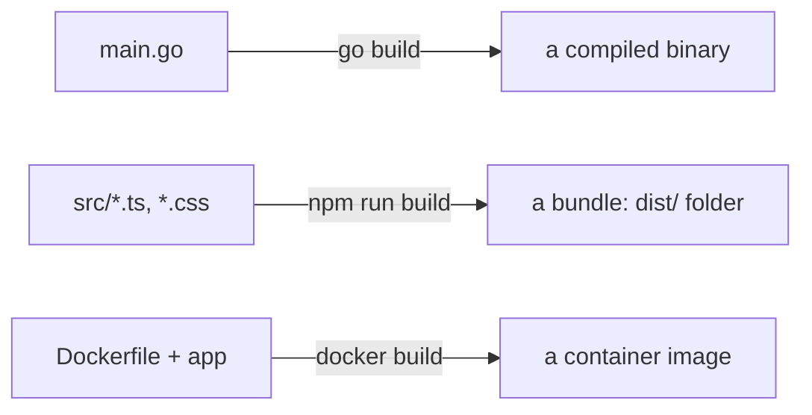

# What "Building" Actually Produces

Here's the thing nobody says out loud: the code you write is *not* the thing that runs. The files in your editor are written for humans - for you, your teammates, the person who reads them next year. The computer that actually serves your app at 3am wants something different: a packaged, ready-to-run thing. **Building is the step that converts one into the other.**

Once you hold that idea - *source goes in, a runnable thing comes out* - the word "build" stops being intimidating. Let's look at what comes out, and why the *way* it comes out matters as much as the result.

## A build is a recipe, and the artifact is the meal

**What it actually is.** A build is a recipe: a fixed series of steps that takes your source code (the ingredients) and produces one packaged result (the meal). That result has a name - an **artifact**.

📝 **Terminology.** An *artifact* is the output of a build: a single, concrete file or package that you can run or ship. "Source code" is what you write; the "artifact" is what you deploy. They are not the same thing, and keeping them straight is most of this guide.

**What it does in real life.** The exact recipe depends on your language and platform, but it almost always does some mix of these jobs:

- **Compiling** - translating source code into the lower-level instructions a machine actually executes. (Languages like Go, Rust, Java, and C# do this.)
- **Bundling** - gathering many source files plus their dependencies into one (or a few) optimized files. (This is what a JavaScript/TypeScript front-end build does.)
- **Packaging** - wrapping the result, and sometimes the environment it needs to run in, into one shippable unit (like a container image).

The artifact you get depends on the job:



The point of the diagram: different stacks produce different *kinds* of artifact, but it's always the same move - source in, one runnable thing out.

## A real example: building a small program

Let's watch a build happen. Here's a compiled language (Go), because the before-and-after is so clear:

```console
$ ls
go.mod  main.go

$ go build -o hello

$ ls
go.mod  hello  main.go

$ ./hello
Hello, world!
```

*What just happened:* The first `ls` showed only source files - `main.go` is human-readable text you could open in any editor. `go build` ran the recipe: it read your source, compiled it, and wrote out a brand-new file called `hello`. That file is the artifact. The final `./hello` *ran the artifact directly* - notice you didn't run `main.go`, you ran the built thing. The source was the recipe; `hello` is the meal.

A front-end build looks different on the surface but is the same idea:

```console
$ npm run build

> build
> vite build

vite v5.0.0 building for production...
✓ 34 modules transformed.
dist/index.html                  0.46 kB
dist/assets/index-a1b2c3d4.js   143.21 kB
✓ built in 1.84s
```

*What just happened:* The build read your TypeScript, CSS, and component files, transformed and combined them, and wrote the result into a `dist/` folder. That `dist/` folder is the artifact - a set of plain files a web server can hand to browsers. Your original source files are still there, untouched; the build *produced* something new alongside them. (The exact file names and sizes you see will be your own - never trust a number you didn't run.)

## Why a clean, repeatable build matters

**What it actually is.** A build is *repeatable* (people also say **reproducible**) when running the same recipe on the same source gives you the same artifact every time - on your machine, on a teammate's, on a server in the cloud. The recipe doesn't secretly depend on something that only exists on your laptop.

**Why people get this wrong.** The classic trap is the build that works because of something *unwritten* - a tool you installed by hand months ago, an environment variable only you have set, a file that lives on your Desktop. The build passes for you and fails for everyone else. This is the original "works on my machine," and it's a build problem: the recipe was incomplete.

⚠️ **The gotcha: hidden ingredients.** If your build needs something, that something must be declared *in the project* - in a dependency file, a lockfile, a `Dockerfile` - not assumed to already be present. A reproducible build is one a stranger could run on a fresh machine and get the identical result. The moment a build depends on a hidden ingredient, it stops being a recipe and becomes a magic trick that only works in your kitchen.

📝 **Terminology.** A *lockfile* (like `package-lock.json` or `Cargo.lock`) records the *exact* version of every dependency your build used. It's how you make "install the dependencies" mean the same thing today and six months from now, instead of silently pulling newer versions that behave differently.

**Why this saves you later.** Almost every "but it built fine yesterday" or "it builds for me, not in CI" panic traces back to a build that wasn't truly self-contained. When your build is a clean, declared recipe, the artifact becomes *trustworthy* - and that trust is exactly what the next phase relies on when we freeze an artifact and ship it everywhere.

## Recap

1. **The code you write isn't the thing that runs.** A *build* converts source into a runnable **artifact**.
2. **A build is a recipe; the artifact is the meal.** Depending on your stack, the artifact is a compiled binary, a bundle of files, or a container image.
3. **Different stacks, same move:** source in, one shippable thing out (`go build`, `npm run build`, `docker build`).
4. **A clean build is reproducible:** same recipe + same source = same artifact, anywhere - because every ingredient is declared, not assumed.

Now that you can produce a trustworthy artifact, the next question is: how do you *name* it, and how do you make sure the thing you tested is the exact thing you ship?

---

[← Guide overview](_guide.md) · [Phase 2: Versions & Artifacts →](02-versions-and-artifacts.md)
