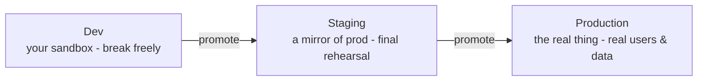
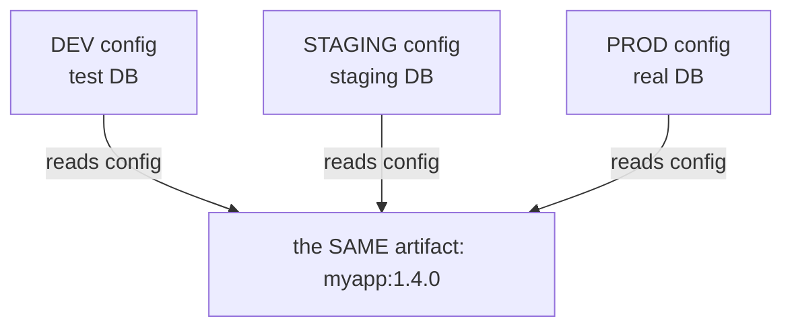

# Environments & Promotion

Your artifact is built, frozen, and sitting in a registry. So where does it go? Not straight to your users - that would be terrifying. Instead it makes a journey through a few separate copies of your running system, each one a slightly more serious dress rehearsal than the last. Understanding those copies, and the one rule for moving an artifact between them, is what turns "deploying" from a leap of faith into a routine.

This phase also answers the single most common confusion in all of releasing - the dreaded "but it worked in staging!" - and shows you why it happens and how to stop dreading it.

## Environments: rehearsal stages for your software

**What it actually is.** An **environment** is a complete, separate place where your software runs. The same artifact can run in several environments at once, each isolated from the others, so what you do in one can't touch the rest. The usual three:



- **Dev (development)** - your sandbox. Fake or sample data, fast feedback, safe to break. This is where you confirm the thing runs at all.
- **Staging** - a deliberate mirror of production, built to be as close to the real thing as possible. The final dress rehearsal: if it's wrong here, you want to find out *now*, not in front of users.
- **Production (prod)** - the real system. Real users, real data, real consequences. This is the performance the rehearsals were for.

📝 **Terminology.** People shorten these constantly: *dev*, *staging* (sometimes *stage*), *prod*. "It's in prod" means it's live for real users. "Push to staging" means deploy to the rehearsal environment first.

**Why this saves you later.** Environments exist so mistakes have somewhere cheap to happen. A bug caught in dev costs you a coffee; the same bug caught in prod costs you an outage and an apology. The whole point of the journey is to give problems every chance to surface before real people are affected.

## Promotion: moving the SAME artifact forward

**What it actually is.** **Promotion** is the act of taking an artifact that has proven itself in one environment and moving that *exact same artifact* to the next one. You promote `1.4.0` from staging to prod - meaning the identical, frozen `1.4.0` that passed staging is now what runs in production.

**Why people get this wrong.** The intuitive (and wrong) picture is: build for dev, then build again for staging, then build again for prod. It feels thorough. It is a trap - and it's exactly the trap Phase 2 warned about. Three separate builds are three potentially *different* artifacts. You'd be testing one thing in staging and shipping a *different* thing to prod, then wondering why prod behaves strangely.

**What promotion does in real life.** Because the artifact is immutable and lives in a registry (Phase 2), promotion is just pointing the next environment at the version that already passed:

```console
$ deploy --env staging --version 1.4.0
Pulling myapp:1.4.0 from registry...
Deployed myapp:1.4.0 to staging.

# ... 1.4.0 is verified in staging ...

$ deploy --env production --version 1.4.0
Pulling myapp:1.4.0 from registry...
Deployed myapp:1.4.0 to production.
```

*What just happened:* The exact same `myapp:1.4.0` artifact was pulled from the registry twice - once for staging, once for production. Nothing was rebuilt between the two deploys. (`deploy` here stands in for whatever your team uses; the names differ, the move is the same.) Production is now running the *byte-for-byte identical* artifact that you just watched pass in staging. That identity is the entire source of your confidence.

💡 **Key point.** Promotion means *moving an artifact*, not *rebuilding it*. "Build once (Phase 1), freeze it (Phase 2), promote that one frozen thing through environments (Phase 3)" is the spine of the whole release process. If you remember one sentence from this guide, remember that one.

## Config per environment: same code, different settings

**What it actually is.** If the artifact is identical in every environment, how does staging talk to the staging database while prod talks to the prod database? The answer: those differences don't live *inside* the artifact. They live in **configuration** that each environment supplies from the outside.

**What it does in real life.** The artifact is built to read its settings - database address, API keys, feature switches - from its surroundings rather than having them baked in. Each environment hands the same artifact a *different* set of values:



One artifact, three sets of settings. The code that runs is identical; only the values it's fed change from place to place. This is the companion idea to "build once": you can ship one artifact everywhere *because* the per-place differences have been pulled out into config. (The how-to of feeding config in safely - environment variables, secrets, and the traps around them - has its own guide: [Environment Variables & Config](/guides/env-vars-and-config).)

⚠️ **The big one: "works in staging, breaks in prod."** This is the most common gotcha in releasing, and now you can decode it. If the *same artifact* passed in staging and then breaks in prod, the artifact is not the suspect - it's identical in both. The difference is almost always the **environment or its config**: a setting that's right in staging and wrong (or missing) in prod, a database prod can't reach, a key that wasn't set, a service that exists in one place but not the other. Knowing this tells you exactly where to look first - at what *differs* between the two environments - instead of staring at code that is provably the same in both. That's the payoff of "build once, deploy everywhere": when something breaks after promotion, you've already ruled out the artifact, so the search starts in the right place.

**Why this saves you later.** The first time prod breaks and staging didn't, you won't spiral. You'll think: *same artifact, so it's a difference between the environments* - and you'll go hunting in the config, which is where the answer lives.

## Recap

1. **Environments** (dev → staging → prod) are separate, isolated copies of your running system - rehearsal stages of increasing seriousness, so mistakes happen somewhere cheap.
2. **Promotion** moves the *same* frozen artifact forward through those environments. You never rebuild per environment.
3. **The spine:** build once, freeze it, promote that one artifact - the identity of the artifact across environments is what makes you confident.
4. **Config lives outside the artifact.** One artifact reads different settings in each environment, which is *why* you can ship the same build everywhere.
5. **"Works in staging, breaks in prod" = an environment or config difference**, not a code difference - because the code (the artifact) is provably identical.

You now understand the whole journey: source becomes a built artifact, the artifact gets a version and is frozen in a registry, and that one artifact is promoted through environments with config supplied per place. The natural next question is *who pushes these buttons, and how do we make it automatic and reliable* - which is exactly what [What CI/CD Does](/guides/what-cicd-does) picks up. You might also enjoy [What Happens When Code Runs](/guides/what-happens-when-code-runs) to see what the artifact does once it's finally live.

---

[← Phase 2: Versions & Artifacts](02-versions-and-artifacts.md) · [Guide overview](_guide.md)
