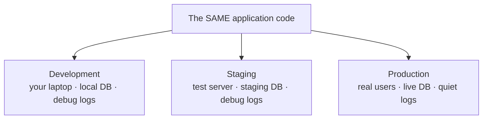

# Why Config Lives Outside Code

Here's a moment every developer hits: you've got code that works perfectly on your laptop. It talks to a
database on your machine, uses a test API key, prints lots of debug logging. Then it's time to put it on
a real server for real users — and *nothing about those settings is right anymore*. The database lives
somewhere else. The API key needs to be the real, paid one. You definitely don't want debug logging
spraying everywhere in front of customers.

The naive fix is to open the code and change those values before you deploy. That way lies pain. The real
answer is older and calmer: **keep the things that change per environment *out* of the code entirely.**
Let's build the mental model that makes the rest of this guide click.

## What an "environment" actually is

**What it actually is.** An **environment** is one place your app runs, with its own surroundings. The
same exact code can run in several of them at once:



📝 **Terminology.** People throw these names around constantly:
- **Development** (or "dev", "local") — your own machine, where you write and test code.
- **Staging** — a rehearsal server that mimics production, where you check things before real users see
  them. (Some teams also have "QA" or "test" environments; same idea.)
- **Production** (or "prod") — the real deal. Real users, real data, real consequences.

**Why people get this wrong.** The tempting mental picture is "different environment means different
code." It doesn't. Shipping different code to each place means every environment is testing something
slightly different from what you'll actually run — so a bug can hide in production that never appeared in
staging. The whole point of staging is to be a faithful rehearsal, and that only works if it runs the
*same code* prod will.

**What it does in real life.** You build your code once and deploy that identical build everywhere. What
differs between the boxes above isn't the code — it's a small set of values: which database to connect
to, which API key to use, how loudly to log. Those values are the **configuration**.

## What configuration actually is

**What it actually is.** **Configuration** is the set of values your app needs to know that depend on
*where it's running*, not on *what it does*. The code says "connect to the database." The config says
"...and here's *which* database." The code is the recipe; the config is which kitchen you're cooking in.

A quick test for whether something belongs in config: **would this value be different on someone else's
machine, or on the production server?** If yes, it's config. If it's the same everywhere forever, it's
probably just part of the code.

```text
   CODE (same everywhere)            CONFIG (varies per environment)
   ─────────────────────            ───────────────────────────────
   how to connect to a DB     +     DATABASE_URL  = which DB
   how to call the payment API +    STRIPE_KEY    = which key (test vs live)
   how to write a log line    +     LOG_LEVEL     = debug vs warn
```

## Why we don't just hardcode it

**Why people get this wrong.** It feels easier to write the value straight into the code:

```text
   db = connect("postgres://localhost:5432/myapp_dev")   ← hardcoded
```

That works on your laptop and quietly creates four problems:

- **You can't deploy without editing code.** Every environment needs a different value, so you'd be
  hand-editing the source for each one — exactly the error-prone ritual we're trying to kill.
- **Secrets end up in your repository.** If that line had your real production database password or API
  key, it's now in Git history forever, visible to everyone with access to the repo. That's how leaks
  happen. (The proper handling of secrets is its own topic — see
  [Secrets Management](/guides/secrets-management).)
- **You can't change a setting without a redeploy.** Want to turn on debug logging in production for ten
  minutes to chase a bug? With a hardcoded value you'd have to change code, rebuild, and redeploy. With
  config, you change one value and restart.
- **Collaboration breaks.** Your teammate's database password isn't yours. If it's baked into the code,
  every `git pull` overwrites their settings with yours.

**Why this saves you later.** Pulling these values out into config means one codebase runs unchanged in
every environment, secrets stay out of your source history, and you can re-point or re-tune a running
system without touching code. This idea is old and battle-tested — it's the "config" part of the
widely-cited **Twelve-Factor App** guidelines, which recommend strict separation of config from code
(source: <https://12factor.net/config>).

## So where *does* config live?

If not in the code, then where? Two places, and the rest of this guide is about each:

1. **Environment variables** — values handed to your program by the operating system when it starts.
   Great for single values and secrets, and the standard way production systems inject config. That's
   [Phase 2](02-env-vars-and-dotenv.md).
2. **Config files** — structured files (YAML, JSON, TOML) that live alongside your project, good for
   larger or nested settings. That's [Phase 3](03-config-files-yaml.md).

Most real projects use *both*, with a clear order of who-wins-when. We'll get to that precedence rule at
the end.

## Recap

1. An **environment** is one place your app runs — dev (your laptop), staging (rehearsal), production
   (real users) — all running the **same code**.
2. **Configuration** is the values that differ per environment: database URL, API keys, log level.
3. **Hardcoding** those values traps you: no clean deploys, secrets leak into Git, no live changes, and
   teammates clobber each other.
4. Keeping config **outside the code** lets one codebase run everywhere — the long-standing Twelve-Factor
   recommendation.
5. Config lives in **environment variables** and **config files**, often both, with a defined precedence.

Next, the workhorse of real-world config: the environment variable.

---

[← Guide overview](_guide.md) · [Phase 2: Environment Variables & .env Files →](02-env-vars-and-dotenv.md)
