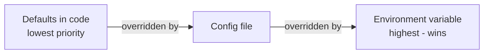

# Config Files: YAML & Friends

Environment variables are perfect for a handful of flat values. But open a real project and you'll find a
`config.yaml` or `appsettings.json` describing whole *structures* - a database section with host, port,
pool size, a list of allowed origins, nested feature flags. Cramming that into `DATABASE_HOST`,
`DATABASE_PORT`, `DATABASE_POOL_SIZE` flat variables gets ugly fast. This is where structured config files
earn their place - read one without fear, then settle *which setting wins* when the same thing is defined
twice.

## Why a config file instead of more env vars

**What it actually is.** A **config file** is a text file that describes settings in a structured,
nested way - sections within sections, lists, grouped values. Where an environment variable is one flat
name and value, a config file can express *shape*: "the database section contains a host and a port."

**What it does in real life.** Keep the structural, non-secret settings in a file committed to the repo
(so the team shares them), and keep per-machine values and secrets in environment variables. The file is
the skeleton; env vars fill in the parts that differ or must stay private.

The three formats you'll meet most:

| Format | Looks like | Strengths | Watch out for |
|---|---|---|---|
| **YAML** | indentation-based | very readable, common for app & infra config | indentation is significant; tabs forbidden |
| **JSON** | braces & quotes | universal, every language reads it | no comments; trailing commas are errors |
| **TOML** | `key = value` + `[sections]` | clear, hard to mess up | less common for app config |

None is "best" - teams pick by convention and tooling. YAML is the one most likely to trip you up, so
we'll spend the most time there.

## Reading YAML

**What it actually is.** **YAML** ("YAML Ain't Markup Language") stores nested data using **indentation**
to show what belongs inside what - the way an outline uses indentation. A `key: value` pair is one
setting; indenting pairs under a key groups them into a section.

📝 **Terminology.** Here are the pieces, named:
- A **key-value pair**: `key: value` (note the space after the colon - it's required).
- A **mapping** (section): a key whose value is a group of indented pairs underneath it.
- A **list**: items each starting with `- ` (dash, space).

Here's an annotated example - read it top to bottom:

```text
# config.yaml - a '#' starts a comment, ignored by the parser

app_name: My Service          # a top-level key-value pair (a string)
port: 8080                    # a number - no quotes needed for plain numbers
debug: false                  # a boolean: true or false

database:                     # a key with NOTHING after the colon = a section...
  host: localhost             # ...these indented lines belong INSIDE 'database'
  port: 5432                  # 'database.port' - distinct from the top-level 'port'
  pool_size: 10

allowed_origins:              # a key whose value is a LIST
  - https://example.com       # each '- ' is one list item
  - https://app.example.com
```

*What this describes:* a service named "My Service" on port 8080 with debug off; a `database` section
holding its own host, port, and pool size; and a two-item list of allowed origins. The indentation is
doing all the structural work - `host` is "inside" `database` purely because it's indented under it.

Loading it in code gives you ordinary nested data. In Python:

```console
$ pip install pyyaml
$ python3 -c "import yaml; c = yaml.safe_load(open('config.yaml')); print(c['database']['host'])"
localhost
```
*What just happened:* `yaml.safe_load` read the file into a nested dictionary, so
`c['database']['host']` walks into the `database` section and pulls out `host`. The structure in the file
is exactly the structure you get in code. (Use `safe_load`, not plain `load` - that can execute arbitrary
tags from an untrusted file.)

## ⚠️ The YAML indentation gotcha

This is the one that bites *everybody*, usually at the worst possible time. In YAML, **indentation is
meaning**, and there are two ways to get it wrong.

**First: tabs are forbidden.** YAML requires **spaces** for indentation - a literal Tab character is not
allowed and the parser will reject the file. The cruel part is that a tab and a few spaces can look
*identical* on screen. You'll swear the indentation is right because your eyes can't see the difference.

```console
$ python3 -c "import yaml; yaml.safe_load(open('config.yaml'))"
yaml.scanner.ScannerError: while scanning for the next token
found character '\t' that cannot start any token
  in "config.yaml", line 5, column 1
```
*What just happened:* The parser hit a Tab character (`\t`) where it expected spaces and stopped cold.
Fix: set your editor to insert spaces on Tab (most have an "indent using spaces" setting), then replace
the offending tab - the error message even tells you the line.

**Second: inconsistent depth changes the meaning.** Because indentation defines what's nested inside what,
a single misaligned space silently restructures your config:

```text
database:
  host: localhost
   port: 5432          # ← one extra space: this line is now MORE indented than 'host'
```

Depending on the parser this either errors or - worse - produces a structure you didn't intend, and your
app reads the wrong shape with no crash. The defense: **pick one indent width (two spaces is common) and
keep every level perfectly consistent.**

💡 **Key point.** If a YAML file mysteriously won't load or your settings come out wrong, suspect the
indentation *first*. Nine times out of ten it's a stray tab or a misaligned line, not a bug in your code.

## Config precedence - which setting wins

Now the question that confuses people once they're using both files *and* environment variables: if the
same setting is defined in two places, **which one does the app actually use?**

**What it actually is.** **Precedence** is the order, decided by the application, in which config sources
override each other. The widely-used convention, from lowest priority to highest, is:



Read it as a stack: the code ships with sensible **defaults**; a **config file** overrides those for the
project; and an **environment variable** overrides even the file. The most specific, most external source
wins - which is exactly what you want, because the environment is where per-deployment and secret values
come from.

Here's the rule in action. Say your code defaults `port` to `3000`, your `config.yaml` sets it to `8080`,
and you launch with an environment variable:

```console
$ echo "port: 8080" > config.yaml
$ PORT=9000 python3 -c "
import os, yaml
cfg = {'port': 3000}                       # 1. default in code
cfg.update(yaml.safe_load(open('config.yaml')))   # 2. file overrides default
if 'PORT' in os.environ:                    # 3. env var overrides file
    cfg['port'] = int(os.environ['PORT'])
print(cfg['port'])
"
9000
```
*What just happened:* All three layers set `port`, and you watched the precedence play out: the default
`3000` was overwritten by the file's `8080`, which was overwritten by the environment's `9000`. The
environment variable won because it sits highest in the stack. Run it again *without* `PORT=9000` and
you'd get `8080` (the file); delete the file too and you'd get `3000` (the default).

**Why people get this wrong.** Without knowing the precedence, you'll change a value in the config file,
see no effect, and lose an hour - an environment variable was quietly overriding it the whole time. Most
config libraries follow defaults < file < env, but **not all** - check your framework's docs for its
exact order rather than assuming.

**Why this saves you later.** Understanding the stack means that when a setting "won't change," you know
immediately where to look: start from the highest-priority source (the environment) and work down. And it
explains the whole design - defaults keep the app runnable out of the box, the file holds shared project
settings, and the environment has the final say for whatever this particular deployment needs.

## Recap

1. **Config files** (YAML, JSON, TOML) hold structured, nested settings that flat environment variables
   express awkwardly; commit the non-secret ones, keep secrets in env vars.
2. **YAML** uses indentation to show nesting: `key: value` pairs, indented **mappings** for sections,
   `- ` for **list** items.
3. The **indentation gotcha**: spaces only (never tabs), and keep every level consistently aligned - a
   stray tab or misaligned line breaks the file or silently changes its meaning. Suspect indentation
   first.
4. **Precedence** is `defaults < config file < environment variable` - the most external source wins.
   When a setting won't change, check the highest-priority source first. Confirm the exact order in your
   framework's docs.

You now have the full picture: *why* config lives outside code, *how* environment variables and `.env`
files work, and *how* structured files and precedence fit together. From here, the natural next step is
handling production secrets properly - see [Secrets Management](/guides/secrets-management).

---

[← Phase 2: Environment Variables & .env Files](02-env-vars-and-dotenv.md) · [Guide overview](_guide.md)
