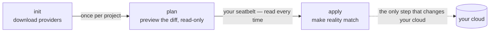
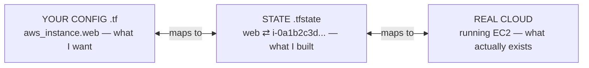

# How Terraform Works

You've got the mindset from [Phase 1](01-why-click-ops-doesnt-scale.md): you describe the desired state, the tool makes it real. Now let's open the hood. There are exactly three things to understand — the **files**, the **loop**, and the **state** — and the third one is where the genuine "must not get this wrong" lives. We'll build up to it.

## The files: HCL describing resources

**What it actually is.** Terraform reads files ending in `.tf`, written in **HCL** (HashiCorp Configuration Language). HCL isn't a programming language built around loops and logic — it's mostly a way to *declare blocks*, where each block says "I want a thing of this type, with these settings." You describe resources; you don't write a procedure.

📝 **Terminology.** A *provider* is the plugin that teaches Terraform how to talk to one specific platform — AWS, Google Cloud, Azure, Cloudflare, and hundreds more. A *resource* is one piece of infrastructure that provider can manage: a virtual machine, a network, a DNS record, a database. (For what these resources actually *are* under the hood, see [Cloud Platforms Explained](/guides/cloud-platforms-explained).)

Here's a small, real example: one server on AWS. Read it as a *description*, not a recipe.

```hcl
# Tell Terraform which provider we need and pin its major version,
# so a future provider release can't silently change behavior on us.
terraform {
  required_providers {
    aws = {
      source  = "hashicorp/aws"
      version = "~> 5.0"
    }
  }
}

# Configure that provider: which region these resources live in.
provider "aws" {
  region = "eu-west-1"
}

# The resource we actually want to exist.
# "aws_instance" is the TYPE; "web" is OUR name for it (used to
# reference it elsewhere in our config — it's not the cloud's name).
resource "aws_instance" "web" {
  ami           = "ami-0abcdef1234567890"  # the OS image to boot
  instance_type = "t3.micro"               # the size of the machine

  tags = {
    Name = "web-1"
  }
}
```

*What just happened:* You declared three things — *which* provider plugin you depend on (and what version range is acceptable), *how* to configure it (the region), and *what* should exist (one `t3.micro` instance booting that image, tagged `web-1`). Nowhere did you say "create" or "launch" — you stated the desired end state. The `aws_instance.web` label is your internal handle for this resource; use it to wire other resources to this one (a disk, a DNS record) and Terraform works out the dependency order itself.

💡 **Key point.** Every resource has a *type* (`aws_instance`, defined by the provider) and a *local name* (`web`, chosen by you). Together, `aws_instance.web` is how this resource is referred to throughout your config and state. The cloud's own ID (like `i-0a1b2c3d`) is something Terraform learns *after* it creates the resource, and stores in state — coming up.

## The core loop: init → plan → apply

You don't run a `.tf` file like a script — you run *Terraform commands* against your files, in a three-step loop you'll repeat for the rest of your life with this tool. Learn it as a rhythm.



### `terraform init` — set up the working directory

**What it does in real life.** `init` reads your config, sees you need the `aws` provider, and downloads that plugin into a local `.terraform/` folder — the "install dependencies" step. Run it once when you start a project, and again whenever you add or upgrade a provider.

```console
$ terraform init

Initializing the backend...
Initializing provider plugins...
- Finding hashicorp/aws versions matching "~> 5.0"...
- Installing hashicorp/aws v5.62.0...
- Installed hashicorp/aws v5.62.0 (signed by HashiCorp)

Terraform has created a lock file .terraform.lock.hcl to record the provider
selections it made above. Include this file in your version control repository
so that Terraform can guarantee to make the same selections by default when
you run "terraform init" in the future.

Terraform has been successfully initialized!
```

*What just happened:* Terraform fetched the AWS provider and wrote a lock file, `.terraform.lock.hcl`, pinning the *exact* provider version it chose (`5.62.0`) — the infrastructure equivalent of `package-lock.json`. Commit it, and every teammate and CI run uses the identical provider instead of quietly picking up a newer one that behaves differently.

### `terraform plan` — preview the diff

This is the most important command in the tool, and the habit that separates calm Terraform users from scared ones. **`plan` changes nothing** — it compares three things (your `.tf` files, the state file, and the real cloud) and prints exactly what it *would* do to make reality match your config.

```console
$ terraform plan

Terraform will perform the following actions:

  # aws_instance.web will be created
  + resource "aws_instance" "web" {
      + ami                          = "ami-0abcdef1234567890"
      + instance_type                = "t3.micro"
      + id                           = (known after apply)
      + private_ip                   = (known after apply)
      + tags                         = {
          + "Name" = "web-1"
        }
      # (several other computed attributes omitted)
    }

Plan: 1 to add, 0 to change, 0 to destroy.
```

*What just happened:* Terraform told you, in advance and with zero risk, its entire intent: create one resource, change none, destroy none. Read the **symbols** — they're the whole language of a plan:

```text
   +   will be CREATED
   -   will be DESTROYED          ← the one to always pause on
   ~   will be CHANGED in place
  -/+  will be DESTROYED and recreated  ← also pause: this is a replacement
```

The `(known after apply)` markers are honest unknowns: the cloud hasn't assigned an `id` or `private_ip` yet, so Terraform can't show them until the resource exists. The summary line — `1 to add, 0 to change, 0 to destroy` — is the headline you check before every apply.

⚠️ **Gotcha.** Never let your eyes slide past `to destroy` because you were focused on the thing you meant to add. A small config change can mean "this resource has to be replaced," and a replace is a destroy *plus* a create. If that resource is your database, the destroy half ruins your week. The plan shows you this *before* it happens — your only job is to actually read it. Phase 3 tackles the destroy danger head-on.

### `terraform apply` — make it real

**What it does in real life.** `apply` runs a plan and then *executes* it — the step that actually talks to the cloud and creates, changes, or destroys resources. By default it shows you the plan once more and waits for you to type `yes`. That pause isn't bureaucracy; it's your last look before reality changes.

```console
$ terraform apply

  # aws_instance.web will be created
  + resource "aws_instance" "web" {
      + ami           = "ami-0abcdef1234567890"
      + instance_type = "t3.micro"
      # ...
    }

Plan: 1 to add, 0 to change, 0 to destroy.

Do you want to perform these actions?
  Terraform will perform the actions described above.
  Only 'yes' will be accepted to approve.

  Enter a value: yes

aws_instance.web: Creating...
aws_instance.web: Still creating... [10s elapsed]
aws_instance.web: Creation complete after 22s [id=i-0a1b2c3d4e5f67890]

Apply complete! Resources: 1 added, 0 changed, 0 destroyed.
```

*What just happened:* You confirmed with `yes`, Terraform called AWS to create the instance, waited for it to come up, and reported success — including the real cloud ID, `i-0a1b2c3d4e5f67890`, that the cloud assigned. Your description is now reality. Critically, Terraform also just *recorded* what it built — the third and final piece.

## State: Terraform's memory of what it built

This is the part people skip and then get burned by. Slow down here.

**What it actually is.** When Terraform creates a resource, it writes down what it created — type, your local name, and the real cloud ID and attributes — into a file called **state** (by default, `terraform.tfstate`). State is Terraform's *memory*: the bridge between `aws_instance.web` in your config and `i-0a1b2c3d4e5f67890` in the real cloud.

**Why it has to exist.** Think about your second `plan`. Terraform needs to answer "does the thing my config describes already exist, and is it correct?" It can't re-derive that from the config alone — the config doesn't contain the cloud's IDs — so Terraform keeps the mapping in state. Without it, Terraform wouldn't know that the `web` in your file is the *same* server already running, and might try to create a second one.



**Why people get this wrong.** The instinct is to treat state as a disposable cache you can ignore or delete. It's not — state is the authoritative record linking your code to your real, possibly-expensive, possibly-production infrastructure. Lose or corrupt it and Terraform forgets it owns those resources: the next `plan` may want to create duplicates of everything, or lose the ability to manage what's already there.

### ⚠️ State is critical, and for teams it must be shared and locked

This is the single most important operational fact about Terraform, so it gets its own warning.

By default, state is a file on *your* laptop. That's fine for learning alone. The moment a second person is involved, a local state file is a disaster waiting to happen, for two reasons:

1. **Sharing.** If state lives on your laptop, your teammate's Terraform has no idea what you've built. They run `plan`, see none of your resources in their (empty) state, and Terraform proposes creating everything again — two people, two divergent pictures of one shared cloud.

2. **Locking.** Even with shared state, if you and a teammate run `apply` at the same time against the same state, you can interleave writes and **corrupt** it — leaving the file describing a world that never existed.

The fix is **remote state**: store the state file in a shared, locked location instead of on a laptop.

📝 **Terminology.** A *backend* is where Terraform keeps its state — the default is `local` (a file on disk). A *remote backend* puts state in a shared service (commonly an S3 bucket, Google Cloud Storage, Azure Blob Storage, or Terraform Cloud) so the whole team reads and writes the *same* state. *State locking* means that while one person runs `apply`, the backend holds a lock so nobody else can write at the same time — others get "state is locked" and wait, instead of corrupting it.

```hcl
# Store state in a shared S3 bucket instead of on a laptop.
# Modern AWS backends can lock using the bucket itself.
terraform {
  backend "s3" {
    bucket       = "acme-terraform-state"
    key          = "prod/web/terraform.tfstate"
    region       = "eu-west-1"
    use_lockfile = true   # turn on state locking
  }
}
```

*What just happened:* You told Terraform to keep state in a shared bucket at a known path, and to lock it during writes. Now the whole team reads and writes one authoritative state, and two simultaneous applies can't trample each other — the second is told the state is locked and waits its turn.

💡 **Key point.** If you remember one thing: **on a team, configure remote state with locking before your second person ever runs `apply`.** It's far easier to set up on day one than to untangle after two laptops have built conflicting realities.

## Recap

1. You describe infrastructure in **`.tf`** files written in **HCL** — declaring **resources** (`aws_instance.web`) that a **provider** (`aws`) knows how to manage.
2. The core loop is **`init`** (download providers, write the lock file), **`plan`** (preview the diff — read-only, your seatbelt), **`apply`** (make it real — the only step that changes the cloud).
3. Read the plan **symbols**: `+` create, `-` destroy, `~` change, `-/+` replace. Always check the `to destroy` count before you type `yes`.
4. **State** is Terraform's memory — the mapping between your config and the real cloud's IDs. It's authoritative, not disposable.
5. ⚠️ For teams, state **must** be shared and **locked** via a **remote backend**, or two people will silently build divergent or corrupted infrastructure.

Next: turning this knowledge into safe habits — plan-before-apply for real, modules for reuse, and the dangers (drift, destroy, secrets in state) that bite people who skip the discipline.

---

[← Guide overview](_guide.md) · [Phase 3: Using It Safely →](03-using-it-safely.md)
