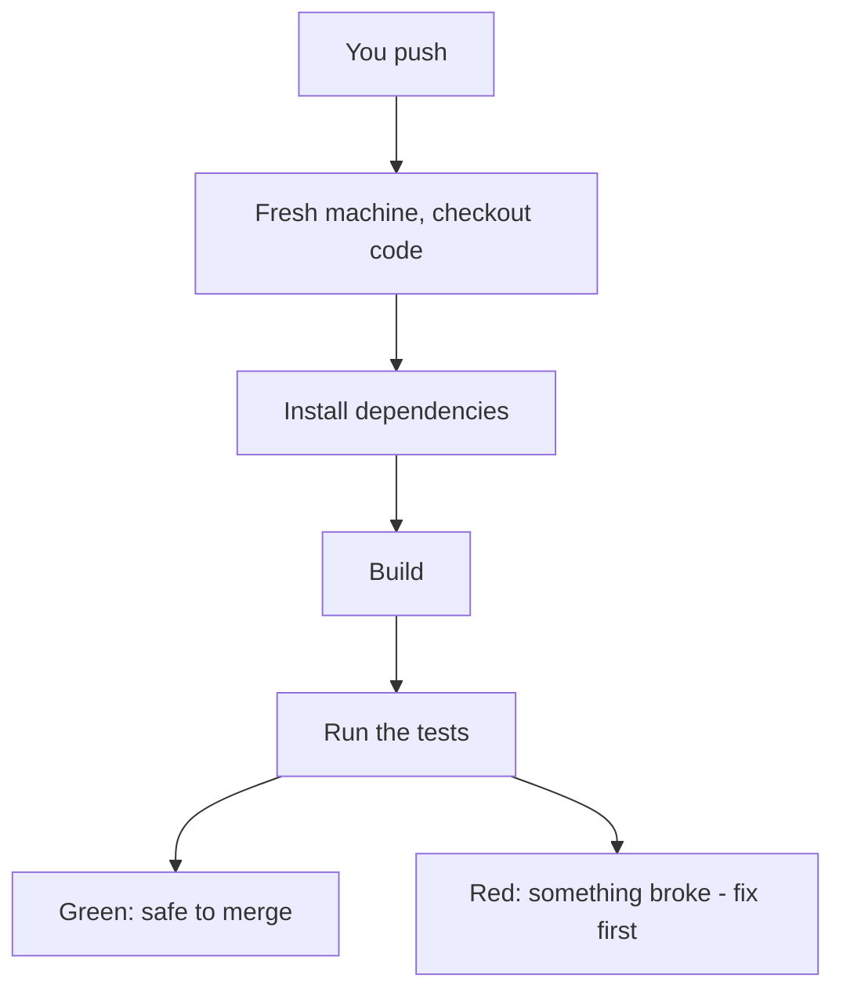

# CI: Continuous Integration

Picture the old way, because it explains everything that came after. A team of six all work in their own
corners for two weeks. Then, on release day, everyone tries to combine their work at once. Nothing fits.
Your code assumed a function that someone else renamed. Their feature breaks a test you wrote. Two people
edited the same file in incompatible ways. The team loses days untangling a knot that formed silently over
weeks. People called this **integration hell** - and it was so reliably miserable that an entire practice
grew up to prevent it.

That practice is **Continuous Integration**. The fix is almost insultingly simple to state: instead of
combining everyone's work rarely and painfully, combine it *constantly* - and have a machine check every
combination automatically. Small merges, checked often, never grow into a knot.

## What CI actually is

**What it actually is.** Continuous Integration is the habit of merging your work into the shared branch
frequently - and a *server* that, on every push, automatically builds the code and runs the tests to prove
the combination still works.

**Why people get this wrong.** Most people first meet CI as "the thing that turns red and blocks my PR,"
so they think CI *is* the test-runner. That's only half of it. CI is really the whole discipline of
integrating early and often; the automated build-and-test is the *enforcement mechanism* that makes the
discipline safe. The machine isn't the point - frequent, verified integration is the point, and the machine
is how you trust it.

📝 **Terminology.** *Integrate* here means "merge your branch's changes together with everyone else's into
the shared branch." CI is short for **Continuous Integration**.

**What it does in real life.** You push a branch or open a pull request. A CI server (GitHub Actions,
GitLab CI, Jenkins, CircleCI - the brand varies, the idea doesn't) notices, spins up a clean machine,
checks out your code, builds it, and runs your test suite. A few minutes later it reports back: a green
check if everything passed, a red X if something broke. That result sits right on your pull request.



## The red/green gate

**What it actually is.** The single most valuable thing CI gives you is a *gate*: a rule that says a pull
request can't be merged into the shared branch until its checks are green. Green means "built and passed
the tests." Red means "stop."

**What it does in real life.** Here's the moment CI earns its keep - you open a PR and the checks come back
red:

```console
$ git push origin feature/discount-codes
...
remote: Resolving deltas: 100% (8/8), done.

# Over on the pull request, a few minutes later:

  ✗ CI / build-and-test (push)   Failed in 2m 14s

  FAIL  src/pricing.test.js
    ✓ applies a flat discount
    ✗ stacks a percentage discount on a flat one

      expected 18.00, received 20.00

  Tests: 1 failed, 14 passed, 15 total
```

*What just happened:* The CI server pulled your branch onto a clean machine, built it, and ran all 15
tests. Fourteen passed; one failed - your new discount-stacking logic returns the wrong total. You learned
this within a couple of minutes of pushing, on your own change, while the code is still fresh in your head.
Nobody else pulled your bug into their work. The gate held.

Compare that to the old world, where this same bug would have surfaced two weeks later, tangled with five
other people's changes, with nobody sure whose code caused it. *That* is the difference CI makes: it moves
the discovery of problems from "much later, mixed with everything" to "right now, on the one change that
caused it."

💡 **Key point.** The whole value of CI is **fast, isolated feedback.** A failure points at *your* change,
*minutes* after you made it. Cheap to find, cheap to fix.

> ⏭️ The depth of *how* to write the tests CI runs is its own subject - see
> [Testing in CI](/guides/testing-in-ci). This phase is about what CI *does* with them.

## Why "on a clean machine" matters

**The gotcha everyone hits: "but it works on my machine."** You run the tests locally, they pass, you push
 - and CI fails. The reason is almost always that your laptop is *not* clean. Over months it has accumulated
a globally-installed tool, a leftover environment variable, a dependency you installed once and forgot. Your
code quietly leans on something that isn't written down anywhere.

CI runs on a fresh, empty machine every single time. It only has what your project explicitly declares - the
dependencies in your lockfile, the config in your repo. So when CI fails but your laptop passes, CI is
usually *right*: it's telling you the project doesn't actually contain everything it needs to build. A
teammate cloning your repo onto a new computer would hit the same wall.

⚠️ **Gotcha.** "Works on my machine" is not a defense - it's a *symptom*. The clean CI machine is the
trustworthy one. When it disagrees with your laptop, suspect a hidden dependency on your local setup before you
suspect the pipeline.

**Why this saves you later.** Because CI forces every build onto a clean machine, your project stays
genuinely portable. New hires can clone and run it on day one. You can rebuild it on a fresh server in an
emergency. The pipeline quietly guarantees something you'd otherwise only discover at the worst possible
moment.

## Recap

1. CI exists to kill **integration hell**: merge small and often instead of rarely and painfully.
2. **Continuous Integration** is the discipline of integrating frequently, enforced by a server that
   **builds and tests every push** automatically.
3. The **red/green gate** blocks merges until checks pass, so a failure points at *your* change, *minutes*
   after you made it.
4. CI runs on a **clean machine**, which is why "works on my machine" failures are real and worth listening
   to.

Watch it animated: [continuous integration](/explainers/CICD.dc.html)

---

[← Guide overview](_guide.md) · [Phase 2: CD - Delivery vs Deployment →](02-delivery-vs-deployment.md)
