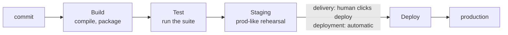

# CD: Delivery vs Deployment

Here's a thing nobody warns you about: "CD" stands for two different things, and people use it
interchangeably as if it were one. That's the source of half the confusion around pipelines. Once you can
tell the two apart, the whole "CD" half of CI/CD snaps into focus - so let's pull them apart carefully,
then walk the stages a pipeline actually runs.

## The two CDs

Both start from the same place: your change is green, CI passed, the code is good. The question CD answers
is *what happens next* - and there are two plain answers.

| | **Continuous Delivery** | **Continuous Deployment** |
|---|---|---|
| What's automated | Everything *up to* production | Everything, *including* production |
| The last step | A **human** clicks "Deploy" | No human - green code **ships itself** |
| The promise | Always *ready* to release, on demand | Always *released*, automatically |
| Who tends to use it | Teams wanting a human gate (regulated, high-stakes, or just cautious) | Teams with deep test trust and fast rollback |

**Continuous Delivery** means your pipeline keeps `main` permanently in a *release-ready* state - built,
tested, packaged, staged - so that shipping to production is a single button press whenever a human decides
the moment is right. The robots do all the toil; a person makes the final call.

**Continuous Deployment** goes one step further: there is no button and no person. Every change that passes
the pipeline goes straight to production, automatically. Merge a green PR in the morning and it can be
serving real users by lunch, untouched by human hands.

💡 **Key point.** Continuous **Delivery** = always *ready* to release (human clicks deploy). Continuous
**Deployment** = always *released* (no human in the loop). Same first letters, one crucial difference: who - 
or whether anyone - pushes the final button.

📝 **Terminology.** Because both shorten to "CD," teams often say "continuous delivery" loosely to mean
either. When it matters, ask the precise question: *"Does a human approve the production release, or is it
automatic?"* That question, not the acronym, tells you which one you're dealing with.

## The stages a pipeline runs

Whichever CD you're doing, the pipeline that gets you there is a **sequence of stages**, each gating the
next. Think of it as an assembly line: a change only advances to the next stage if it cleared the one
before.



- **Build** - turn source code into the thing you actually run: compile it, bundle it, package it into an
  artifact or container image. If it won't build, the line stops here.
- **Test** - run the automated checks from [Phase 1](01-continuous-integration.md). Red stops the line.
- **Staging** - deploy the built artifact to a *staging* environment: a private copy of production, with
  prod-like data and settings, where the change can be exercised for real before any user sees it.
- **Deploy** - release to production. This is the line that Delivery guards with a human and Deployment
  crosses on its own.

📝 **Terminology.** An **artifact** is the packaged output of the build - a compiled binary, a zip, a
container image - the concrete thing you deploy. **Staging** is a rehearsal environment that mirrors
production as closely as practical, so problems show up there instead of in front of customers.

**What it does in real life.** A pipeline definition (often a YAML file in your repo) lists these stages,
and the CI/CD server runs them in order on every change:

```console
# A pipeline run, summarized:

  ✓ build       packaged image app:9f2a1c7         (1m 02s)
  ✓ test        218 passed                          (3m 41s)
  ✓ staging     deployed to staging.example.com     (48s)
  ⏸ deploy      waiting for manual approval ...
```

*What just happened:* The change cleared build, passed all 218 tests, and went live on the staging
environment automatically. Then it *stopped* and is waiting - this is a continuous **delivery** pipeline,
so the production deploy is paused for a human to approve. In a continuous **deployment** pipeline, that
last line would read `✓ deploy` instead of `⏸`, with no pause at all.

## Deploy strategies, gently

When the deploy stage does run, it has to swap the new version in for the old one *without dropping the
users currently relying on the service*. You don't have to master these - just recognize the names, because
they come up constantly. Each is a different answer to "how do we change the running thing safely?"

```text
  ROLLING      ▢▢▢▢  ──►  ◼▢▢▢  ──►  ◼◼▢▢  ──►  ◼◼◼◼
               replace servers a few at a time; old + new run side by side briefly

  BLUE-GREEN   [blue = live]   spin up a full [green = new] copy,
                               then flip ALL traffic blue ──► green at once
                               (blue stays warm, so flipping back is instant)

  CANARY       send 5% of users to the new version, watch the metrics,
               then 25%, 50%, 100% - back out at the first sign of trouble
```

- **Rolling** - replace the old version with the new a few servers at a time, so the service never fully
  goes down during the swap. Simple and common.
- **Blue-green** - keep two complete environments. One ("blue") serves users while you deploy and warm up
  the other ("green"); then you flip all traffic over at once. If green misbehaves, you flip straight back
  to blue. The trade-off: you're paying for two full environments.
- **Canary** - release the new version to a *small slice* of users first (the "canary"), watch the error
  rates and metrics, and only widen the rollout if it stays healthy. You catch a bad release while it's
  hurting 5% of users instead of 100%. The trade-off: it's slower and needs good monitoring to be worth it.

⚠️ **Gotcha.** None of these strategies make a *bad release* good - they limit the *blast radius* and make
backing out fast. Canary catches a bad deploy early; blue-green lets you flip back instantly; rolling keeps
the lights on during the swap. They buy you a safe, reversible change, not a guaranteed-correct one. The
correctness still comes from the tests.

**Why this saves you later.** When someone in a meeting says "let's canary this one" or "just blue-green it
back," you'll know exactly what they're proposing and what it costs - and you'll understand why the deploy
stage is the careful, deliberate part of the whole pipeline.

## Recap

1. **CD is two things.** Continuous **delivery** = always release-ready, a human clicks deploy. Continuous
   **deployment** = green changes ship to production automatically.
2. A pipeline is a **sequence of stages** - typically **build → test → staging → deploy** - and a change
   only advances if it cleared the stage before.
3. The **deploy** stage is where delivery and deployment differ: delivery pauses for a human; deployment
   crosses the line on its own.
4. **Deploy strategies** (rolling, blue-green, canary) limit the blast radius and make backing out fast - 
   they manage risk, they don't replace tests.

---

[← Phase 1: CI - Continuous Integration](01-continuous-integration.md) · [Phase 3: Why It's Worth It →](03-why-its-worth-it.md)
