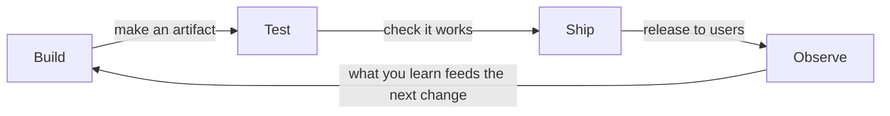

# The Loop: Build → Test → Ship → Observe

In [Phase 1](01-not-a-team.md) we tore down the wall: one team now owns software from building it to running it. But that raises a fair question - *how do they actually work?* If there's no hand-off from dev to ops, what does the day-to-day rhythm look like?

The answer is a **loop**. And once you see the shape of it, the whole point of DevOps - moving fast without breaking everything - suddenly makes sense.

## The shape of the loop

Software in a DevOps world isn't a straight line from "start" to "done." It's a cycle that keeps turning, where the *end* feeds the *beginning*:

**What it actually is.** DevOps is a *continuous* cycle: you **build** a change, **test** it, **ship** it to users, **observe** how it behaves in the real world, and what you learn there feeds straight back into the next thing you build. Then it turns again. And again.

**Why a loop and not a line.** A straight line says "we built the software, we're done." But software is never done - there are always more features, fixes, and things to learn from real users. Drawing it as a loop captures the truth: the team is always somewhere on this cycle, connected end-to-end. The output of running the software (what you observe) is the input to improving it.

Let's walk each stage in plain terms.

## Stage 1: Build

**What it is.** This is the part most people already picture as "making software": writing the code, and then **building** it - turning your human-readable source code into something the computer can actually run (compiling it, bundling it, packaging it up).

**What it does in real life.** A developer writes some code on their machine and commits it. The "build" turns that raw code into a runnable, shippable *artifact* - a packaged version of the app ready to be tested and deployed.

📝 **Terminology.** *Artifact* = the packaged, ready-to-run output of a build (a compiled program, a container image, a zipped bundle). It's the thing that moves through the rest of the loop.

## Stage 2: Test

**What it is.** Checking that the change actually works - and, just as importantly, that it didn't *break something else* that used to work.

**What it does in real life.** Automated tests run against the freshly built artifact. Did the new login button work? Did adding it accidentally break the signup page? Tests are how you find out *before* real users do.

⚠️ **Gotcha.** "We'll test it manually later" is where the loop quietly dies. If testing depends on a human remembering to click through the app, it gets skipped under deadline pressure, and broken code reaches users. In DevOps, testing is **automated** so it runs every single time, without anyone having to remember.

## Stage 3: Ship

**What it is.** Releasing the tested change so real users can use it. Also called *deploying* - putting the code onto the actual servers where it runs in production.

📝 **Terminology.** *Production* (often "prod") = the real, live environment that actual users touch. The opposite of a test or staging environment, where only the team pokes at it.

**What it does in real life.** The tested artifact gets pushed out to the production servers and becomes the version users are now running. In the old world, this was the scary hand-off across the wall. In DevOps, it's a routine, repeatable step in the loop.

## Stage 4: Observe

**What it is.** Watching the software *as it runs in production*, so you actually know how it's behaving for real users - not guessing.

**What it does in real life.** Once your change is live, you watch it: Are errors spiking? Did the page get slower? Are users actually clicking the new button? This is the stage that didn't exist for developers before the wall came down - they shipped and walked away. Now, observing is how you *close the loop*.

📝 **Terminology.** *Observability* = being able to understand what your running software is doing from the outside, using its logs, metrics, and traces. (It has its own depth - that's a separate guide.)

**Why this stage is the secret.** Observing is what turns the cycle into a *loop* instead of a line. What you learn - "this new feature is confusing," "this query is slow under real load" - becomes the very next thing you build. The software running in the world *teaches you* what to do next.

## What makes the loop fast AND safe

Here's the tension at the heart of all of this. Going *fast* usually means going *dangerously* - rush a release and you break things. Being *safe* usually means going *slowly* - check everything by hand and you ship once a quarter. The old wall lived inside that trade-off: ops slowed dev down precisely *because* fast felt unsafe.

DevOps escapes the trade-off with two ideas working together:

- **Automation makes it fast.** When building, testing, and shipping are done by machines instead of humans clicking through checklists, a change can go from "committed" to "live" in minutes, the *exact same way* every time - no forgotten steps, no "did you remember to run the tests?" That machinery is called a **CI/CD pipeline**, and it's important enough to have its own guide - [What CI/CD Does](/guides/what-cicd-does).

- **Feedback makes it safe.** Every loop you complete teaches you something. Automated tests give fast feedback *before* shipping ("this change broke login - stop"). Observing gives feedback *after* shipping ("errors are spiking - roll it back"). Because feedback is fast, mistakes get caught small, while they're still cheap to fix.

💡 **Key point.** Automation makes the loop **fast**; feedback makes it **safe**. Together they dissolve the old "fast *or* safe" trade-off - that's the engine that lets DevOps teams ship many small changes a day instead of one terrifying change a quarter.

**Why this saves you later.** When you hear a team say they "deploy fifty times a day," it sounds reckless - until you understand the loop. Each deploy is small, automatically tested, and watched after it ships, so a broken one is caught in minutes and reversed. *That's* why frequent shipping is safer than rare shipping, not despite it. Phase 3 explains why "small and frequent" is a deliberate choice, not chaos.

## Recap

1. DevOps runs as a continuous **loop**: **build → test → ship → observe**, then repeat.
2. It's a loop, not a line, because what you **observe** in production feeds straight into the next thing you **build**.
3. The four stages in plain terms: **build** (make a runnable artifact), **test** (check it works), **ship** (release it to real users in production), **observe** (watch how it behaves).
4. **Automation** makes the loop **fast** - machines build, test, and ship the same way every time.
5. **Feedback** makes the loop **safe** - tests catch problems before shipping, observing catches them after.
6. Together, automation and feedback let teams ship **small changes often** instead of rare, scary ones.

Next, the part that's easiest to skip and hardest to fake: the *culture* underneath the loop - the shared habits and attitudes that make any of this actually work.

---

[← Guide overview](_guide.md) · [Phase 3: The Culture Underneath →](03-the-culture.md)
